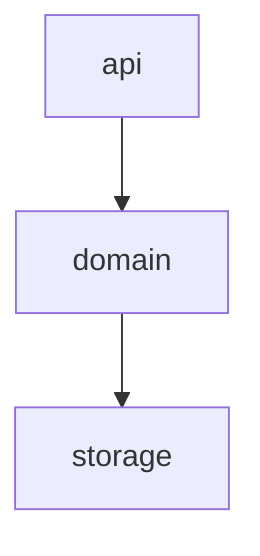

# Pipeline Plan

Workflow tier: high-risk

Risk profile: ./risk-profile.yaml

## Trigger
- Proposal: docs/versions/<version>/modules/<packet-module>/<task-name>/proposal.md
- User launch confirmed: <yes-after-explicit-user-launch>
- User launch statement: <verbatim-user-instruction-that-explicitly-launches-auto-pipeline>
- Launch stage: proposal
- First auto stage: design
- Design source: pipeline/plan.md
- Per-stage user confirmation: skipped by explicit user auto-pipeline authorization
- Auto-confirm completed document stages: no design/testing Markdown documents generated; repository-local document extensions only
- Auto-pipeline document policy: stage-selective; automatic design uses pipeline plan; automatic testing uses runtime state; testplan.yaml required for automatic testing
- Version: <version>
- Packet module: <project-or-globals>
- Task name: <task-seq>-<task-slug>
- Target module(s): <project-module>[, <project-module>]
- change_id values: <change-id>[, <change-id>]

## Acceptance Baseline
- Final acceptance is judged against:
  - `proposal.md`

## Stage Graph
| Task ID | Stage | Execution Mode | Responsibility | Scope | Parent Task | Depends On | Output | Done Condition |
|---------|-------|----------------|----------------|-------|-------------|------------|--------|----------------|
| D-1 | design | auto-pipeline | convert user-confirmed intent into executable structure | bound task packet | root | none | pipeline plan design mappings and scope bindings | design rules satisfied without generating design docs |
| I-1 | implementation | auto-pipeline | deliver production code inside approved boundaries | bound task packet | root | D-1 | production code | implementation complete |
| T-1 | testing | auto-pipeline | design test cases from proposal/plan/code, generate test implementation, and wire tests into unified entrypoint | bound task packet | root | I-1 | tests + testplan.yaml + test-run wiring + state testing evidence | testing implementation reachable through test-run |
| A-1 | acceptance | auto-pipeline | review requirement and implementation, plus consistency with existing design/testing documents | bound task packet | root | T-1 | acceptance report | acceptance passed |

## Submodule Tasks
<!-- Optional: leave this table empty when the task has no independently owned submodule work. -->
| Task ID | Stage | Execution Mode | Responsibility | Submodule | Parent Task | Depends On | Output | Done Condition |
|---------|-------|----------------|----------------|-----------|-------------|------------|--------|----------------|

## Parallel Scheduling
- Strategy: dependency-ready-set
- Concurrency: use all runtime-available child-agent slots
- Shared artifact owner: parent-orchestrator
- Lock directory: `.harness/locks/`
- Dispatch rule: launch dependency-ready work with practical edit coordination and available capacity
- Serialization reasons: explicit dependency, edit coordination, or exhausted concurrency capacity
- Evidence: record launched task ids and serialization reasons in `.harness/pipelines/<version>/<packet-module>/<task-name>/state.json` scheduler waves

## Dependency Graphs
<!-- Required only when First auto stage is design. When design is manual, set Design source to design.md and keep design evidence in design.md. -->

| Level | Parent | Node | Depends On |
|-------|--------|------|------------|
| submodule | <project-module> | api | domain |
| submodule | <project-module> | domain | storage |
| submodule | <project-module> | storage | none |

## Exported Interfaces
| Interface | Owner | Consumer | Compatibility | Affected Callers | Migration Path |
|-----------|-------|----------|---------------|------------------|----------------|
| <interface-name> | <owning-submodule> | <existing-module-or-change-id> | new | none | none |

## API and Build Surface Impact
- Public API impact: none
- Crate-root export change: no
- Build-surface change: no
- Documentation examples affected: no

## Consumer Migration Closure
| Old Symbol | New Path | change_id | Consumer Path | Consumer Kind | Migration Status |
|------------|----------|-----------|---------------|---------------|------------------|
| not-applicable | not-applicable | <change-id> | not-applicable | not-applicable | verified-none |

## State Ownership
| State | Owner | Access Interface | Lifecycle | Failure Transitions |
|-------|-------|------------------|-----------|---------------------|
| <persistent-or-shared-state> | <single-owner-submodule> | <exported-interface> | <states-and-legal-transitions> | <failed-state-and-recovery-transitions> |

## Failure Flows
| Flow | Boundary | Failure | Handling |
|------|----------|---------|----------|
| <key-call-flow> | <cross-module-boundary> | <concrete-failure> | <propagation-retry-rollback-or-compensation> |

## Rejected Alternatives
| Decision Type | Selected | Rejected | Reason |
|---------------|----------|----------|--------|
| boundary | <selected-boundary> | <rejected-boundary> | <why-rejected> |
| technical | <selected-technology> | <rejected-technology> | <why-rejected> |
| collaboration | <selected-collaboration> | <rejected-collaboration> | <why-rejected> |

## Implementation Scope Bindings
| change_id | target_module | proposal_id | design_coverage | scope_paths | design_rules_applied |
|-----------|---------------|-------------|-----------------|-------------|----------------------|
| <change-id> | <project-module> | <proposal-id> | <concrete pipeline-plan design mapping> | `<repo-relative/path>` | module decomposition, dependencies, interfaces, state, risks |

## File-Level Implementation Sequence
| Sequence | Task ID | File-Level Module | Action | Depends On | change_id | target_module | Scope Paths | Context Sources |
|----------|---------|-------------------|--------|------------|-----------|---------------|-------------|-----------------|
| 1 | I-1 | `<repo-relative/path>` | create / modify | none | <change-id> | <project-module> | `<repo-relative/path>` | proposal excerpt, pipeline plan design mapping, relevant source only |

## Return Rules
- If acceptance finds proposal ambiguity:
  - stop the pipeline and ask the user to decide; do not infer the requirement or create an automatic proposal return task
- If acceptance finds implementation defect:
  - return missing required behavior or defective delivered code to implementation
- If implementation conflicts with an existing design or testing document:
  - return the stale or incorrect document to its owning stage when implementation still satisfies the requirement
- If the same unresolved issue remains after more than 5 unsuccessful iterations:
  - stop and report the issue to the user

Execution status, testing evidence, return records, and final acceptance are stored in `.harness/pipelines/<version>/<packet-module>/<task-name>/state.json`. They are deliberately excluded from this immutable design-and-scope plan.
