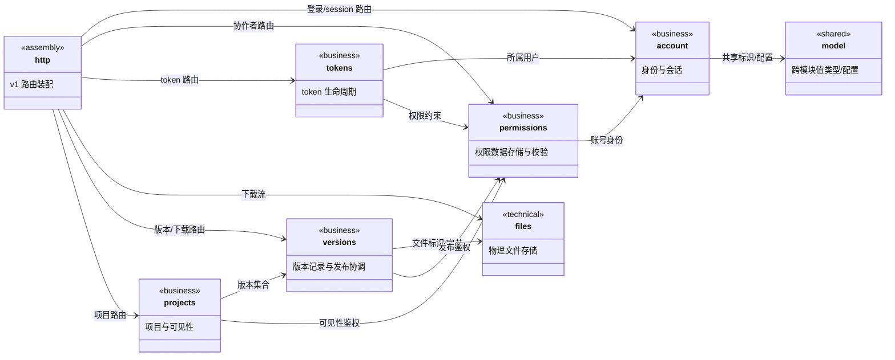
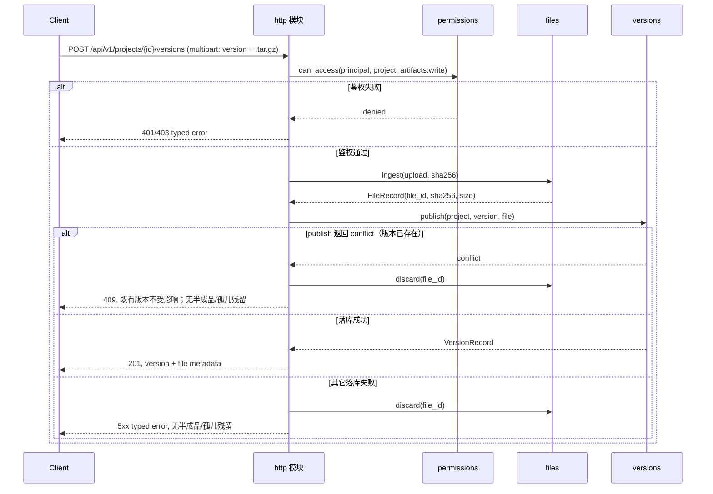
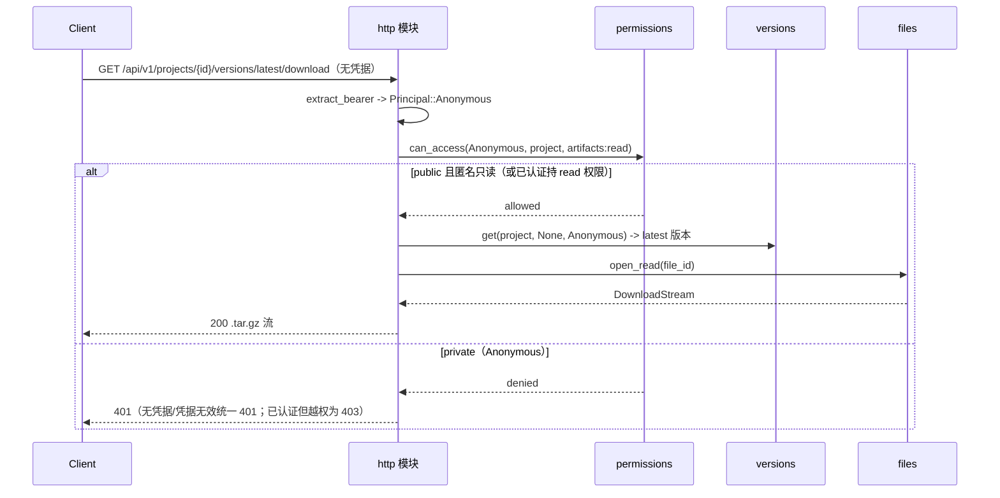
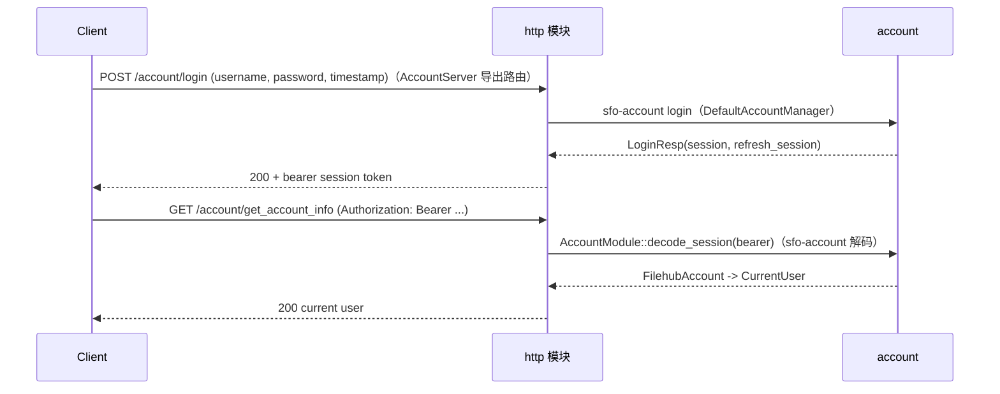
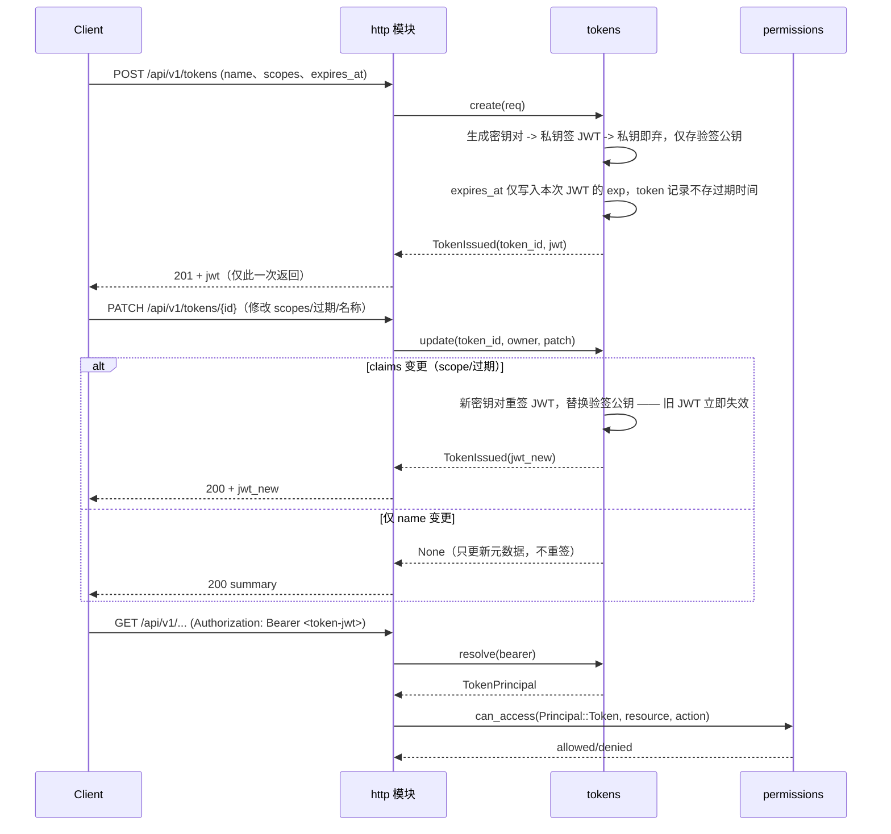
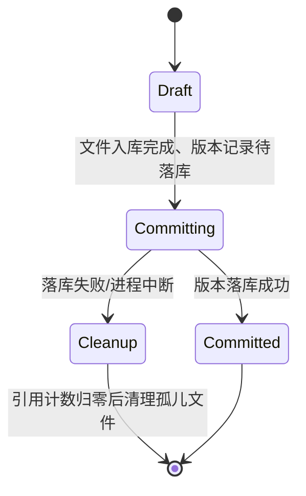

## Approval Record

- approver: user
- approval_date: 2026-08-19
- user_statement: 确认，自动完成001任务吧


# filehub 服务后台（filehub-server）设计

Risk profile: ./risk-profile.yaml

## Design Scope

### Goals

- 落地 `filehub-server` 单一 Rust crate（`server/`），七个实现子模块全部为该 crate 内的子 mod：account、permissions、tokens、files、versions、projects、http。
- 按提案 P-01 ~ P-07 定义 crate 内静态依赖、子模块对外服务接口、SQLite 数据归属、统一授权入口、`.tar.gz` 文件/版本流水线与 `/api/v1` 装配契约。
- 输出文件级实现顺序，使实现子任务（I-001 ~ I-008）可按依赖顺序执行，scope 与 `task.yaml` change 绑定一致。

### Non-goals

- 不实现/不设计前端托管、CLI、注册与后台建号（002/003 与提案范围外）。
- 不设计测试用例、测试计划、fixtures 或验证标识（测试阶段负责）。
- 不引入 Organization/Team、断点续传、分片上传、CDN/对象存储等提案非目标能力。

## Useful Context

- 用户已确认（第六次修订）：HTTP 服务器统一使用 `sfo-http`（0.7，`HttpServerConfig` 提供监听/CORS；服务端实现 Actix/Tide 二选一在实现期锁定，HTTPS 由部署面前置反向代理终结）；技术栈为 Rust + `sfo-http` + SQLite + 本地 `data_dir` 文件存储；管理后台为 React（002）。
- 依赖约束（来源与版本在设计期锁定）：账号与会话复用 `sfo-account` v0.2.0（仓库 `github.com/wugren/sfo-account`，本机工作区 `account-basic` 已核对路由/`decode_session` 签名；实现清单以 crates.io 锁定为准）；协作者、账号导出与 token 管理 HTTP 接口统一使用 `sfo-http` 0.7；日志统一 `sfo-log`（实现期锁定 crates.io/Git 来源与版本）。
- 用户已确认：session 仅经 HTTP `Authorization` 头传输，不使用 cookie；角色模型不落入账号模块；token 生命周期独立成模块，权限判定收敛到权限模块；版本模块依赖文件模块，项目模块依赖版本模块。
- 仓库当前为 greenfield bootstrap：无生产代码、无既有消费者、无迁移兼容负担；`docs/modules/filehub.md` 于本阶段同步为长期边界文档。

## Overall Approach

单个 crate `server/`，`lib.rs` 声明七个履职子 mod（account、permissions、tokens、storage、versions、projects、http）与共享 `model`、`contract` 子 mod；子模块通过目录级 mod 暴露 service/port 接口，业务子模块之间只调用对方公开接口（Rust trait/service 结构体），http 模块为唯一装配层，将各子模块的 handler 经 `HttpServer::serve` 注册进 sfo-http 服务器实体并暴露 v1 API。持久化统一由各子模块自有的 SQLite 表承担，迁移文件集中 `server/migrations/`（每条迁移标注归属子模块），文件字节由 files 模块独占。版本发布走“权限校验 -> 文件入库 -> 版本落库”的原子顺序。crate 内不允许循环依赖，图纸见 Module Relationship UML。所有可能执行 IO 的子模块 trait 接口方法（SQLite、物理文件、验签/密钥读取等）统一声明为 `async fn`，纯内存计算保持同步。

## Layered Design Document Index

| level | parent_document | unit | design_document | responsibility |
|-------|-----------------|------|-----------------|----------------|
| root | `design.md` | filehub-server crate | `design.md` | 整体 crate 布局、依赖方向、数据归属、装配与实现顺序 |
| submodule | `design.md` | model（共享模型） | `design/model.md` | UserId/ProjectId/TokenId/FileId 等共享标识、角色/权限/可见性枚举、Principal/Resource 与跨模块记录、配置 DTO；无持久化状态 |
| submodule | `design.md` | account | `design/account.md` | 身份、sfo-account 装配与登录/session HTTP 接口直接导出 |
| submodule | `design.md` | permissions | `design/permissions.md` | 权限数据存储/校验、访问矩阵（冻结）、配置驱动角色初始化与协作者授权 |
| submodule | `design.md` | tokens | `design/tokens.md` | token 生命周期与权限数据 |
| submodule | `design.md` | files | `design/files.md` | `.tar.gz` 物理存储与完整性 |
| submodule | `design.md` | versions | `design/versions.md` | 版本元数据、不可覆盖、latest、原子发布协调与孤儿回收 keep |
| submodule | `design.md` | projects | `design/projects.md` | 项目 CRUD、可见性与 owner 隐式 admin |
| submodule | `design.md` | http | `design/http.md` | v1 路由契约（冻结）/DTO/错误映射、sfo-http 装配（监听/CORS）与请求上下文 |

## Module Relationship UML



依赖方向：business -> technical、业务 -> 权限判定、http（assembly）不被任何业务子模块反向依赖；图中无环（由 doc-structure-check 校验）。

## File-Level Interfaces

```rust
// 接口并发语义（第五次修订）：可能执行 IO（SQLite/物理文件/验签等）的 trait 方法与初始化方法一律 async fn；纯计算保持同步
// server/src/model/：共享值类型底座（shared，无持久化状态；不依赖任何业务/技术子模块）
//   UserId/ProjectId/TokenId/FileId、项目角色 ProjectRole、Scope/ProjectScope/Visibility、
//   Principal（Anonymous/User/Token）、Resource、CurrentUser/ProjectRecord/VersionRecord/FileRecord/
//   Collaborator/TokenSummary/TokenIssued，以及 UsersConfig/ServerConfig/FilesConfig/HttpConfigSeed；
//   供 account/permissions/tokens/storage/versions/projects/http 六个子模块复用，避免 ID/枚举依赖环。
// server/src/lib.rs：crate 顶层声明与装配入口
pub mod account;
pub mod permissions;
pub mod tokens;
pub mod files;
pub mod versions;
pub mod projects;
pub mod http;

pub use http::register_api; // sfo-http 装配入口（唯一对外 HTTP 装配面）

// account：配置驱动初始化 + sfo-account 装配；直接导出 sfo-account 的 HTTP 接口
// （AccountServer::register_server 挂载 POST /account/login、POST /account/get_account_info_of_session、
//   GET /account/get_account_info、POST /account/refresh_session），不自建 SessionService 与登录/登出 handler
pub struct AccountModule {
    manager: Arc<DefaultAccountManager<FilehubAccount, SqliteAccountStore>>,
}
impl AccountModule {
    pub async fn init(config: &UsersConfig, db: &SqlitePool) -> Result<Self, AccountInitError>;
    pub fn register_http<S: HttpServer<Req, Resp>>(&self, server: &mut S);
    // 认证中间件 session 校验直接复用 sfo-account 解码（不保留独立 JwtSessionVerifier）
    pub async fn decode_session(&self, bearer_session: &str) -> Result<FilehubAccount, SessionError>;
    pub fn current_user(&self, account: &FilehubAccount) -> CurrentUser;
}
pub struct CurrentUser { pub id: UserId, pub username: String }

// permissions：权限数据存储 + 校验服务
pub trait PermissionChecker {
    async fn can_access(
        &self,
        principal: &Principal, // Anonymous / User{id} / Token{id, scopes, user_id}
        resource: &Resource, // 功能/数据对象（项目、版本、文件）
        action: &str, // metadata:read / artifacts:read|write / administration / projects:create|delete
    ) -> Result<bool, PermissionError>;
    // 协作者管理（均要求 actor 具备项目 administration）；list 为 002 页面契约支撑
    async fn list_collaborators(&self, project: &ProjectId, actor: &Principal) -> Result<Vec<Collaborator>, PermissionError>;
    async fn grant_collaborator(&self, project: &ProjectId, actor: &Principal, user: &UserId, role: ProjectRole) -> Result<(), PermissionError>;
    async fn update_collaborator(&self, project: &ProjectId, actor: &Principal, user: &UserId, role: ProjectRole) -> Result<(), PermissionError>;
    async fn remove_collaborator(&self, project: &ProjectId, actor: &Principal, user: &UserId) -> Result<(), PermissionError>;
}
pub struct PermissionsModule { checker: Arc<dyn PermissionChecker> }
impl PermissionsModule {
    pub async fn init(db: &SqlitePool, project_access: Arc<dyn ProjectAccess>) -> Result<Self, PermissionInitError>;
    pub fn checker(&self) -> Arc<dyn PermissionChecker>;
}

// tokens：JWT 形态 token 生命周期（签发/列表/撤销/轮换/属性修改；凭据一次性返回）
pub trait TokenService {
    async fn create(&self, req: TokenCreateRequest) -> Result<TokenIssued, TokenError>; // expires_at 仅写入本次签发 JWT 的 exp
    async fn list(&self, owner: &UserId) -> Result<Vec<TokenSummary>, TokenError>;
    async fn update(&self, token_id: &TokenId, owner: &UserId, patch: TokenUpdateRequest) -> Result<Option<TokenIssued>, TokenError>; // 重签时新 exp 写入新 JWT
    async fn rotate(&self, token_id: &TokenId, owner: &UserId) -> Result<TokenIssued, TokenError>;
    async fn revoke(&self, token_id: &TokenId, owner: &UserId) -> Result<(), TokenError>;
    async fn resolve(&self, bearer: &str) -> Result<TokenPrincipal, TokenError>; // 每 token 验签公钥验签 + JWT exp 校验，构造 Principal::Token
}

// files：物理字节的原子入库与下载
pub trait FileStore {
    async fn ingest(&self, source: UploadStream, expected_sha256: Option<&str>) -> Result<FileRecord, FileStoreError>;
        // 仅接受 .tar.gz（gzip magic + tar 结构），超过 files.max_archive_bytes 拒绝（422）；临时文件失败即清理
    async fn open_read(&self, file_id: &FileId) -> Result<DownloadStream, FileStoreError>;
    async fn discard(&self, file_id: &FileId) -> Result<(), FileStoreError>; // 发布失败（含 409）立即回滚未引用文件
    async fn gc_orphans(&self, keep: &HashSet<FileId>) -> Result<Vec<FileId>, FileStoreError>; // 启动/恢复回收
}

// versions：版本记录与原子发布协调
pub trait VersionService {
    async fn publish(&self, project: &ProjectId, version: &str, file: FileRecord, actor: &Principal) -> Result<VersionRecord, VersionError>;
    async fn list(&self, project: &ProjectId, actor: &Principal) -> Result<Vec<VersionRecord>, VersionError>;
    async fn get(&self, project: &ProjectId, version: Option<&str>, actor: &Principal) -> Result<VersionRecord, VersionError>; // None = latest
    async fn referenced_file_ids(&self) -> Result<HashSet<FileId>, VersionError>; // gc_orphans 的 keep 来源
}

// projects：项目实体与可见性
pub trait ProjectService {
    async fn create(&self, actor: &Principal, name: &str, visibility: Visibility) -> Result<ProjectRecord, ProjectError>; // owner = actor 的用户 id；Anonymous deny
    async fn set_visibility(&self, project: &ProjectId, actor: &Principal, visibility: Visibility) -> Result<(), ProjectError>;
    async fn delete(&self, project: &ProjectId, actor: &Principal) -> Result<(), ProjectError>;
}

// http：装配配置、统一端点包装（认证/授权/请求上下文）与 v1 路由契约（冻结）见 design/http.md；
// register_api 将子模块 handler 注册进 sfo-http HttpServer（serve）；extract_bearer 保持 async
```

- Consumer: 各子模块实现与 `http::register_api`（装配 x 全部 change：fh-server-account / fh-server-permissions / fh-server-tokens / fh-server-files / fh-server-versions / fh-server-projects / fh-server-http）；http 模块经 `AccountModule::register_http` 挂载 sfo-account 路由，登录 session 经 `AccountModule::decode_session` 作为认证校验
- Compatibility: new
- Migration path when required: 不适用（新 crate，无旧符号消费者）

## API and Build Surface Impact

- Public API impact: none
- Crate-root export change: no
- Build-surface change: no
- Documentation examples affected: no

## Consumer Migration Closure

not-applicable: 无既有公开接口、crate-root 导出或构建面变更，无旧符号消费者需要迁移。

## Key Flows









认证中间件凭据类型分支：`Bearer` 凭据若为登录 session JWT 走 account `decode_session`（`sfo-account` 解码验签）构造 `Principal::User`；若为 token JWT（对应 token 记录验签公钥可验签）走 tokens `resolve` 构造 `Principal::Token`；两者验签密钥来源不同，不可互冒。

## State and Ownership



- Owner: 持久化数据按表归属——
  - users：account 模块（实现 `sfo-account` 的 `AccountStore`）；sessions 为 `sfo-account` 签发的无状态 JWT，无服务端 session 表，过期由 JWT `exp` 承载（tokens 归属见下）
  - project_grants（协作者关系，不含 owner）：permissions 模块；项目 owner 为 `projects.owner` 隐式 admin，无账号级角色
  - tokens / token_scopes：tokens 模块；token 记录含 name/scope 快照/当前验签公钥，签名私钥签发后即弃，不保存 JWT 明文与过期字段（过期仅由签发 JWT 的 exp 承载）
  - files 索引（file_id、sha256、size、路径）：files 模块；物理字节位于 `data_dir`
  - versions / version_files 关联：versions 模块
  - projects：projects 模块
- Access path for other modules: 其他子模块仅通过各 owner 的 service trait 访问；禁止跨模块直写 SQLite 表或直接读 `data_dir` 字节。
- Invariants to preserve:
  - 同一 `<project>:<version>` 唯一且不可覆盖（数据库唯一约束 + 冲突返回 409）。
  - 任何时刻可读取的版本记录只能引用已提交文件；半成品版本对用户不可见。
  - 发布失败（含 409）后未引用文件立即 discard；进程中断残留由启动 `referenced_file_ids()` + `gc_orphans(keep)` 回收。
  - 上传仅接受 `.tar.gz`（流式格式判定）且不超过 `[files] max_archive_bytes`；其它格式/超限返回 422。
  - token 权限不超过其所属用户权限（发布与校验均为 permissions 入口）。
  - 凭据类型可区分：登录 session JWT 与 token JWT 验签密钥来源、claims 与解析路径分离，互不冒充；认证中间件据此构造 `Principal::User` / `Principal::Token`。
  - 无凭据请求统一 `Principal::Anonymous`：public 项目仅放行只读（metadata/artifacts:read），private 与全部写动作 deny。
  - 服务端不持久化 token 签名私钥；轮换/重签替换验签公钥后旧 JWT 立即失效；登录 session 无服务端逐会话撤销能力，失效/过期由 `sfo-account` 解码与 JWT `exp` 判定。

## Directly Mapped Change Items

| change_id | target_module | proposal_id | Design Coverage | Scope Paths | Interface / Boundary Impact | Notes |
|-----------|---------------|-------------|-----------------|-------------|------------------------------|-------|
| fh-server-account | filehub | P-01 | design/account.md + 本文件 account 装配与 Key Flows | `server/src/account/`, `server/migrations/`, `tests/` | 直接导出 `sfo-account` 的 HTTP 接口（`AccountServer::register_server`）；认证中间件复用 `decode_session`；users 表实现 `AccountStore` | 角色模型不在本模块；不自建 SessionService/JwtSessionVerifier |
| fh-server-permissions | filehub | P-02 | design/permissions.md + 本文件 PermissionChecker | `server/src/permissions/`, `server/migrations/`, `tests/` | 新增权限数据表与统一判定入口 | 协作者接口用 sfo-http |
| fh-server-tokens | filehub | P-03 | design/tokens.md + 本文件 TokenService | `server/src/tokens/`, `server/migrations/`, `tests/` | 新增 token 表（属性+验签公钥）、JWT 签发/解析与生命周期接口（创建/列表/修改/轮换/撤销），凭据类型区分 | 放行判定仍走 permissions；登录 session 归 account |
| fh-server-files | filehub | P-04 | design/files.md + 本文件 FileStore | `server/src/storage/`, `server/migrations/`, `tests/` | 新增文件索引与 `data_dir` 物理存储 | 不感知版本语义 |
| fh-server-versions | filehub | P-05 | design/versions.md + 本文件 VersionService 与发布时序 | `server/src/versions/`, `server/migrations/`, `tests/` | 新增版本表/关联表与发布协调 | 依赖文件模块 |
| fh-server-projects | filehub | P-06 | design/projects.md + 本文件 ProjectService | `server/src/projects/`, `server/migrations/`, `tests/` | 新增项目表与可见性接口 | 依赖版本模块与权限核心 |
| fh-server-http | filehub | P-07 | design/http.md + 本文件 register_api 与 API 契约 | `server/src/http/`, `server/src/contract/`, `server/migrations/`, `tests/` | 新增 v1 路由、DTO、错误映射与装配 | 只做装配，不做业务判定 |

## Implementation Order

| Phase | Goal | Depends On | Output |
|-------|------|------------|--------|
| 1 | crate 骨架：Cargo/feature 声明、lib.rs 子 mod 声明、共享 model 子模块、migrations 目录 | none | `server` crate 可编译（model 值类型就绪） |
| 2 | account：配置初始化 + sfo-account 装配、直接导出 HTTP 接口、中间件 decode_session 适配 | 骨架 | AccountModule + users 表（实现 sfo-account AccountStore） |
| 3 | permissions：角色/授权数据与 `can_access` 入口 | account | permissions service + 授权表 |
| 4 | tokens：JWT 签发/解析、生命周期（创建/列表/修改/轮换/撤销）与权限数据 | account、permissions | tokens service + tokens 表（验签公钥） |
| 5 | files：原子入库、下载流、SHA-256 与路径防穿越 | 骨架 | files service + 文件索引表 |
| 6 | versions：版本发布协调、不可覆盖、latest | files、permissions | versions service + 版本表 |
| 7 | projects：项目 CRUD、可见性切换、删除 | versions、permissions | projects service + 项目表 |
| 8 | http：v1 路由注册、DTO、错误映射与契约文档 | 全部子模块 | `register_api` + v1 API 契约 |

## File-Level Implementation Sequence

| sequence | file_level_module | action | depends_on | change_id | scope_path | implementation_task |
|----------|-------------------|--------|------------|-----------|------------|---------------------|
| 1 | `server/Cargo.toml` | create | none | fh-server-account | `server/` | I-001 |
| 2 | `server/src/lib.rs` | create | `server/Cargo.toml` | fh-server-account | `server/src/` | I-001 |
| 2a | `server/src/model/mod.rs` | create | `server/src/lib.rs` | fh-server-account | `server/src/model/` | I-001 |
| 2b | `server/src/model/id.rs` | create | `server/src/model/mod.rs` | fh-server-account | `server/src/model/` | I-001 |
| 2c | `server/src/model/role.rs` | create | `server/src/model/mod.rs` | fh-server-account | `server/src/model/` | I-001 |
| 2d | `server/src/model/scope.rs` | create | `server/src/model/mod.rs` | fh-server-account | `server/src/model/` | I-001 |
| 2e | `server/src/model/principal.rs` | create | `server/src/model/mod.rs` | fh-server-account | `server/src/model/` | I-001 |
| 2f | `server/src/model/record.rs` | create | `server/src/model/mod.rs` | fh-server-account | `server/src/model/` | I-001 |
| 2g | `server/src/model/config.rs` | create | `server/src/model/mod.rs` | fh-server-account | `server/src/model/` | I-001 |
| 3 | `server/migrations/0001_core.sql` | create | `server/src/lib.rs` | fh-server-account | `server/migrations/` | I-001 |
| 4 | `server/src/account/mod.rs` | create | `server/src/lib.rs` | fh-server-account | `server/src/account/` | I-002 |
| 5 | `server/src/account/authn.rs` | create | `server/src/account/mod.rs` | fh-server-account | `server/src/account/` | I-002 |
| 6 | `server/src/account/store.rs` | create | `server/src/account/mod.rs` | fh-server-account | `server/src/account/` | I-002 |
| 7 | `server/src/account/http.rs` | create | `server/src/account/mod.rs` | fh-server-account | `server/src/account/` | I-002 |
| 8 | `server/migrations/0002_accounts.sql` | create | `server/src/account/mod.rs` | fh-server-account | `server/migrations/` | I-002 |
| 9 | `server/src/permissions/mod.rs` | create | `server/src/account/mod.rs` | fh-server-permissions | `server/src/permissions/` | I-003 |
| 10 | `server/src/permissions/model.rs` | create | `server/src/permissions/mod.rs` | fh-server-permissions | `server/src/permissions/` | I-003 |
| 11 | `server/src/permissions/checker.rs` | create | `server/src/permissions/model.rs` | fh-server-permissions | `server/src/permissions/` | I-003 |
| 12 | `server/src/permissions/http.rs` | create | `server/src/permissions/checker.rs` | fh-server-permissions | `server/src/permissions/` | I-003 |
| 13 | `server/migrations/0003_roles_grants.sql` | create | `server/src/permissions/mod.rs` | fh-server-permissions | `server/migrations/` | I-003 |
| 14 | `server/src/tokens/mod.rs` | create | `server/src/permissions/checker.rs` | fh-server-tokens | `server/src/tokens/` | I-004 |
| 15 | `server/src/tokens/model.rs` | create | `server/src/tokens/mod.rs` | fh-server-tokens | `server/src/tokens/` | I-004 |
| 16 | `server/src/tokens/service.rs` | create | `server/src/tokens/model.rs` | fh-server-tokens | `server/src/tokens/` | I-004 |
| 17 | `server/src/tokens/http.rs` | create | `server/src/tokens/service.rs` | fh-server-tokens | `server/src/tokens/` | I-004 |
| 18 | `server/migrations/0004_tokens.sql` | create | `server/src/tokens/mod.rs` | fh-server-tokens | `server/migrations/` | I-004 |
| 19 | `server/src/storage/mod.rs` | create | `server/src/lib.rs` | fh-server-files | `server/src/storage/` | I-005 |
| 20 | `server/src/storage/store.rs` | create | `server/src/storage/mod.rs` | fh-server-files | `server/src/storage/` | I-005 |
| 21 | `server/src/storage/integrity.rs` | create | `server/src/storage/store.rs` | fh-server-files | `server/src/storage/` | I-005 |
| 22 | `server/src/storage/http.rs` | create | `server/src/storage/store.rs` | fh-server-files | `server/src/storage/` | I-005 |
| 23 | `server/migrations/0005_files.sql` | create | `server/src/storage/mod.rs` | fh-server-files | `server/migrations/` | I-005 |
| 24 | `server/src/versions/mod.rs` | create | `server/src/storage/store.rs` | fh-server-versions | `server/src/versions/` | I-006 |
| 25 | `server/src/versions/model.rs` | create | `server/src/versions/mod.rs` | fh-server-versions | `server/src/versions/` | I-006 |
| 26 | `server/src/versions/service.rs` | create | `server/src/versions/model.rs` | fh-server-versions | `server/src/versions/` | I-006 |
| 27 | `server/src/versions/http.rs` | create | `server/src/versions/service.rs` | fh-server-versions | `server/src/versions/` | I-006 |
| 28 | `server/migrations/0006_versions.sql` | create | `server/src/versions/mod.rs` | fh-server-versions | `server/migrations/` | I-006 |
| 29 | `server/src/projects/mod.rs` | create | `server/src/versions/service.rs` | fh-server-projects | `server/src/projects/` | I-007 |
| 30 | `server/src/projects/model.rs` | create | `server/src/projects/mod.rs` | fh-server-projects | `server/src/projects/` | I-007 |
| 31 | `server/src/projects/service.rs` | create | `server/src/projects/model.rs` | fh-server-projects | `server/src/projects/` | I-007 |
| 32 | `server/src/projects/http.rs` | create | `server/src/projects/service.rs` | fh-server-projects | `server/src/projects/` | I-007 |
| 33 | `server/migrations/0007_projects.sql` | create | `server/src/projects/mod.rs` | fh-server-projects | `server/migrations/` | I-007 |
| 34 | `server/src/contract/mod.rs` | create | `server/src/lib.rs` | fh-server-http | `server/src/contract/` | I-008 |
| 35 | `server/src/http/mod.rs` | create | `server/src/contract/mod.rs` | fh-server-http | `server/src/http/` | I-008 |
| 36 | `server/src/http/router.rs` | create | `server/src/http/mod.rs` | fh-server-http | `server/src/http/` | I-008 |
| 37 | `server/src/main.rs` | create | `server/src/http/router.rs` | fh-server-http | `server/src/` | I-008 |
| 38 | `docs/api/v1-contract.md` | create | `server/src/http/router.rs` | fh-server-http | `docs/api/` | I-008 |

## Design Notes

- 子模块 HTTP 归属（第六次修订）：每个业务/技术子模块自带 `http.rs`（sfo-http handler 与 DTO），http 模块在 `register_api` 中只负责把这些 handler 经 sfo-http `HttpServer::serve` 注册进服务器实体并统一错误映射；账号模块例外（第四次修订）——不自写 handler，`account/http.rs` 只做 `AccountServer::register_server`（`POST /account/login`、`POST /account/get_account_info_of_session`、`GET /account/get_account_info`、`POST /account/refresh_session`）的直接导出与装配。
- account 不做账号领域接口复刻（第四次修订）：不定义 `SessionService`/`JwtSessionVerifier`；登录/session HTTP 接口直接由 `sfo-account::AccountServer::register_server` 导出，TTL/续期/过期语义由 `sfo-account` 承担；认证中间件复用 `AccountManager::decode_session`，filehub 不自建 session 生命周期（列表/逐会话撤销/登出）。
- 凭据类型区分：登录 session JWT 用配置公钥验签并构造 `Principal::User`；token JWT 用每 token 独立验签公钥验签并构造 `Principal::Token`。两类凭据的 claims、签发密钥来源与解析路径分离，认证中间件按「哪个验签路径通过」分支，不能互冒。
- token 签名密钥策略：签发/重签时临时生成密钥对，私钥签名后立即丢弃（不落库、不进日志），服务端仅保存当前验签公钥；`update`（scope/过期变更）与 `rotate` 生成新密钥对并替换验签公钥，旧 JWT 立即失效，不保存历史 JWT 明文。
- token 过期策略：token 本身无过期时间，过期只存在于每个签发 JWT 的 `exp` 声明；签发（create/update/rotate）时服务端校验「不过期或最长 1 年」并写入 `exp`，resolve 只基于 JWT `exp` 判定过期，token 记录与 TokenSummary 均不携带过期字段。
- 会话校验状态归属（第四次修订）：签名/解码密钥与会话配置由 `sfo-account` 的 `DefaultAccountManager` 持有；`AccountModule` 只持有该 manager 并作薄适配，不保留独立校验器对象。
- 匿名访问（本轮补齐）：认证中间件无凭据时构造 `Principal::Anonymous`；访问矩阵（冻结于 `design/permissions.md`）定义 public 只读放行与 private/写动作 deny，杜绝 public/private 边界的自拼装分支。
- 访问矩阵（本轮补齐 + 035 修订）：动作常量（metadata/artifacts/administration/projects:create、项目级 projects:delete）、账号能力与项目级判定表冻结于 `design/permissions.md`；token 二次限制 = 用户权限 ∩ token scope 快照；无账号级 owner/member。
- 项目 owner（本轮补齐）：`projects.owner` 为隐式 admin，不需写入 project_grants；协作者管理/可见性切换要求 owner 或 admin 协作者；项目删除为项目级动作（见下 035 修订）。
- 项目删除（035 修订）：`projects:delete` 为项目级动作，仅项目 owner 可删；admin 协作者不可删；token 需同时携带 `projects:delete` 与 `administration` scope 且所属用户为目标项目 owner。
- 发布失败清理（本轮补齐）：`http` 发布分支在 `publish` 失败（含 409）时调用 `files.discard(file_id)`；启动时 `versions.referenced_file_ids()` + `files.gc_orphans(keep)` 回收中断残留；"引用计数" = 版本引用集合，不新增计数表。
- 归档约束（本轮补齐）：ingest 流式校验 gzip magic + tar 结构（仅 `.tar.gz`）、`[files] max_archive_bytes` 超限拒绝（422）；对应需求"统一 .tar.gz、不支持其它格式"与风险项"目录打包上限按部署配置"。
- http 装配（本轮补齐 + 第六次修订）：`ServerConfig`（sfo-http 监听/CORS、users、files）由 main.rs 装载；`design/http.md` 冻结 v1 路由表、DTO、错误映射与 002/003 消费映射；`docs/api/v1-contract.md` 在 I-008 从冻结表落盘，不再新增端点。
- 日志与请求上下文（本轮补齐）：http 中间件生成 `RequestContext`（request_id/principal/started_at），经 `sfo-log` 输出 method/path/status/duration/principal 类型；日志白名单不含凭据、请求体与 token/session 内容。
- `build-surface change` 判定为 no：仓库在 greenfield bootstrap 下没有现存生产构建面，“新增 server crate”属于新构建面而非变更既有构建面；对应风险已由 risk-profile `build` 覆盖。
- HTTP 技术域统一（本轮定稿）：HTTP 服务器与全部业务接口统一使用 `sfo-http` 0.7；`HttpServerConfig` 承载监听地址/端口与 CORS；具体服务端后端（ActixHttpServer/TideHttpServer）在实现期按依赖与部署面选择其一并锁定（均实现同一 `HttpServer<Req, Resp>` trait，接口装配不受影响）；sfo-http 0.7 服务端无 TLS，HTTPS 由部署面前置反向代理终结。
- 跨任务契约（本轮补齐）：002"token 列表展示过期时间"与服务端"TokenSummary 不含过期"冲突，以服务端已确认语义为准——`expires_at` 仅在 `TokenIssued` 一次性返回；契约落盘时同步 002 页面调整（列表不展示过期）。
- owner/member 语义保留账号级（归属 permissions 的数据模型），若用户改为纯项目角色，仅影响 permissions 数据模型与访问矩阵，不影响其他子模块接口。
- 接口并发语义（第五次修订）：permissions/tokens/files/versions/projects 的 service trait 方法、account 的 `init`/`decode_session`、http 的 `register_api`/`extract_bearer` 均为 async；`AccountModule::register_http`、`current_user` 与纯计算辅助方法保持同步。
- 共享 model 子模块（本轮定稿）：跨模块共享的 ID 新类型（UserId/ProjectId/TokenId/FileId）、角色/权限/可见性枚举、Principal/Resource、跨模块记录与配置 DTO 统一放在 `server/src/model/`，不持有持久化状态；避免 account/permissions/tokens/projects 之间的标识依赖环，也避免业务子模块反向依赖 http/contract。
- 项目读取端口（本轮定稿）：permissions 的统一判定需要项目可见性与 owner，但 `projects` 表归属 projects 模块；由 projects 模块提供只读 `ProjectAccess` 端口（`SqliteProjectAccess` 实现，读取 `projects` 表）注入 `PermissionsModule::init`，权限模块不直接读写 projects 表，保持「跨模块只经 owner 端口访问」约束。
- 测试相关设计（用例、fixtures、validation 标识）不属于本阶段文档，testing 阶段承接 required_checks。

## Risks and Rollback

- 数据 schema 是首版冻结点：迁移按 0001-0007 顺序执行，owner 明确到子模块；首版无在线迁移兼容需求，滚回策略为“版本 + `data_dir` 备份 + 迁移前快照”。
- 凭据与密钥：token 签名私钥必须即弃、不得落库/进日志，验签公钥随 token 记录存储；重签/轮换后旧公钥与旧 JWT 立即失效；session 与 token 凭据类型区分若实现期出现混淆，回退到「按验签密钥来源分支」的认证中间件收敛。
- 原子发布：版本记录只引用已提交文件；中断/失败时由 Cleanup 清理孤儿文件，任何时刻不暴露半成品版本。
- 权限判定只保留 permissions 一个入口，避免子模块自行放行；若实现期出现循环依赖，从最近的公共父层级重新收敛。
- 对外 v1 契约一旦发布即冻结；契约文档与 002/003 的消费映射在 http 模块完成前定稿。
