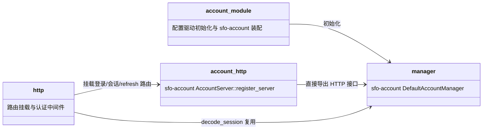

## Approval Record

- approver: user
- approval_date: 2026-08-19
- user_statement: 确认，自动完成001任务吧


# account 子模块设计（P-01 fh-server-account）

## Design Scope

- 归属：`filehub-server` crate 内 `server/src/account/` 子 mod。
- 覆盖：配置驱动账号初始化适配、`sfo-account` 装配（`DefaultAccountManager` + `AccountStore` 实现）、直接导出 `sfo-account` 的 HTTP 接口（`AccountServer::register_server` 挂载登录/会话信息/refresh 路由）、认证中间件对 session 凭据的解码复用（`AccountManager::decode_session`）、与 token 凭据的类型区分（登录 session -> `Principal::User`；token session -> `Principal::Token`）。
- 不覆盖：账号业务逻辑（复用 `sfo-account` 的 `Account`/`DefaultAccountManager`）、注册/后台建号、角色模型（归 permissions）、token（归 tokens）。
- 不覆盖（第四次修订）：自建 session 生命周期管理、`SessionService`/`JwtSessionVerifier` 与自定义登录/登出/session 列表/逐会话撤销 handler；session 语义以 `sfo-account` 现役能力为准。

## Module Relationship UML



## File-Level Interfaces

```rust
// server/src/account/mod.rs：配置驱动初始化 + sfo-account 装配；不自建领域服务
pub struct AccountModule {
    manager: Arc<DefaultAccountManager<FilehubAccount, SqliteAccountStore>>,
}

impl AccountModule {
    // [users] 每项含用户名、密码或密码哈希；可选 role = "owner"|"member"（缺省 member）由 permissions::PermissionsModule::init 消费，
    // account 只负责 users 表，不写 account_roles
    pub async fn init(config: &UsersConfig, db: &SqlitePool) -> Result<Self, AccountInitError>;
    // 直接导出 sfo-account 的 HTTP 接口（AccountServer::register_server 装配），filehub 不自写 handler：
    //   POST /account/login                      -> LoginResp { session, refresh_session }
    //   POST /account/get_account_info_of_session -> FilehubAccount
    //   GET  /account/get_account_info             -> FilehubAccount（Authorization: Bearer <session>）
    //   POST /account/refresh_session              -> LoginResp（Authorization: Bearer <refresh_session>）
    pub fn register_http<S: HttpServer<Req, Resp>>(&self, server: &mut S);
    // 认证中间件 session 校验：直接复用 sfo-account 解码（不保留独立 JwtSessionVerifier）
    pub async fn decode_session(&self, bearer_session: &str) -> Result<FilehubAccount, SessionError>;
    pub fn current_user(&self, account: &FilehubAccount) -> CurrentUser;
}

pub struct CurrentUser { pub id: UserId, pub username: String }
```

- Consumer: `http` 模块获取 `AccountModule`，调用 `register_http` 挂载 `sfo-account` 路由；认证中间件调用 `decode_session` 校验 Bearer session 并配合 `current_user` 构造 `Principal::User`（无凭据请求构造 `Principal::Anonymous`）；`permissions` 通过 `CurrentUser` 建立 `Principal::User`；token JWT 走 tokens::resolve 建立 `Principal::Token`（凭据类型按验签路径分支）；change_id `fh-server-account`
- Compatibility: new
- Migration path when required: 不适用（greenfield）

## State and Ownership

- Owner: `users` 表（SQLite，实现 `sfo-account` 的 `AccountStore` 接口）；sessions 是 `sfo-account` 签发的无状态 JWT，不新增 session 数据表，过期由 JWT `exp` 承载，续期走 `POST /account/refresh_session`
- Access path for other modules: `AccountModule::decode_session` / `DefaultAccountManager` 接口；`users` 表不对外直读
- Invariants: 配置 `[users]` 启动幂等初始化；session JWT 过期/解码失败时验证不通过；session 凭据仅经 `Authorization` 头携带（不用 cookie）；session 凭据与 token 凭据在解析路径上互不混用（两类验签密钥来源分离，不可互冒）

## Change Mapping

| change_id | target_module | proposal_id | Design Coverage | Scope Paths |
|-----------|---------------|-------------|-----------------|-------------|
| fh-server-account | filehub | P-01 | 本文件 + design.md account 装配与登录时序 | `server/src/account/`, `server/migrations/0002_accounts.sql`, `tests/` |

## Design Notes

- 直接导出 `sfo-account` HTTP 接口：`AccountServer::register_server(server, manager)` 挂载 `POST /account/login`、`POST /account/get_account_info_of_session`、`GET /account/get_account_info`、`POST /account/refresh_session`；路由路径与请求/响应以 `sfo-account` v0.2 接口为准，filehub 不新增登录/登出/session 列表/逐会话撤销路由，不定义 `SessionService`。
- 认证中间件 session 校验：直接复用 `DefaultAccountManager::decode_session`（`AccountModule::decode_session` 作薄适配），不保留独立 `JwtSessionVerifier` 对象；登录 session 与 token 凭据的验签密钥来源、claims 与解析路径分离，token 凭据由 tokens 模块解析，两类不可互冒。
- 存储：账号数据经本模块实现的 `AccountStore` 落 SQLite `users` 表；sessions 无独立表，不存在服务端 session 生命周期状态需要维护。
- 登录成功后返回 session + refresh_session，客户端后续请求带 `Authorization: Bearer <session-token>`，refresh 续期按 `sfo-account` 语义调用 `/account/refresh_session`；TTL/续期不新造模型。
- 不实现账号领域 trait（如 `AccountService`、`SessionService`）：账号逻辑全部来自 `sfo-account`。
- `UsersConfig` 的 `role` 字段属权限域配置：account 模块忽略该字段，`permissions` 模块在启动装配同一阶段读取并幂等初始化 `account_roles`；避免角色数据进入账号模块。
- 接口并发语义（第五次修订）：本模块无自建服务 trait；`init`（配置/SQLite 初始化）与 `decode_session` 为 async，`register_http`/`current_user` 保持同步。
- 测试设计由 testing 阶段承接。
