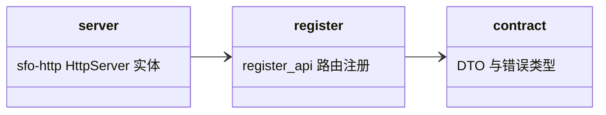

## Approval Record

- approver: user
- approval_date: 2026-08-19
- user_statement: 确认，自动完成001任务吧


# http 子模块设计（P-07 fh-server-http）

## Design Scope

- 归属：`filehub-server` crate 内 `server/src/http/` + `server/src/contract/` 子 mod。
- 覆盖：`/api/v1` 路由注册、请求/响应 DTO、HTTP 错误映射、统一端点包装（认证/授权/请求上下文）、sfo-http 服务装配（监听/CORS/配置装载）、`sfo-log` 日志、v1 契约冻结、失败/超时/幂等边界。
- 不覆盖：业务逻辑、权限判定、物理存储、会话/token 生命周期（均在各自子模块）。

## Module Relationship UML



## File-Level Interfaces

```rust
// 装配配置：main.rs 从配置文件装载，来源与格式在实现期锁定
pub struct ServerConfig {
    pub http: HttpConfigSeed,    // [server] 文件 DTO（反序列化用）；main.rs 转为 sfo-http HttpServerConfig
    pub users: UsersConfig,      // [users]：账号（用户名、密码或密码哈希），无角色字段
    pub files: FilesConfig,      // [files]：data_dir、max_archive_bytes
}
pub struct HttpConfigSeed {
    pub server_addr: String,
    pub port: u16,
    pub allow_origins: Vec<String>,
    pub allow_methods: Vec<String>,
    pub allow_headers: Vec<String>,
    pub expose_headers: Vec<String>,
    pub max_age: usize,
    pub support_credentials: bool,
}
pub struct FilesConfig { pub data_dir: PathBuf, pub max_archive_bytes: u64 }

// sfo-http 装配唯一入口：把全部子模块 handler 经 HttpServer::serve 注册；不返回框架 Router；
// 声明为 async（第五次修订的 http 公共入口语义），本体内无阻塞 IO
pub async fn register_api<S: HttpServer<Req, Resp>>(server: &mut S, state: AppState);

// main.rs 装配示例：
//   let http_config = HttpServerConfig::new(seed.server_addr, seed.port) // 由 HttpConfigSeed 转换
//       .allow_origins(seed.allow_origins) .allow_methods(seed.allow_methods) ...;
//   let mut server = ActixHttpServer::new(http_config);       // 或 TideHttpServer，实现期二选一锁定
//   http::register_api(&mut server, state).await;
//   server.run().await;
// HTTPS 由部署面前置反向代理终结到该监听端口（sfo-http 0.7 服务端不提供 TLS）

// 统一错误映射：401 未认证 / 403 越权 / 404 不存在 / 409 版本已存在 / 422 参数非法
pub enum ApiError { Unauthenticated, Forbidden, NotFound, Conflict, InvalidInput }
impl ApiError { /* 映射为 sfo-http 响应：from_result / 显式 status 与 body */ }

// 凭据解析只接受 Authorization: Bearer <token>，不用 cookie
pub struct Bearer(pub String);
pub async fn extract_bearer(request: &Request) -> Result<Bearer, ApiError>;

// 请求上下文：中间件构造，经 sfo-log 输出 request_id/method/path/status/duration/principal 类型；
// 不得记录凭据明文、请求体、token/session 内容
pub struct RequestContext { pub request_id: String, pub principal: Principal, pub started_at: SystemTime }
```

- Consumer: `server/src/main.rs` 启动入口；web（002）/ cli（003）消费 v1 契约；change_id `fh-server-http`
- Compatibility: new
- Migration path when required: 不适用（greenfield）

## 认证与授权统一包装

sfo-http 的 `HttpServer` trait 面向端点注册（`serve(path, method, endpoint)`），不提供 Axum 式框架中间件注入；认证/授权/请求上下文以 http 模块的统一端点包装器实现——每个 handler 注册前包一层 `authz(resource, action, handler)`，职责等价于中间件链路：

1. `extract_bearer` 从 `Authorization: Bearer` 取凭据；无凭据构造 `Principal::Anonymous`；非 Bearer 或格式非法返回 401。
2. 凭据分支（不可互冒）：登录 session JWT 走 `AccountModule::decode_session` -> `Principal::User`；token JWT 走 `TokenService::resolve` -> `Principal::Token`；两条验签路径均失败返回 401。
3. 路由级授权统一调用 `permissions::can_access(principal, resource, action)`：401 指未认证/凭据失效，403 指已认证但越权；公开只读路由放行 `Principal::Anonymous`。
4. 子模块写接口（publish/create/set_visibility/delete、协作者管理）内部的权限核心调用是同一入口的纵深校验，不构成第二套判定逻辑。

## v1 路由契约（冻结）

路由与动作映射如下；`docs/api/v1-contract.md` 在 I-008 从本表落盘（含示例与错误码），成为 002/003 唯一契约源。

| method | path | 认证 | action | 成功响应 |
|--------|------|------|--------|----------|
| POST | `/account/login` | 匿名 | 登录（sfo-account 导出） | 200 `LoginResp{session, refresh_session}` |
| POST | `/account/get_account_info_of_session` | session | 会话信息（sfo-account 导出） | 200 account info |
| GET | `/account/get_account_info` | session | 当前账号（sfo-account 导出） | 200 account info |
| POST | `/account/refresh_session` | refresh session | 续期（sfo-account 导出） | 200 `LoginResp` |
| GET | `/api/v1/projects` | 匿名/session/token | 列表（按可见性过滤） | 200 `Project[]` |
| POST | `/api/v1/projects` | session/token | `projects:create` | 201 `Project` |
| GET | `/api/v1/projects/{project_id}` | 匿名(public)/session/token | `metadata:read` | 200 `Project` / 404 |
| PATCH | `/api/v1/projects/{project_id}/visibility` | session/token | `administration` | 200 `Project` |
| DELETE | `/api/v1/projects/{project_id}` | session/token | `projects:delete` | 204 |
| GET | `/api/v1/projects/{project_id}/collaborators` | session/token | `administration` | 200 `Collaborator[]` |
| PUT | `/api/v1/projects/{project_id}/collaborators/{user_id}` | session/token | `administration` | 200 `Collaborator` |
| DELETE | `/api/v1/projects/{project_id}/collaborators/{user_id}` | session/token | `administration` | 204 |
| POST | `/api/v1/tokens` | session | 创建 | 201 `TokenIssued`（jwt 仅此一次） |
| GET | `/api/v1/tokens` | session | 列表 | 200 `TokenSummary[]`（无过期字段） |
| PATCH | `/api/v1/tokens/{token_id}` | session | 属性修改 | 200 `TokenIssued`（重签）或 `TokenSummary`（仅 name） |
| POST | `/api/v1/tokens/{token_id}/rotate` | session | 轮换 | 200 `TokenIssued` |
| DELETE | `/api/v1/tokens/{token_id}` | session | 撤销 | 204 |
| POST | `/api/v1/projects/{project_id}/versions` | session/token | `artifacts:write`（multipart：`version` + `.tar.gz`） | 201 `VersionRecord` |
| GET | `/api/v1/projects/{project_id}/versions` | 匿名(public)/session/token | `metadata:read` | 200 `VersionRecord[]` |
| GET | `/api/v1/projects/{project_id}/versions/{version}` | 匿名(public)/session/token | `metadata:read` | 200 `VersionRecord` / 404 |
| GET | `/api/v1/projects/{project_id}/versions/{version}/download` | 匿名(public)/session/token | `artifacts:read` | 200 `.tar.gz` 流 |
| GET | `/api/v1/projects/{project_id}/versions/latest` | 匿名(public)/session/token | `metadata:read` | 200 latest `VersionRecord` |
| GET | `/api/v1/projects/{project_id}/versions/latest/download` | 匿名(public)/session/token | `artifacts:read` | 200 latest `.tar.gz` 流 |

DATA 归属：所有 `Project/Version/Collaborator/TokenSummary` 响应的字段以子模块记录为准；错误统一 `ApiError` 映射（401 未认证/凭据无效——含 Anonymous 访问 private；403 已认证但越权；404 已认证但不具备资源可见性/资源不存在；409 版本已存在；422 参数非法/非 `.tar.gz`/超限/非法过期参数；其余落库/存储失败 5xx）。
LATEST 语义：`latest` = 该项目最近发布的版本（`published_at` 倒序第一条），与 003 下载语义一致。
TOKEN 过期契约：`expires_at` 只出现在 `TokenIssued`；列表接口不含过期，002 页面不得依赖列表展示过期时间（见 tokens.md 契约定位）。

## 失败、超时与幂等边界

- 上传中断/校验失败：ingest 内部清理临时文件，不产生可见文件；客户端可安全重试。
- 版本发布重试：`<project>:<version>` 唯一约束使重试天然幂等——重复请求返回 409，不重复入库/落库。
- 进程中断：启动装配执行 `versions.referenced_file_ids()` + `files.gc_orphans(keep)` 回收孤儿文件。
- 下载中断：仅中断当前流，不影响已提交文件与后续下载。
- token 创建/轮换重试：服务端不保存 JWT 明文；客户端未收到成功响应即视为未签发，重试 = 新建/再次轮换，旧凭据在轮换后立即失效，响应一次性返回。
- 写接口超时/连接断开：HTTP 层返回 5xx 或连接错误，业务侧按上述幂等/回滚规则收敛，不产生半成品版本或孤儿文件。

## State and Ownership

- Owner: 无持久化数据；只持有装配态 `AppState`（各子模块 service 引用）与 `ServerConfig`（main.rs 装载）
- Access path for other modules: 各子模块提供 handler，http 只注册与接线
- Invariants: 路由只调用子模块公开接口；凭据只从 `Authorization` 头读取；错误统一 `ApiError`；v1 契约以本文件路由表为冻结源

## Change Mapping

| change_id | target_module | proposal_id | Design Coverage | Scope Paths |
|-----------|---------------|-------------|-----------------|-------------|
| fh-server-http | filehub | P-07 | 本文件 + design.md register_api 与 Key Flows | `server/src/http/`, `server/src/contract/`, `docs/api/v1-contract.md`, `tests/` |

## Design Notes

- 各子模块自带 `http.rs`（sfo-http handler），本模块 `register_api` 负责把它们经 `HttpServer::serve` 注册进 sfo-http 服务器实体，避免装配层变成“业务 God 模块”。
- API 契约文档 `docs/api/v1-contract.md` 为 web/CLI 唯一契约源：内容由本文件冻结路由表在 I-008 落盘，示例与错误码随契约冻结，不再在设计之后新增端点。
- 装配与配置（第六次修订）：HTTP 服务器统一为 `sfo-http`——`HttpServerConfig` 承载监听地址/端口与 CORS（来自 `[server]`），`ActixHttpServer`/`TideHttpServer` 二选一在实现期锁定，`register_api` 完成全部路由注册后 `run()`；TLS/HTTPS 由部署面前置反向代理终结，证书与私钥路径不进入应用日志；`data_dir` 与归档上限为部署配置（对应需求 P-07 的监听/TLS 与风险项“目录打包上限”）。
- 日志与请求上下文：每个请求生成 request_id，sfo-log 输出 method/path/status/duration/principal 类型；日志白名单不含凭据、请求体与 token/session 内容。
- 消费映射：002 页面对应 projects/collaborators/tokens/versions 读接口与 token 创建响应；003 CLI 对应登录、发布（POST versions）、版本列表/下载（含 latest）；契约差异（如 002 token 列表过期展示）在本表冻结后按 tokens.md 契约定位对齐。
