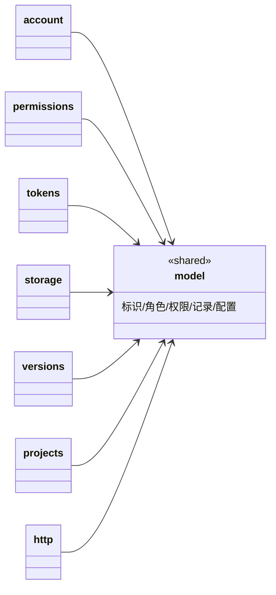

## Approval Record

- approver: user
- approval_date: 2026-08-19
- user_statement: 确认，自动完成001任务吧


# model 共享子模块设计（跨模块值类型与配置）

## Design Scope

- 归属：`filehub-server` crate 内 `server/src/model/` 共享子 mod。
- 覆盖：跨子模块复用的值类型与配置 DTO——`UserId`/`ProjectId`/`TokenId`/`FileId` 标识、`AccountRole`/`ProjectRole` 角色、`Scope`/`ProjectScope`/`ScopeSet`/`Visibility`、`Principal`/`Resource`、跨模块记录（`CurrentUser`/`ProjectRecord`/`VersionRecord`/`FileRecord`/`Collaborator`/`TokenSummary`/`TokenIssued`）以及装配配置（`UsersConfig`/`ServerConfig`/`FilesConfig`/`HttpConfigSeed`）。
- 不覆盖：任何业务逻辑、持久化状态、HTTP 路由或 sfo-http 依赖。

## Module Relationship UML



依赖方向：所有子模块只消费 `model` 的纯值类型，`model` 不依赖任何子模块；图中无环。

## File-Level Interfaces

```rust
// server/src/model/id.rs：带 Display/FromStr/序列化的标识新类型
pub struct UserId(pub i64);
pub struct ProjectId(pub i64);
pub struct TokenId(pub i64);
pub struct FileId(pub String); // 文件标识 = uuid 字符串

// server/src/model/role.rs
pub enum AccountRole { Owner, Member }          // 缺省 Member
pub enum ProjectRole { Read, Write, Admin }

// server/src/model/scope.rs：token 权限与项目可见性
pub enum Scope { MetadataRead, ArtifactsRead, ArtifactsWrite, Administration, ProjectsCreate, ProjectsDelete }
pub enum ProjectScope { All, Specified(Vec<ProjectId>) }
pub struct ScopeSet(pub std::collections::HashSet<Scope>);
pub enum Visibility { Public, Private }

// server/src/model/principal.rs：认证/授权统一输入
pub enum Principal {
  Anonymous,
  User { user_id: UserId, account_role: AccountRole },
  Token { token_id: TokenId, scopes: ScopeSet, user_id: UserId },
}
pub enum Resource { Project(ProjectId), Feature(FeatureName) }
pub struct FeatureName(pub &'static str); // "projects:create" 等动作域

// server/src/model/record.rs：跨模块记录
pub struct CurrentUser { pub id: UserId, pub username: String }
pub struct ProjectRecord { pub project_id: ProjectId, pub name: String, pub visibility: Visibility, pub owner: UserId }
pub struct FileRecord { pub file_id: FileId, pub sha256: String, pub size: u64 }
pub struct VersionRecord { pub project_id: ProjectId, pub version: String, pub file_id: FileId, pub sha256: String, pub size: u64, pub published_at: chrono::DateTime<chrono::Utc> }
pub struct Collaborator { pub user_id: UserId, pub role: ProjectRole }
pub struct TokenSummary { pub token_id: TokenId, pub name: String, pub project_scope: ProjectScope, pub scopes: ScopeSet, pub created_at: chrono::DateTime<chrono::Utc>, pub updated_at: chrono::DateTime<chrono::Utc> }
pub struct TokenIssued { pub token_id: TokenId, pub jwt: String, pub name: String, pub expires_at: Option<chrono::DateTime<chrono::Utc>> }

// server/src/model/config.rs：装配配置 DTO（main.rs 反序列化用）
pub struct UsersConfig { pub users: Vec<UserConfig>, pub session_key: String }
pub struct UserConfig { pub username: String, pub password: Option<String>, pub password_hash: Option<String>, pub role: Option<String> }
pub struct FilesConfig { pub data_dir: PathBuf, pub max_archive_bytes: u64 }
pub struct HttpConfigSeed { pub server_addr: String, pub port: u16, pub allow_origins: Vec<String>, pub allow_methods: Vec<String>, pub allow_headers: Vec<String>, pub expose_headers: Vec<String>, pub max_age: usize, pub support_credentials: bool }
pub struct ServerConfig { pub server: HttpConfigSeed, pub users: UsersConfig, pub files: FilesConfig }
```

- Consumer: account（UserId/UsersConfig）、permissions（Principal/Resource/角色/ProjectRecord）、tokens（TokenId/Scope/Token*）、storage（FileId/FileRecord）、versions（VersionRecord/FileId）、projects（ProjectId/ProjectRecord/Principal）、http（全部 DTO/错误响应结构）；兼容性 new。
- Compatibility: new
- Migration path when required: 不适用（greenfield 新 crate）。

## State and Ownership

- Owner: 无持久化数据；model 只拥有类型定义，不允许持有 session/token/file 状态。SQLite 表归属仍在各业务子模块（见 design.md State and Ownership）。
- Access path for other modules: 直接 import model 值类型；反向禁止（model 不 import 任何业务子模块）。
- Invariants: 标识类型在 SQLite 中的形成为 `INTEGER PRIMARY KEY`（UserId/ProjectId/TokenId）或 `TEXT` uuid（FileId）；角色/权限枚举的字符串序列化与 SQLite 存储值一一对应，见 design.md 各子模块 State and Ownership。

## Change Mapping

| change_id | target_module | proposal_id | Design Coverage | Scope Paths |
|-----------|---------------|-------------|-----------------|-------------|
| fh-server-account | filehub | P-01 | 本文件 + design.md 共享模型依赖方向（标识/配置为全部子模块底座） | `server/src/model/`, `server/src/` |

## Design Notes

- 任何需要同时被 permissions/account/projects/tokens 引用的标识与枚举都集中在此，避免"公共工具夹"式无职责模块：本模块的唯一职责是文件名可验证的共享值类型与配置契约。
- 访问矩阵逻辑、物理存储、JWT 解析与 HTTP/DTO 不进入本模块。
- 具体文件名与实现期命名以本文件与 design.md File-Level Implementation Sequence 为准。
