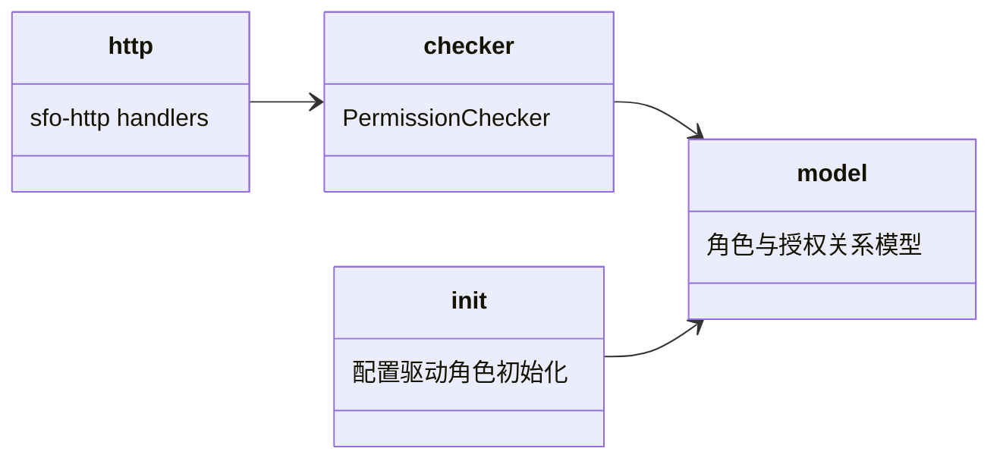

## Approval Record

- approver: user
- approval_date: 2026-08-19
- user_statement: 确认，自动完成001任务吧


# permissions 子模块设计（P-02 fh-server-permissions）

## Design Scope

- 归属：`filehub-server` crate 内 `server/src/permissions/` 子 mod。
- 覆盖：权限数据存储（账号角色、项目协作角色与授权关系）、统一校验入口、访问矩阵（冻结）、配置驱动角色初始化、协作者管理 HTTP 接口（含协作者列表）。
- 不覆盖：token 生命周期（归 tokens）、项目实体（归 projects）、账号身份（归 account）。

## Module Relationship UML



## File-Level Interfaces

```rust
// Principal::Anonymous 承载 public 项目匿名只读（版本列表与下载）；无凭据请求统一构造为 Anonymous
pub enum Principal {
    Anonymous,
    User(UserId, AccountRole),                        // 登录 session（AccountModule::decode_session）
    Token(TokenId, ScopeSet, UserId),                 // token session（token scopes + 所属用户，二次限制用）
}
pub enum Resource { Project(ProjectId), Version(ProjectId), File(ProjectId), Feature(FeatureName) }
pub struct Collaborator { pub user_id: UserId, pub role: ProjectRole }

// 统一授权入口：所有放行判定（含协作者管理自身的前置校验）只经本 trait
pub trait PermissionChecker {
    async fn can_access(&self, principal: &Principal, resource: &Resource, action: &str) -> Result<bool, PermissionError>;
    async fn list_collaborators(&self, project: &ProjectId, actor: &Principal) -> Result<Vec<Collaborator>, PermissionError>;
    async fn grant_collaborator(&self, project: &ProjectId, actor: &Principal, user: &UserId, role: ProjectRole) -> Result<(), PermissionError>;
    async fn update_collaborator(&self, project: &ProjectId, actor: &Principal, user: &UserId, role: ProjectRole) -> Result<(), PermissionError>;
    async fn remove_collaborator(&self, project: &ProjectId, actor: &Principal, user: &UserId) -> Result<(), PermissionError>;
}

// 项目读取端口：projects 表归属 projects 模块，权限判定需要可见性/owner 时只经该只读端口读取
pub trait ProjectAccess: 'static + Send + Sync {
    async fn project(&self, project_id: &ProjectId) -> Result<Option<ProjectRecord>, PermissionError>;
    async fn list_projects(&self) -> Result<Vec<ProjectRecord>, PermissionError>;
}

// 配置驱动角色初始化（[users] role 字段，缺省 member；与 account 的 users 表初始化同一启动阶段幂等执行）
pub struct PermissionsModule { checker: Arc<dyn PermissionChecker> }
impl PermissionsModule {
    // project_access 由 projects 子模块实现（SqliteProjectAccess），仅用于读取项目可见性/owner；
    // permissions 不直接读写 projects 表
    pub async fn init(config: &UsersConfig, db: &SqlitePool, project_access: Arc<dyn ProjectAccess>) -> Result<Self, PermissionInitError>;
    pub fn checker(&self) -> Arc<dyn PermissionChecker>;
}
```

- Consumer: `http`（协作者路由）、`versions`、`projects` 经 checker 校验；`ProjectAccess` 由 projects 子模块实现并注入；change_id `fh-server-permissions`
- Compatibility: new
- Migration path when required: 不适用（greenfield）

## 访问矩阵（冻结）

动作常量（`action` 字符串，即需求 P-03 的权限常量）：

- 项目级：`metadata:read`（项目/版本元数据与列表可见性）、`artifacts:read`（下载 `.tar.gz`）、`artifacts:write`（发布版本）、`administration`（协作者管理、public/private 切换、项目设置）；
- 账号级：`projects:create`、`projects:delete`。

账号级判定（`Resource::Feature`）：

| action | Anonymous | member | owner | 备注 |
|--------|-----------|--------|-------|------|
| `projects:create` | deny | deny | allow | token 需携带 `projects:create` 且所属用户为 owner |
| `projects:delete` | deny | deny | allow | token 需携带 `projects:delete` 且所属用户为 owner |

项目级判定（`Resource::Project`/`Version`/`File`；private 项目先满足可见性约束）：

| action | public + Anonymous | read | write | admin | project owner（隐式 admin） |
|--------|--------------------|------|-------|-------|----------------------------|
| `metadata:read` | allow | allow | allow | allow | allow |
| `artifacts:read` | allow | allow | allow | allow | allow |
| `artifacts:write` | deny | deny | allow | allow | allow |
| `administration` | deny | deny | deny | allow | allow |

可见性规则：

- public 项目：Anonymous 仅可执行 `metadata:read`/`artifacts:read`（只读），其余动作一律 deny；User/Token 按账号级与项目角色继续判定；
- private 项目：Anonymous 一律 deny；User/Token 需为项目 owner 或持有项目角色。

token 二次限制：有效权限 = 所属用户当前权限 ∩ token scope 快照；`can_access` 在 `Principal::Token` 分支内执行该交集，token 权限不超出其所属用户，账号级动作还需用户为 owner。

项目 owner 为隐式 admin：`projects.owner` 即项目最高权限身份，不需要向 `project_grants` 写入 owner 行；协作角色只记录非 owner 用户。

协作者管理动作本身不依赖调用方先验权：`grant/update/remove/list_collaborators` 内部先执行 `can_access(actor, Project, administration)`，仅 project owner 或 admin 协作者可管理。

## State and Ownership

- Owner: `account_roles`、`project_grants` 表（授权关系以项目为载体）；`account_roles` 在启动装配时按 `[users].role`（缺省 `member`）幂等 upsert，删除与新建用户跟随 users 表初始化顺序
- Access path for other modules: `PermissionChecker` 唯一入口；业务子模块不自行拼装权限
- Invariants: token 权限不超过所属用户权限；授权变更即时生效；public 匿名只读/private 强制授权按上表冻结；协作者管理先过 `administration`

## Change Mapping

| change_id | target_module | proposal_id | Design Coverage | Scope Paths |
|-----------|---------------|-------------|-----------------|-------------|
| fh-server-permissions | filehub | P-02 | 本文件 + design.md PermissionChecker | `server/src/permissions/`, `server/migrations/0003_roles_grants.sql`, `tests/` |

## Design Notes

- 协作者管理 HTTP 接口属于本模块，基于 `sfo-http` 实现（用户已确认）。
- `owner`/`member` 语义当前保留账号级（GitHub 风格），属本模块数据模型；若用户改为纯项目角色，仅改 model 与访问矩阵。
- `Principal::Anonymous` 是本设计新增的枚举变体（需求“public 项目匿名只读”的唯一表达载体）；认证中间件无凭据时构造 Anonymous，所有写动作与 private 资源据此 deny。
- 协作者列表接口为 002-web“查看项目协作者与角色”的契约支撑；列表本身也要求 `administration`。
- 账号角色初始化：`[users]` 每项支持可选 `role = "owner" | "member"`，缺省 `member`（fail-closed）；这是对提案“角色首版由配置初始化”的唯一落地路径。
- `ProjectAccess`（只读端口）由 `projects` 子模块的 `SqliteProjectAccess` 实现，`PermissionsModule::init` 注入；权限核心只经该端口读取项目可见性与 owner，不直接访问 projects 表，与「跨模块只经 owner 端口访问」保持一致（见 design.md Design Notes）。
- `PermissionsModule::init` 为 async（第五次修订的 IO 接口语义：SQLite 写入与配置读取）。
