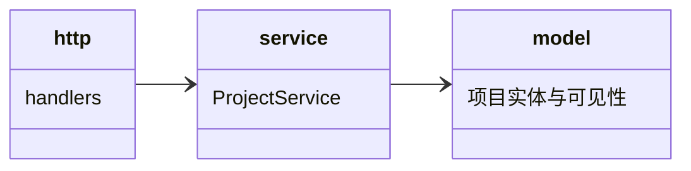

## Approval Record

- approver: user
- approval_date: 2026-08-19
- user_statement: 确认，自动完成001任务吧


# projects 子模块设计（P-06 fh-server-projects）

## Design Scope

- 归属：`filehub-server` crate 内 `server/src/projects/` 子 mod。
- 覆盖：项目创建/列表/删除、public/private 可见性切换、项目与版本集合的归属模型。
- 不覆盖：版本/文件数据（versions/files）、角色与授权数据（permissions）。

## Module Relationship UML



## File-Level Interfaces

```rust
pub enum Visibility { Public, Private }
pub struct ProjectRecord { pub project_id: ProjectId, pub name: String, pub visibility: Visibility, pub owner: UserId }

pub trait ProjectService {
    async fn create(&self, actor: &Principal, name: &str, visibility: Visibility) -> Result<ProjectRecord, ProjectError>;
        // actor 必须为 User/Token 且经权限核心 projects:create 放行；owner = actor 的用户 id；Anonymous deny
    async fn list(&self, actor: &Principal) -> Result<Vec<ProjectRecord>, ProjectError>;
    async fn set_visibility(&self, project: &ProjectId, actor: &Principal, visibility: Visibility) -> Result<(), ProjectError>;
    async fn delete(&self, project: &ProjectId, actor: &Principal) -> Result<(), ProjectError>;
}
```

- Consumer: `http`（项目路由）与 `permissions`（授权关系以项目为载体）；change_id `fh-server-projects`
- Compatibility: new
- Migration path when required: 不适用（greenfield）

## State and Ownership

- Owner: `projects` 表（含 owner 字段）；可见性与写操作判定调用 permissions checker
- Access path for other modules: `ProjectService` trait
- Invariants: public 匿名只读、private 强制授权；任何写操作需有效 session/token 且通过权限判定；`projects.owner` 为隐式 admin（无需写入 project_grants）；创建/删除分别受 `projects:create`/`projects:delete` 账号级权限控制，project admin 不自动获得删除权

## Change Mapping

| change_id | target_module | proposal_id | Design Coverage | Scope Paths |
|-----------|---------------|-------------|-----------------|-------------|
| fh-server-projects | filehub | P-06 | 本文件 + design.md ProjectService | `server/src/projects/`, `server/migrations/0007_projects.sql`, `tests/` |

## Design Notes

- 依赖 versions（P-05）承载版本集合归属，依赖 permissions 做可见性放行，本模块不重复实现判定。
- 创建流程：http 中间件执行 `can_access(actor, Feature, projects:create)` -> `ProjectService::create` -> `projects.owner = actor.user_id`；owner 由此获得全部项目级能力（隐式 admin），无需额外的 owner 授权行。
- `list` 按权限核心过滤可见项目：Anonymous 仅 public；User/Token 为 public + 拥有项目角色/owner 的 private 项目。
- 本子模块实现 `permissions::ProjectAccess`（`SqliteProjectAccess`）：对权限核心只读暴露 `projects` 表（可见性/owner/全量项目列表），权限模块不直读 projects 表。
- `set_visibility` 需 `administration`（owner 或 admin 协作者）；`delete` 需账号级 `projects:delete`（与提案“删除项目由账号级权限控制”一致）。
