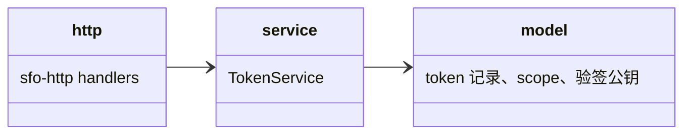

## Approval Record

- approver: user
- approval_date: 2026-08-19
- user_statement: 确认，自动完成001任务吧


# tokens 子模块设计（P-03 fh-server-tokens）

## Design Scope

- 归属：`filehub-server` crate 内 `server/src/tokens/` 子 mod。
- 覆盖：JWT 形态 token 的签发（创建）、列表、撤销、轮换与属性修改；token 服务端属性存储（名称、权限范围、验签公钥——签名私钥签发后即弃、不落库；token 本身无过期时间，过期仅存在于签发 JWT 的 `exp` 声明）；token 凭据解析（`resolve`）；token session 与用户登录 session 的凭据类型区分。
- 不覆盖：业务放行判定（permissions checker）、用户登录 session（归 account，见 design/account.md）、账号角色模型（归 permissions）。

## Module Relationship UML



## File-Level Interfaces

```rust
pub struct TokenCreateRequest { pub owner: UserId, pub name: String, pub project_scope: ProjectScope, pub scopes: Vec<Scope>, pub expires_at: Option<DateTime> }
// expires_at 仅作为本次签发参数写入 JWT exp（最长 1 年或不过期由服务端签发时校验），不存入 token 记录

pub struct TokenIssued {
    pub token_id: TokenId,
    pub jwt: String, // 仅本响应返回一次；服务端不保存任何 JWT 明文
    pub name: String,
    pub expires_at: Option<DateTime>, // 本次 JWT 的 exp，供客户端参考；token 记录中无该字段
}

pub struct TokenSummary { pub token_id: TokenId, pub name: String, pub project_scope: ProjectScope, pub scopes: Vec<Scope>, pub created_at: DateTime, pub updated_at: DateTime }
// TokenSummary 不展示过期时间：过期只存在于当前签发 JWT 的 exp，服务端不保存该值

pub struct TokenUpdateRequest {
    pub name: Option<String>,
    pub project_scope: Option<ProjectScope>,
    pub scopes: Option<Vec<Scope>>,
    pub expires_at: Option<UpdateExpires>, // 仅重签时写入新 JWT exp；token 记录不保存
}

pub trait TokenService {
    async fn create(&self, req: TokenCreateRequest) -> Result<TokenIssued, TokenError>;
    async fn list(&self, owner: &UserId) -> Result<Vec<TokenSummary>, TokenError>;
    async fn update(&self, token_id: &TokenId, owner: &UserId, patch: TokenUpdateRequest) -> Result<Option<TokenIssued>, TokenError>;
        // 权限范围/过期变更影响 JWT claims -> 生成新密钥对重签并返回新 JWT（旧 JWT 立即失效）；
        // 仅 name 变更 -> 只更新元数据，返回 None，不重签。
    async fn rotate(&self, token_id: &TokenId, owner: &UserId) -> Result<TokenIssued, TokenError>;
        // 新密钥对重签相同 claims，替换验签公钥，旧 JWT 立即失效
    async fn revoke(&self, token_id: &TokenId, owner: &UserId) -> Result<(), TokenError>;
    async fn resolve(&self, bearer: &str) -> Result<TokenPrincipal, TokenError>;
        // 用 token 记录中的验签公钥验签 + 撤销/过期/权限快照校验
}
```

- Consumer: `http`（token 路由）与认证中间件（调用 `resolve` 构造 `Principal::Token`）；`permissions::checker` 经 `Principal::Token(TokenId, ScopeSet, UserId)` 做二次限制。change_id `fh-server-tokens`
- Compatibility: new
- Migration path when required: 不适用（greenfield）

## State and Ownership

- Owner: `tokens`、`token_scopes` 表（SQLite）；token 记录保存 owner、token_id、name、created_at、updated_at、revoked_at、当前验签公钥（verify-only，如 Ed25519 公钥字节）与 scope 快照；不保存过期时间（过期只位于签发 JWT 的 `exp` 声明）；`token_keys` 不单独成表，验签公钥作为 token 记录字段（密钥版本由 token 记录更新时间隐含）。
- 密钥生命周期：签发/重签时临时生成密钥对 -> 私钥签名 JWT 后立即丢弃（不落库、不进日志）-> 服务端仅写验签公钥；`update`（claims 变更）与 `rotate` 替换验签公钥；旧公钥随旧 JWT 一起失效。
- 凭据 JWT 明文不落库；创建/update/rotate 响应之外的读取均返回 `TokenSummary`（不含 jwt）。
- Access path for other modules: 认证中间件与 http 仅经 `TokenService::resolve` 获得 `TokenPrincipal`；其他模块不得直读 tokens/token_scopes 表。
- Invariants: 过期（JWT `exp` 判定）、撤销、轮换、重签后旧 JWT resolve 失败；token 记录无过期字段；token 权限不超过所属用户权限（权限变更由 permissions 执行二次校验）；服务端不保存签名私钥、历史 JWT 明文与过期时间。

## Change Mapping

| change_id | target_module | proposal_id | Design Coverage | Scope Paths |
|-----------|---------------|-------------|-----------------|-------------|
| fh-server-tokens | filehub | P-03 | 本文件 + design.md TokenService（JWT 签发/属性修改/轮换/凭据类型区分） | `server/src/tokens/`, `server/migrations/0004_tokens.sql`, `tests/` |

## Design Notes

- 凭据类型区分：登录 session JWT 由 account 的 `AccountModule::decode_session`（直接复用 `sfo-account` 的 `AccountManager::decode_session`）校验并构造 `Principal::User`；token JWT 由 `TokenService::resolve`（每 token 独立验签公钥）校验并构造 `Principal::Token`。两类凭据在签发密钥来源、claims（token 含 jti/sub/iat/exp/scope；session 含会话标识与用户）与解析路径上分离，token JWT 不能通过 session 验签，session JWT 也无法通过任一 token 的验签公钥。
- 过期只由 JWT `exp` 承载：token 本身没有过期时间，token 记录不保存过期字段；签发（create/update/rotate）时服务端校验"不过期或最长 1 年"并写入 JWT `exp`，不信任客户端；resolve 只校验 JWT `exp`；"不过期" 的 token 签发 JWT 不带 `exp`。
- 权限修改即时生效：update 修改 scopes 后会重签 JWT，新的 scope 快照随新 JWT 一次性返回并在下一次 resolve 生效；旧 JWT 因验签公钥被替换立即失效，不存在旧权限回退窗口。
- 契约定位：`TokenIssued.expires_at`（本次 JWT 的 exp）仅在创建/属性修订/轮换响应中返回一次；`TokenSummary` 不含过期字段。002-web"列表展示过期时间"需与之一致：服务端不持久化过期时间，web 只能展示创建响应中的值或业务文案，不能从列表接口读取；该对齐项在 v1 契约落盘时同步给 002/003。
- 轮换/撤销并发：rotate 与 revoke 在同一 SQLite 事务内替换验签公钥/写 revoked_at，resolve 以最新记录为准；旧 JWT 在替换后立即验签失败。
- 密钥类型与算法（Ed25519 或其他非对称算法）在实现阶段按依赖锁定；验签公钥序列化格式随 token 记录存储。
- 测试设计由 testing 阶段承接。
