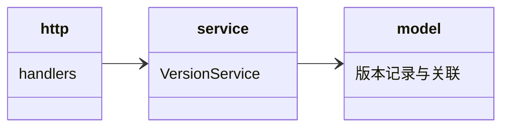

## Approval Record

- approver: user
- approval_date: 2026-08-19
- user_statement: 确认，自动完成001任务吧


# versions 子模块设计（P-05 fh-server-versions）

## Design Scope

- 归属：`filehub-server` crate 内 `server/src/versions/` 子 mod。
- 覆盖：版本元数据、版本不可覆盖、latest 语义、版本-文件关联、原子发布协调。
- 不覆盖：物理字节（files）、文件/版本权限放行（permissions）、项目实体（projects）。

## Module Relationship UML



## File-Level Interfaces

```rust
pub struct VersionRecord { pub project_id: ProjectId, pub version: String, pub file_id: FileId, pub sha256: String, pub size: u64, pub published_at: DateTime }

pub trait VersionService {
    async fn publish(&self, project: &ProjectId, version: &str, file: FileRecord, actor: &Principal) -> Result<VersionRecord, VersionError>;
    async fn list(&self, project: &ProjectId, actor: &Principal) -> Result<Vec<VersionRecord>, VersionError>;
    async fn get(&self, project: &ProjectId, version: Option<&str>, actor: &Principal) -> Result<VersionRecord, VersionError>;
    async fn referenced_file_ids(&self) -> Result<HashSet<FileId>, VersionError>;
        // 全部已发布版本引用的文件标识集合，供 files.gc_orphans(keep) 计算 keep
}
```

- Consumer: `projects`（版本集合归属依据）、`http`（发布/列表/下载路由）、启动装配（孤儿回收 keep 来源）；change_id `fh-server-versions`
- Compatibility: new
- Migration path when required: 不适用（greenfield）

## State and Ownership

- Owner: `versions`、`version_files` 表；发布顺序为权限校验 -> 文件入库 -> 版本落库
- Access path for other modules: `VersionService` trait；不直接访问 `data_dir`
- Invariants: `<project>:<version>` 唯一不可覆盖（409）；latest = 按发布时间倒序最近一次；可读版本只引用已提交文件；匿名只读仅适用于 public 项目（列表/get 对 `Principal::Anonymous` 的可见性过滤以权限核心返回为准）

## Change Mapping

| change_id | target_module | proposal_id | Design Coverage | Scope Paths |
|-----------|---------------|-------------|-----------------|-------------|
| fh-server-versions | filehub | P-05 | 本文件 + design.md VersionService 与发布时序 | `server/src/versions/`, `server/migrations/0006_versions.sql`, `tests/` |

## Design Notes

- 依赖 files（P-04）提供文件标识；若落库失败进入 Cleanup，不暴露半成品版本。
- 发布失败回滚：`http` 编排在 `publish` 返回失败（含 409）后调用 `files.discard(file_id)`，未引用文件不残留；进程中断由启动时 `referenced_file_ids()` + `files.gc_orphans(keep)` 恢复。
- 可见性过滤：`list/get` 接收 `actor`，对 private 项目只返回权限核心判定可读的版本；public 项目放行 Anonymous，但写动作无法经本模块触发（写路径在 http 已先拒绝）。
