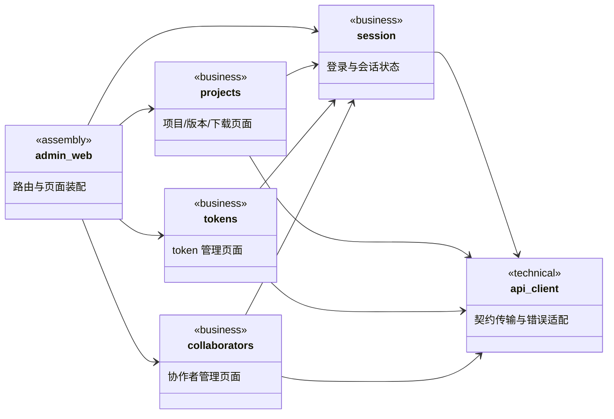
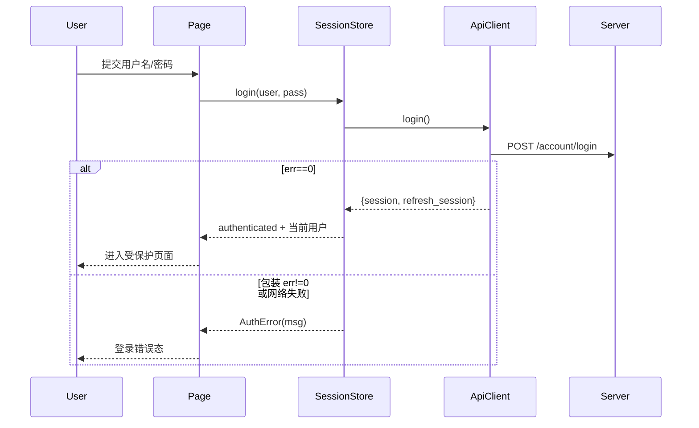
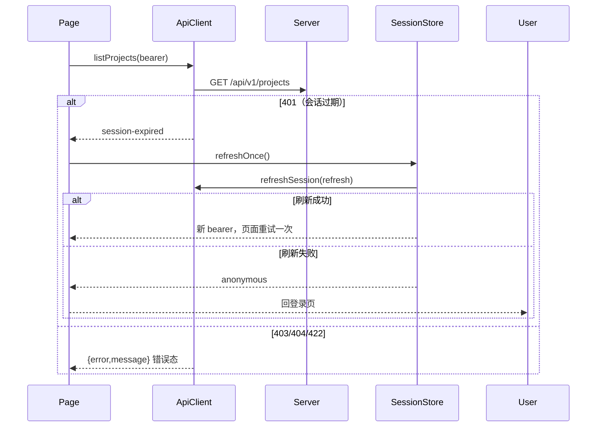
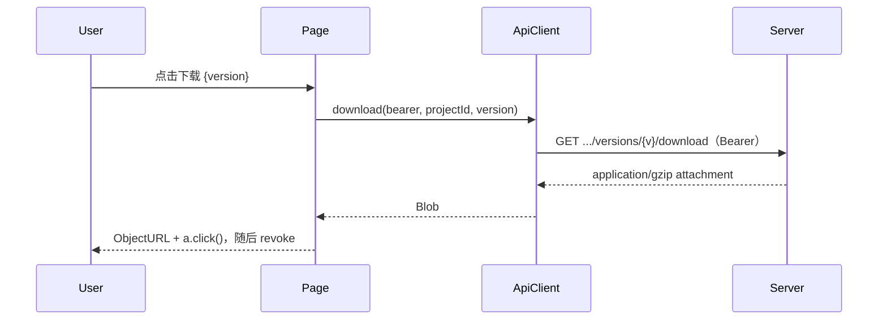
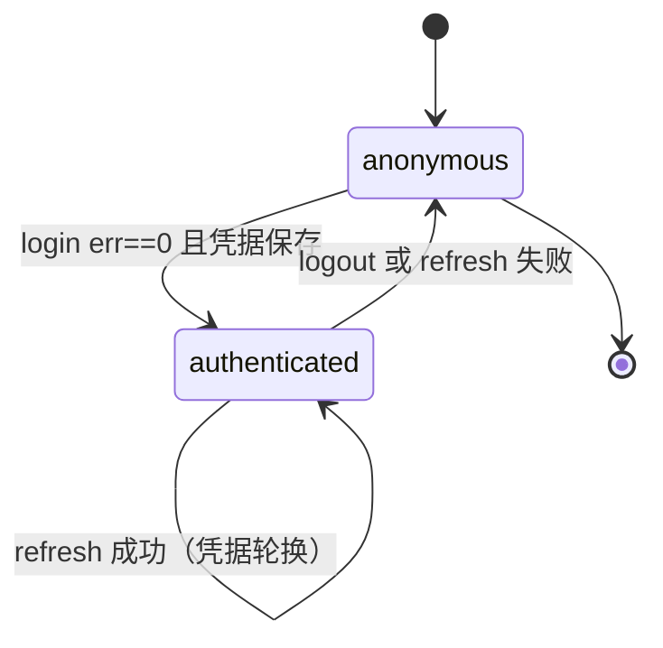

## Approval Record

- approver: user
- approval_date: 2026-08-20
- user_statement: 确认，自动完成任务


# filehub-web 管理后台设计

Risk profile: ./risk-profile.yaml

## Design Scope

### Goals

- 交付独立静态站点 `admin-web/`（React + TypeScript + Vite），实现登录/会话、可见项目/版本与下载、token 管理、项目协作者管理四个 change 覆盖的需求。
- 只消费 001 已冻结的公共 v1 契约（`docs/api/v1-contract.md` 与 server 实际行为），不实现任何服务端能力。
- 输出文件级实现顺序，使实现可按依赖顺序执行，scope 与 `task.yaml` 中 4 个 change_id 绑定一致。

### Non-goals

- 不实现服务端认证、授权、token、项目、版本与产物 API（归属 001）。
- 不实现版本发布/上传、用户注册、用户目录、服务端会话注销（当前 server 不提供，登出仅本地清除）。
- 不设计测试用例、测试计划、测试 fixtures 或验证标识（测试阶段负责）。
- 不引入 PWA/离线、i18n 多语言、换肤、Organization/团队等提案非目标能力。

## Useful Context

- 用户已确认：技术栈 React；三模块拆分；版本发布只由 CLI 承担；服务后台不托管前端资源（页面独立部署）；token 修改/轮换入口纳入首版。
- 当期 server 契约事实（设计约束，来自 `docs/api/v1-contract.md` 与 001 交付代码）：
  - 登录/refresh/account info 由 sfo-account 导出，响应为 sfo-http 包装 `{err,msg,result}`，登录失败仍为 HTTP 200；`/api/v1/*` 错误体为 `{error,message}` 且带真实状态码；
  - 凭据一律 `Authorization: Bearer`，不用 cookie；session 无登出端点，登出=清除前端本地凭据；
  - 更新语义端点（项目可见性、token 属性）当前以 POST 提供；
  - token 列表 `TokenSummary` 无过期字段；`expires_at` 只出现在创建/修改/轮换响应；`project_scope` JSON 为 `"All"` 或 `{"Specified":[...]}`；
  - 协作者接口只返回数字 `user_id`，server 无用户名/用户目录 API；
  - 下载响应 `application/gzip`、`attachment; filename="{project_id}-{version}.tar.gz"`，`latest` 关键字可用。
- 仓库为 greenfield bootstrap，admin-web 无既有代码、无迁移兼容负担；`docs/modules/filehub.md` 于设计阶段同步长期边界。

## Overall Approach

`admin-web/` 交付一个 Vite + React + TypeScript 单页应用，按职责划分为六个运行时子模块：`session`（登录/会话状态/续期/登出）、`api-client`（HTTP 传输/两套响应与错误适配/URL 装配）、`projects`（项目/版本/下载页面）、`tokens`（token 管理页面）、`collaborators`（协作者页面）、`build`（独立构建与 API base 配置）。页面只做表达与交互，权限全部以服务端响应为准；会话凭据短期保存在内存与 sessionStorage，JWT 明文仅在一次签发响应中展示。构建产物 `admin-web/dist` 独立部署，通过 `VITE_API_BASE_URL` 指向服务后台。

## Layered Design Document Index

| level | parent_document | unit | design_document | responsibility |
|-------|-----------------|------|-----------------|----------------|
| root | `design.md` | admin-web 整体 | `design.md` | 模块布局、依赖方向、状态归属、变更映射与实现顺序 |
| submodule | `design.md` | api-client（技术） | `design/api-client.md` | v1 DTO/URL/两套响应错误适配/Bearer 注入/下载 blob |
| submodule | `design.md` | session | `design/session.md` | 登录、会话状态、401 续期一次、本地登出 |
| submodule | `design.md` | projects | `design/projects.md` | 项目列表/创建/删除/可见性、版本列表、下载 |
| submodule | `design.md` | tokens | `design/tokens.md` | token 创建/列表/修改(重签)/轮换/撤销与一次性明文展示 |
| submodule | `design.md` | collaborators | `design/collaborators.md` | 按 user_id 查看/添加/改级/移除协作者 |
| submodule | `design.md` | build | `design/build.md` | Vite 构建、目录约束、API base 配置与独立静态交付 |

## Module Relationship UML



## File-Level Interfaces

```typescript
// api-client：唯一 HTTP 传输入口（consumer: session/projects/tokens/collaborators，change_ids fh-web-login/fh-web-project-versions/fh-web-token-manage/fh-web-members）
export interface ApiClientConfig { baseUrl: string; timeoutMs: number }
export class ApiClient {
  constructor(cfg: ApiClientConfig)
  login(userName: string, password: string): Promise<LoginResult>            // /account/login 包装解包
  refreshSession(refresh: string): Promise<LoginResult>                      // /account/refresh_session
  getAccountInfo(session: string): Promise<CurrentUser>                      // /account/get_account_info
  listProjects(bearer: string): Promise<Project[]>
  createProject(bearer: string, name: string, visibility: Visibility): Promise<Project>
  setVisibility(bearer: string, id: number, visibility: Visibility): Promise<Project>
  deleteProject(bearer: string, id: number): Promise<void>
  listCollaborators(bearer: string, id: number): Promise<Collaborator[]>
  setCollaborator(bearer: string, id: number, userId: number, role: ProjectRole): Promise<Collaborator>
  removeCollaborator(bearer: string, id: number, userId: number): Promise<void>
  listTokens(bearer: string): Promise<TokenSummary[]>
  createToken(bearer: string, req: TokenCreateInput): Promise<TokenIssued>
  updateToken(bearer: string, tokenId: number, patch: TokenUpdateInput): Promise<TokenIssued | TokenSummary>
  rotateToken(bearer: string, tokenId: number): Promise<TokenIssued>
  revokeToken(bearer: string, tokenId: number): Promise<void>
  listVersions(bearer: string | null, projectId: number): Promise<VersionRecord[]>
  download(bearer: string | null, projectId: number, version: string): Promise<Blob>
}

// session：会话状态与凭据保存（consumer: admin_web/页面，change_id fh-web-login）
export class SessionStore {
  constructor(client: ApiClient)
  get state(): "anonymous" | "authenticated"
  login(userName: string, password: string): Promise<SessionState>           // 失败抛 AuthError
  refreshOnce(): Promise<boolean>                                            // 401 后 refresh 一次，失败转 anonymous
  logout(): void                                                              // 仅本地清除
  bearer(): string | null                                                     // 供页面请求使用
  currentUser(): CurrentUser | null
}

// 页面组件入口（consumer: browser；change_ids 对应各页面）
export function App(): JSX.Element            // 路由装配与 ProtectedRoute 守卫
export function LoginPage(): JSX.Element
export function ProjectsPage(): JSX.Element
export function ProjectDetailPage(): JSX.Element
export function TokensPage(): JSX.Element
export function MembersPage(): JSX.Element
```

- Consumer: 上述 change_ids 与浏览器运行时
- Compatibility: new
- Migration path when required: 不适用（greenfield 新模块）

## API and Build Surface Impact

- Public API impact: none
- Crate-root export change: no
- Build-surface change: no
- Documentation examples affected: no

## Consumer Migration Closure

not-applicable: 新交付独立前端模块，无可迁移旧符号/旧消费者；不修改既有 crate 导出或构建面。

## Key Flows







## State and Ownership



- Owner: `session/SessionStore`（内存 + `sessionStorage`），唯一拥有 session/refresh_session/当前用户状态；页面仅经其读取。
- Owner: `tokens` 页面组件状态，唯一拥有「本次签发 JWT 的一次性展示」；展示后/离开页面即清除，不持久化。
- Access path for other modules: 页面经 `SessionStore.bearer()` 取凭据，经 `ApiClient` 访问 server；server 端状态不归本模块所有。
- Invariants to preserve:
  - 会话凭据不写入 `localStorage`、不进入日志与组件状态之外的存储；
  - JWT 明文只在创建/修改/轮换成功响应中展示一次；
  - 页面不做权限本地放行，越权一律呈现服务端 401/403；
  - 下载必须携带 Bearer（匿名 public 文件除外），文件名遵循 `{project_id}-{version}.tar.gz`。

## Directly Mapped Change Items

| change_id | target_module | proposal_id | Design Coverage | Scope Paths | Interface / Boundary Impact | Notes |
|-----------|---------------|-------------|-----------------|-------------|-----------------------------|-------|
| fh-web-login | filehub | P-01 | `design/session.md` + `design/api-client.md` 与 `## Key Flows` | `admin-web/src/` | 消费 `/account/login|refresh_session|get_account_info`；两套响应适配 | 服务端无登出端点 |
| fh-web-project-versions | filehub | P-02 | `design/projects.md` + `design/api-client.md` | `admin-web/src/` | 消费 projects/versions/download 接口；POST 更新语义 | 无版本发布 UI |
| fh-web-token-manage | filehub | P-03 | `design/tokens.md` + `design/api-client.md` | `admin-web/src/` | 消费 tokens 全部端点；列表无过期字段 | 重签/轮换旧 JWT 失效 |
| fh-web-members | filehub | P-04 | `design/collaborators.md` + `design/api-client.md` | `admin-web/src/` | 消费 collaborators 端点；user_id 输入/展示 | 无用户目录/用户名 |

## Implementation Order

| Phase | Goal | Depends On | Output |
|-------|------|------------|--------|
| 1 | 搭建 admin-web 工程与构建配置 | 无（greenfield） | package 配置、Vite/tsconfig、index.html |
| 2 | 实现 api-client 契约层 | Phase 1 | DTO/URL/错误适配/client |
| 3 | 实现 session 状态 | Phase 2 | SessionStore/登录页/路由守卫 |
| 4 | 实现项目/版本/下载页面 | Phase 2、3 | Projects/ProjectDetail 页面 |
| 5 | 实现 token 页面 | Phase 2、3 | Tokens 页面与一次性明文展示 |
| 6 | 实现协作者页面 | Phase 2、3 | Members 页面 |
| 7 | 装配路由与样式并完成构建验证 | Phase 3~6 | App/main/样式、dist 可产出 |

## File-Level Implementation Sequence

| sequence | file_level_module | action | depends_on | change_id | scope_path | implementation_task |
|----------|-------------------|--------|------------|-----------|------------|---------------------|
| 1 | `admin-web/package.json` | create | none | fh-web-login | `admin-web/` | W-001 |
| 2 | `admin-web/vite.config.ts` | create | 1 | fh-web-project-versions | `admin-web/` | W-001 |
| 3 | `admin-web/tsconfig.json` | create | 1 | fh-web-login | `admin-web/` | W-001 |
| 4 | `admin-web/index.html` | create | 1 | fh-web-login | `admin-web/` | W-001 |
| 5 | `admin-web/src/api/contract.ts` | create | 2 | fh-web-login | `admin-web/src/` | W-002 |
| 6 | `admin-web/src/api/errors.ts` | create | 5 | fh-web-login | `admin-web/src/` | W-002 |
| 7 | `admin-web/src/api/client.ts` | create | 5、6 | fh-web-login | `admin-web/src/` | W-002 |
| 8 | `admin-web/src/api/session.ts` | create | 7 | fh-web-login | `admin-web/src/` | W-003 |
| 9 | `admin-web/src/components/ProtectedRoute.tsx` | create | 8 | fh-web-login | `admin-web/src/` | W-003 |
| 10 | `admin-web/src/pages/LoginPage.tsx` | create | 8 | fh-web-login | `admin-web/src/` | W-003 |
| 11 | `admin-web/src/pages/ProjectsPage.tsx` | create | 7、8 | fh-web-project-versions | `admin-web/src/` | W-004 |
| 12 | `admin-web/src/pages/ProjectDetailPage.tsx` | create | 11 | fh-web-project-versions | `admin-web/src/` | W-004 |
| 13 | `admin-web/src/pages/TokensPage.tsx` | create | 7、8 | fh-web-token-manage | `admin-web/src/` | W-005 |
| 14 | `admin-web/src/pages/MembersPage.tsx` | create | 7、8 | fh-web-members | `admin-web/src/` | W-006 |
| 15 | `admin-web/src/App.tsx`、`main.tsx`、样式 | create | 9~14 | fh-web-login | `admin-web/src/` | W-007 |

## Design Notes

- 会话存储取舍：凭据放内存 + `sessionStorage` 而非 `localStorage`，因 server 无登出/会话撤销端点，需最快可清除的存储面；刷新页面后可恢复，关闭标签页即清除。
- 一次性 JWT 展示：创建/修改/轮换响应中的 `jwt` 只写入页面组件短时状态，展示后即清空，不进入 API client 的通用缓存或日志。
- 账号角色不对外暴露：`/account/get_account_info` 仅返回 id/name，页面不展示角色、不做角色分支；创建/删除/管理按钮的错误态以服务端 401/403 为准。
- 协作者无用户名：server 无用户目录，输入框接受数字 user_id 并校验为正整数；不建本地用户名映射表。
- 两套响应格式必须由 api-client 统一适配，页面与页面组件只见业务结果或 `ApiError`，避免契约泄漏。
- 拒绝替代方案：cookie session（与契约冲突）；页面侧权限矩阵（会造成越权提示失真）；服务端静态托管（用户已确认独立部署）。
- 测试阶段细节：设计阶段有意不定义测试用例、测试层级或验证标识；测试职责由测试阶段承接。
- 大模块子模块决策：admin-web 目录包含多个独立目录（api/components/pages），按业务职责建立 6 个同级子模块文档，不建立 grab-bag common 模块。

## Risks and Rollback

- 服务端契约漂移：若 001 后续调整端点/字段，admin-web 仅消费方，需同步契约；回滚=回退 admin-web 构建产物，不影响服务端与 CLI。
- 会话凭据泄露：受限存储 + 最短可清除周期缓解；无服务端撤销端点的残余风险记录在 risk-profile。
- npm 供应链：版本锁定于 package-lock.json，构建在 CI/本仓库可复现。
- 部署面：dist 为独立站点，API base URL 配置错误会导致整链路不可用；配置在构建期显式注入并在验收阶段用构建产物验证。
