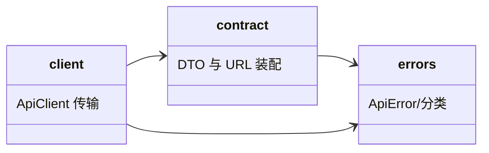

# api-client 子模块设计

## 职责

`admin-web/src/api/` 是唯一 HTTP 契约层：持有 v1 DTO、URL 装配、两套响应/错误适配（sfo-account 包装与 `/api/v1` 错误体）、Bearer 注入与下载 blob 获取。页面与 session 只调用本模块。

## 模块关系



## 关键接口

```typescript
export type Visibility = "public" | "private";
export type ProjectRole = "read" | "write" | "admin";
export type Scope = "metadata:read" | "artifacts:read" | "artifacts:write" | "administration" | "projects:create" | "projects:delete";
export interface LoginResult { session: string; refresh_session: string }
export interface CurrentUser { id: number; name: string }
export interface Project { project_id: number; name: string; visibility: Visibility; owner: number }
export interface Collaborator { user_id: number; role: ProjectRole }
export interface TokenSummary { token_id: number; name: string; project_scope: ProjectScopeDto; scopes: Scope[]; created_at: string; updated_at: string }
export interface TokenIssued { token_id: number; jwt: string; name: string; expires_at: string | null }
export interface VersionRecord { project_id: number; version: string; file_id: string; sha256: string; size: number; published_at: string }
export class ApiClient { /* 见根设计 File-Level Interfaces */ }
```

- `project_scope` 序列化：页面选项「全部项目」映射 `"All"`；勾选项目列表映射 `{"Specified":[<project_id>,...]}`。
- 错误分级：`AuthError`（err!=0、401、refresh 失败）、`ForbiddenError`（403）、`NotFoundError`（404）、`ConflictError`（409）、`InvalidInputError`（422）、`TransportError`（网络/超时/5xx）。
- 登录/account 接口 HTTP 200 包装 `{err,msg,result}`：仅 `err===0` 且 `result` 存在视为成功；否则按 `msg` 构造 `AuthError`。
- 下载：`fetch` + Bearer，成功转为 `Blob`；非 2xx 按错误体分级回页面。

## 状态与边界

- Owner: 无持久状态；`ApiClient` 每次请求显式接收 bearer，不缓存凭据。
- 时序约束：URL 以 `baseUrl` 规范化（去尾斜杠）后拼接；超时使用 AbortController（默认 15 秒，可配置）。

## 不变项

- 不打印/记录 Authorization 明文与请求体；
- 统一走 fetch，不使用浏览器第三方库；
- 401 只向上报告 `AuthError`，由 session 层决定是否刷新重试。

- Consumer: session/projects/tokens/collaborators（change_id: fh-web-login、fh-web-project-versions、fh-web-token-manage、fh-web-members）
- Compatibility: new
