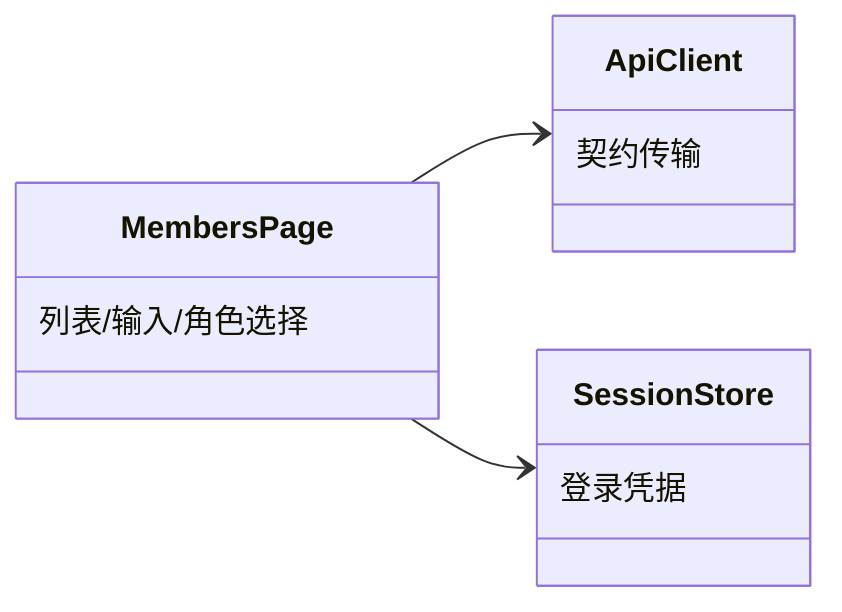

# collaborators 子模块设计（项目协作者管理页面）

## 职责

`MembersPage` 按项目消费 collaborators 契约：查看、添加/改级、移除；无用户名/用户目录 API 的前提下列表与输入均使用数字 `user_id`。

## 模块关系

## 页面行为

- 列表：`GET /api/v1/projects/{id}/collaborators`，行显示 `user_id` 与角色（read/write/admin）；页面注明项目 owner 为隐式 admin 且不在列表。
- 添加/改级：输入正整数 user_id + 选择角色，`PUT .../collaborators/{user_id}` body `{role}`（upsert：已存在即改级）。
- 移除：确认后 `DELETE .../collaborators/{user_id}`；对 owner 行操作由服务端返回 403 并展示。
- 无 `administration` 权限时列表加载与写操作呈现 403 错误态。

## 状态

- Owner: `MembersPage` 本地状态（列表快照、user_id 输入、角色选择、加载/错误态）；无持久数据。

## 不变项

- 用户身份只允许数字 user_id（正整数），前端做格式校验后再提交；
- 不建立 user_id→name 的本地映射/缓存；
- 页面不预测角色权限，全部以服务端返回为准。

- Consumer: 浏览器用户（change_id: fh-web-members）
- Compatibility: new
