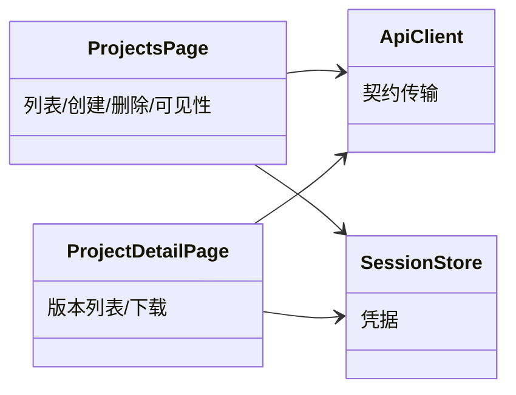

# projects 子模块设计（项目/版本/下载）

## 职责

`ProjectsPage`（列表/创建/删除/可见性）与 `ProjectDetailPage`（版本列表、单版本、下载）消费 projects 与 versions 契约；无发布/上传能力。

## 模块关系

## 页面行为

- 列表：`GET /api/v1/projects`；文案「可见项目」；每行展示 name、visibility、owner（数字 id）；含创建入口、删除确认、可见性切换。
- 创建：`POST /api/v1/projects` body `{name, visibility?}`；越权显示 403。
- 可见性：`POST /api/v1/projects/{id}/visibility` body `{visibility}`；成功以返回 Project 刷新行。
- 删除：`DELETE /api/v1/projects/{id}`；确认交互后执行，204 后移除行。
- 版本列表：`GET /api/v1/projects/{id}/versions`；表格列 version/sha256/size/published_at。
- 下载：`GET /api/v1/projects/{id}/versions/{version}/download`（含 `latest`）；`ApiClient.download` 返回 Blob，页面创建 ObjectURL 触发下载并在完成/失败后 `revokeObjectURL`；文件名按 `{project_id}-{version}.tar.gz` 展示。

## 状态

- Owner: 页面组件本地状态（列表快照、加载/错误态、确认对话框）；不缓存版本内容，下载流不落盘。
- 无服务端持久状态归属（全部属 001）。

## 不变项

- 下载必须带 Authorization（public 匿名场景由页面提供空 bearer 调用，服务端匿名放行）；
- 不允许页面自行按角色隐藏/放行操作，错误以服务端响应为准；
- 不使用普通 `<a href>` 直链下载（无法携带 Bearer）。

- Consumer: 浏览器用户（change_id: fh-web-project-versions）
- Compatibility: new
