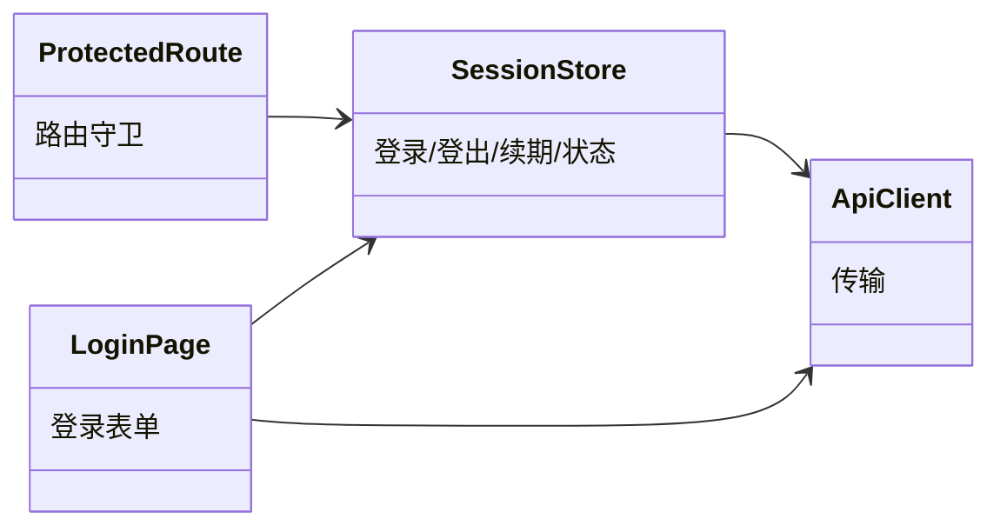
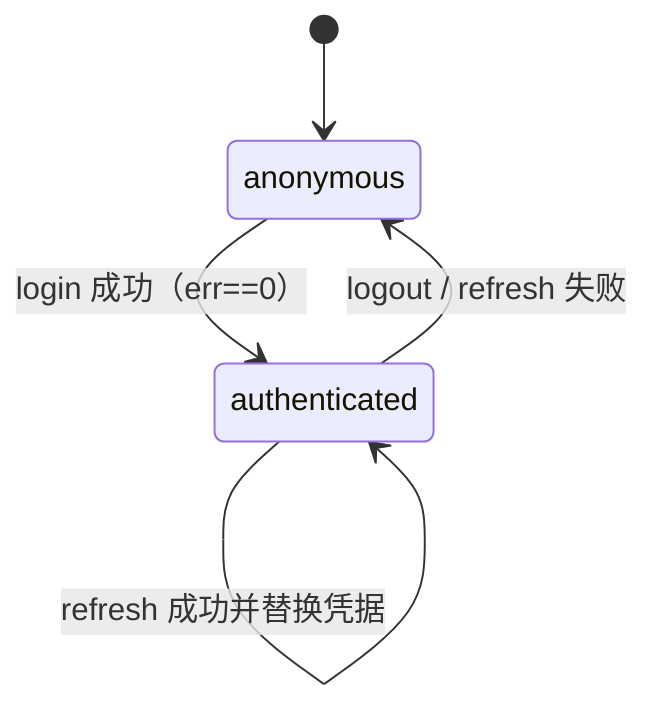

# session 子模块设计

## 职责

`admin-web/src/api/session.ts` 与 `components/ProtectedRoute.tsx`、`pages/LoginPage.tsx` 承担登录、会话状态、401 续期一次、本地登出与路由守卫。对 server 只消费 `/account/login`、`/account/refresh_session`、`/account/get_account_info`。

## 模块关系

## 状态与流转

- Owner: `SessionStore`：session/refresh_session/currentUser，内存中为真相，镜像写入 `sessionStorage`（key 前缀 `fh_web_`），页面刷新后可恢复；不写 `localStorage`。
- 续期策略：页面请求遇 `AuthError` 时 `refreshOnce()` 用 `refresh_session` 调 `/account/refresh_session`；成功则替换凭据并允许调用方重试一次；失败或无可刷新凭据则 `logout()`。
- 登出：无服务端端点，仅清除内存与 sessionStorage、置 anonymous。

## 页面与路由

- `LoginPage`：用户名/密码表单；提交后展示 `err==0`/失败消息；成功后跳转原始目标页。
- `ProtectedRoute`：anonymous 访问受保护路由时重定向 `/login?next=<path>`。

## 不变项

- 凭据只经 SessionStore 存取，页面不直接持有 session 明文；
- 不在 console/日志输出 session/refresh_session；
- 当前用户仅显示 `{id,name}`，不展示账号角色。

- Consumer: 全部受保护页面与根 App（change_id: fh-web-login）
- Compatibility: new
