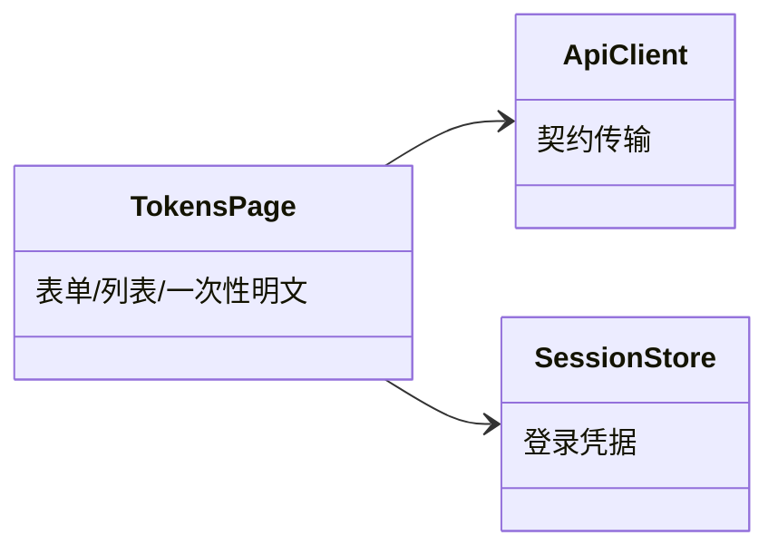
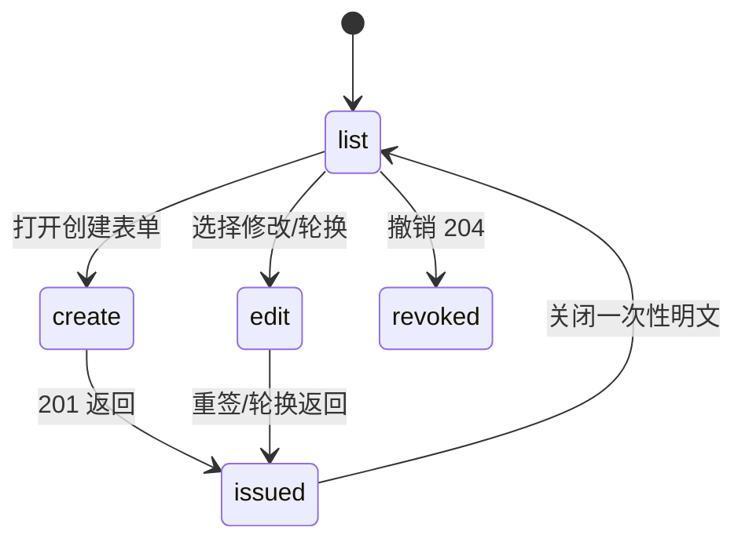

# tokens 子模块设计（token 管理页面）

## 职责

`TokensPage` 消费 tokens 契约：创建、列表、属性修改（重签）、轮换、撤销；仅用户 session 可操作（token 凭据遇 403 呈现错误态）。

## 模块关系

## 页面行为

- 创建表单：名称必填；项目范围选择「全部项目」或按项目列表勾选（映射 `"All"`/`{"Specified":[...]}`）；六固定 scope 复选；过期时间可选（RFC3339 输入，最长 1 年）或不过期（null）。
- 列表：`GET /api/v1/tokens`；列 token_id/name/project_scope/scopes/created_at/updated_at；**不渲染过期列**（服务端不返回）。
- 修改：`POST /api/v1/tokens/{id}`；仅改名称成功返回 `TokenSummary`；包含 scopes/project_scope/expires_at 变更（或显式轮换）返回新 JWT 且旧 JWT 立即失效——统一以一次性明文卡片展示并提示「轮换后不过期(如需可重新设置过期)/旧 JWT 已失效」。
- 轮换：`POST /api/v1/tokens/{id}/rotate`，返回新 JWT 一次；提示轮换后不过期。
- 撤销：确认后 `DELETE /api/v1/tokens/{id}`，成功后从列表移除。

## 状态

- Owner: `TokensPage` 组件短时状态一次性持有新签发 `jwt`，关闭/离开即清空；不持久化、不进日志。

## 不变项

- 创建/修改/轮换响应之外的任何接口都不包含 jwt；
- JWT 明文展示限制于单次响应，页面刷新/跳转后不可再查看；
- `expires_at:null` 语义为「不修改」（更新请求），表单提示与之一致。

- Consumer: 浏览器用户（change_id: fh-web-token-manage）
- Compatibility: new
