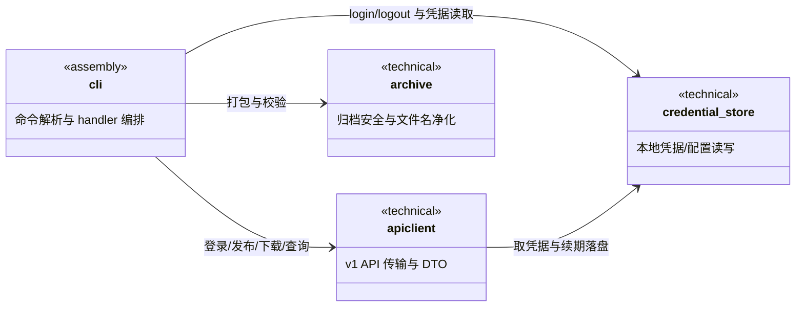
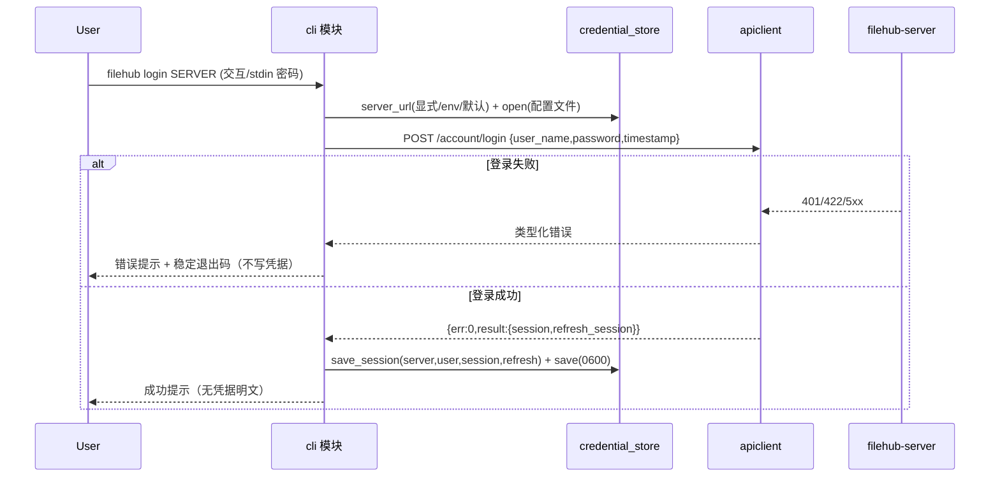
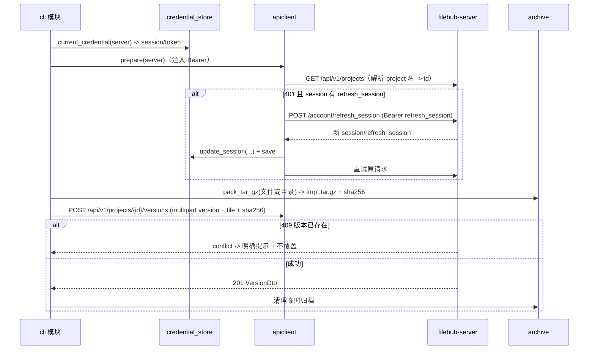
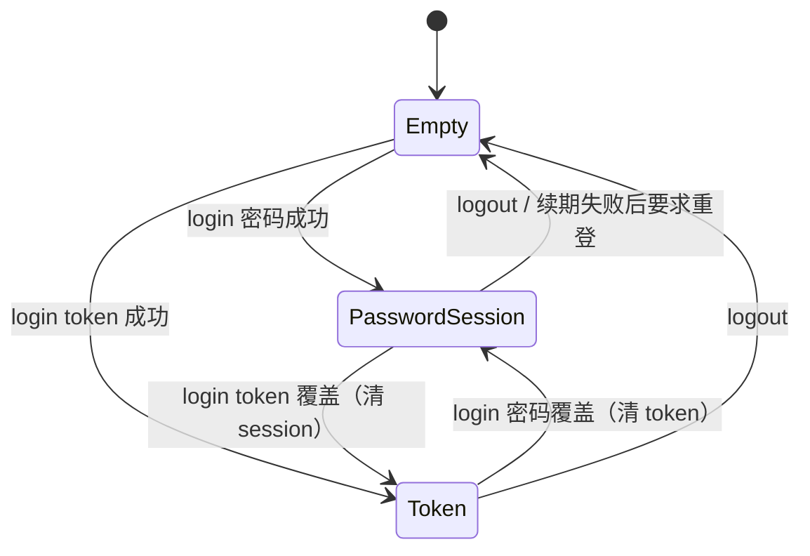

## Approval Record

- approver: user
- approval_date: 2026-08-20
- user_statement: 自动完成003任务吧


# filehub 发布客户端（filehub-cli）设计

Risk profile: ./risk-profile.yaml

## Design Scope

### Goals

- 交付 `cli/` 单一 Rust crate（二进制 `filehub-cli`），按已批准提案 P-01 ~ P-04（change_id：fh-cli-login / fh-cli-publish / fh-cli-download / fh-cli-versions）实现 login/logout、publish、download、versions 四条命令面、稳定参数/退出码与本地凭据复用。
- 将 CLI 分解为四个子模块：`cli`（命令装配）、`apiclient`（v1 API 传输）、`credential_store`（本地凭据/配置）、`archive`（归档安全），依赖方向 cli -> apiclient / credential_store / archive、apiclient -> credential_store，保持无环。
- 与 001 服务后台只通过冻结契约 `docs/api/v1-contract.md` 交互；登录/session 复用 sfo-account 导出的 `/account/login` 与 `/account/refresh_session`。

### Non-goals

- 不实现服务端认证、授权、项目/版本/文件 API（001 负责）；不实现管理后台（002 负责）。
- 不做断点续传、分片上传协议、下载自动解压、安装器/自动更新/签名分发、交互式 TUI（提案非目标）。
- 本设计不定义测试用例、测试计划、测试装置或验证标识（测试阶段负责）。

## Useful Context

- 用户已确认：跨平台单二进制 Rust CLI；日志统一 `sfo-log`；发布格式统一 `.tar.gz`；token 优先于登录 session 复用；密码/token 不明文进入命令行参数；`filehub login` 参数以已批准 proposal「filehub login 参数定义」为冻结基线。
- 服务端契约已冻结（`docs/api/v1-contract.md`）：`POST /account/login` 返回 sfo-http 包装 `{err:0,result:{session,refresh_session}}`；`POST /account/refresh_session` 用 refresh session 换新 session/refresh_session；`/api/v1` 项目/版本/下载路由以 `project_id` 寻址；发布接口为 multipart（`version` + `file`，可选 `sha256`）；错误统一 JSON `{"error":"<code>","message":"<text>"}`（401/403/404/409/422/5xx），两个更新语义端点按实现以 POST 提供。
- 仓库 greenfield：`cli/` 目录尚不存在，无既有消费者与符号迁移负担；`docs/modules/filehub.md` 已声明 cli 交付面，本设计补充其 crate 内子模块边界并同步该文档。

## Overall Approach

`cli/` crate 采用 lib + 薄 main 的布局：`main.rs` 只负责取退出码并退出，`lib.rs` 声明四个子 mod。命令解析使用 clap 冻结 proposal 的命令面；HTTP 传输使用 reqwest（rustls），凭据统一经 `credential_store` 读取/写入；`apiclient::AuthClient` 负责取凭据（token > session）、注入 `Authorization: Bearer`，并在 session 凭据遇 401 且存在 refresh_session 时先经 `/account/refresh_session` 续期后重试一次，续期失败或无凭据时要求重新登录。`archive` 在发布前做安全 `.tar.gz` 打包与 SHA-256，在下载后做文件名净化与完整性校验。日志统一 `sfo-log`，密码/token/session 明文在任何输出路径中脱敏。

## Layered Design Document Index

| level | parent_document | unit | design_document | responsibility |
|-------|-----------------|------|-----------------|----------------|
| root | `design.md` | filehub-cli crate | `design.md` | crate 布局、子模块依赖、凭据归属、命令流与实现顺序 |
| submodule | `design.md` | cli（命令装配） | `design/cli.md` | 命令解析/参数校验、交互与输出、退出码、命令 handler 编排 |
| submodule | `design.md` | apiclient（API 传输） | `design/apiclient.md` | v1 契约 DTO、HTTP 传输、凭据注入与 401 续期重试、错误映射 |
| submodule | `design.md` | credential_store（本地凭据） | `design/credential-store.md` | 凭据/配置文件路径解析、原子读写、最小权限、token > session 复用、logout |
| submodule | `design.md` | archive（归档安全） | `design/archive.md` | 安全 `.tar.gz` 打包、SHA-256、下载文件名净化与落盘校验 |

## Module Relationship UML



依赖方向：assembly（cli）指向各技术子模块，技术子模块之间只有 apiclient -> credential_store；无环（由 doc-structure-check 校验）。

## File-Level Interfaces

```rust
// cli/src/credential_store/：本地凭据与配置（technical；独占本地持久状态）
pub struct ServerCredential {
    pub server: String,          // 规范化身份 host[:port]（传输层 HTTPS 优先、loopback HTTP 降级）
    pub username: Option<String>,// 密码登录用户；token 登录可为 None
    pub session: Option<String>, // 登录 session JWT
    pub refresh_session: Option<String>,
    pub token: Option<String>,   // token JWT；与 session 字段互斥（login 覆盖）
}
pub struct CredentialStore { /* config_path, default_server, servers: HashMap<String, ServerCredential> */ }
impl CredentialStore {
    pub fn open(config: &ConfigPath) -> Result<Self, CredentialStoreError>;   // 不存在则空配置，权限 0600
    pub fn current_credential(&self, server: Option<&str>) -> Option<Credential>; // token > session
    pub fn save_session(&mut self, server: &str, user: &str, session: &str, refresh: &str) -> Result<(), CredentialStoreError>;
    pub fn save_token(&mut self, server: &str, token: &str) -> Result<(), CredentialStoreError>; // 清除该 server 的 session 字段
    pub fn update_session(&mut self, server: &str, session: &str, refresh: &str) -> Result<(), CredentialStoreError>; // refresh 续期落盘
    pub fn logout(&mut self, server: Option<&str>) -> Result<(), CredentialStoreError>;
    pub fn server_url(&self, explicit: Option<&str>, env_server: Option<&str>) -> Result<String, CredentialStoreError>;
    pub fn save(&mut self) -> Result<(), CredentialStoreError>; // 原子写（临时文件 + rename），类 Unix 0600
}

// cli/src/apiclient/：v1 API 传输（technical；无持久状态）
pub struct FilehubClient { base_url: String, http: reqwest::Client, timeout: Duration }
impl FilehubClient {
    pub fn new(base_url: &str) -> Result<Self, ClientError>;            // URL 规范化 + rustls 默认
    pub async fn login_password(&self, user: &str, password: &str) -> Result<LoginResp, ClientError>;   // POST /account/login
    pub async fn list_projects(&self, bearer: &str) -> Result<Vec<ProjectDto>, ClientError>;            // GET /api/v1/projects
    pub async fn publish(&self, bearer: &str, project_id: &str, version: &str, archive: &Path) -> Result<VersionDto, ClientError>;
    pub async fn get_version(&self, bearer: &str, project_id: &str, version: Option<&str>) -> Result<VersionDto, ClientError>; // None=latest
    pub async fn download_to(&self, bearer: &str, project_id: &str, version: Option<&str>, dest: &Path, expected_sha256: &str) -> Result<(), ClientError>;
    pub async fn list_versions(&self, bearer: &str, project_id: &str) -> Result<Vec<VersionDto>, ClientError>; // GET /api/v1/projects/{id}/versions
    pub fn refresh_session_url(&self) -> String; // POST /account/refresh_session
}
pub struct AuthClient { transport: FilehubClient, store: Arc<RwLock<CredentialStore>> }
impl AuthClient {
    pub async fn prepare(&self, server: Option<&str>) -> Result<Prepared, ClientError>;
        // current_credential -> Bearer；401 且 session 有 refresh 时续期一次并 update_session
}

// cli/src/archive/：归档安全（technical；纯函数 + 文件 IO）
pub fn pack_tar_gz(source: &Path) -> Result<PackedArchive, ArchiveError>;
    // 仅打包文件或目录内容为 .tar.gz；排除绝对路径、.. 与越界符号链接；返回 tmp 路径 + sha256 + size
pub fn sanitize_artifact_name(project: &str, version: &str) -> Result<String, ArchiveError>;
    // 生成 <project>-<version>.tar.gz 并做跨平台文件名净化（保留字符/长度/保留名）
pub fn verify_sha256(path: &Path, expected: &str) -> Result<(), ArchiveError>;

// cli/src/cli/：命令装配（assembly；解析、编排、输出）
pub struct CliArgs { #[command(subcommand)] pub command: Command } // clap derive：login/logout/publish/download/versions
pub enum Command {
    Login(LoginArgs), Logout(LogoutArgs), Publish(PublishArgs), Download(DownloadArgs), Versions(VersionsArgs),
}
pub struct App { client: AuthClient, store: CredentialStore, archive: ArchiveContext }
impl App {
    pub async fn run(&mut self, args: CliArgs) -> Result<i32, AppError>; // dispatch -> 稳定退出码
}
```

- Consumer: `cli/src/main.rs`（装配 App 并取退出码）；四个命令 handler（login/logout/publish/download/versions）消费 apiclient / credential_store / archive；映射 change_id：fh-cli-login（login/logout + credential_store + AuthClient）、fh-cli-publish（publish + archive）、fh-cli-download（download + archive）、fh-cli-versions（versions）
- Compatibility: new
- Migration path when required: 不适用（新 crate，无旧符号消费者）

## API and Build Surface Impact

- Public API impact: none
  - 说明：greenfield 新 crate，无既有公开 Rust 库符号可被破坏；对外 CLI 命令契约见 design/cli.md
- Crate-root export change: no
- Build-surface change: no
- Documentation examples affected: no

说明：新 crate 无既有 crate-root 导出、构建面与文档示例可被破坏（解释见 Design Notes 与 Consumer Migration Closure）。

## Consumer Migration Closure

not-applicable: 无既有公开接口、crate-root 导出或构建面变更，无旧符号消费者需要迁移。

## Key Flows

### 密码登录



### 发布与 401 续期



## State and Ownership

- Owner: `credential_store` 独占本地凭据/配置文件（类 Unix `~/.config/filehub/config.toml`，Windows/macOS 对应用户配置目录）；`apiclient` 无持久状态；`archive` 只产生可清理的临时文件；`cli` 不持有跨命令状态。
- Access path for other modules: 其它子模块只能经 `CredentialStore` 公开方法读写凭据；禁止直接编辑配置文件、把凭据写入日志或经命令行参数传递。



- Invariants to preserve:
  - 同一 server 在同一时刻只有一类凭据生效：token 存在则优先复用；login 覆盖后旧凭据不残留（token 登录清 session，密码登录清 token）。
  - 凭据文件最小权限（类 Unix 0600）且原子写入；解析失败时不自动删除/覆盖既有内容，提示用户重新 login/logout。
  - 任何输出（stdout/stderr/日志）不得包含密码、token、session/refresh_session 明文。
  - 401 + session 场景最多续期一次；续期失败直接报错要求重新登录，不无限重试；4xx 一律不盲目重试。
  - 发布前本地打包排除绝对路径、`..` 与越界符号链接；下载内容 SHA-256 与服务端一致后才落盘，文件名经净化。

## Directly Mapped Change Items

| change_id | target_module | proposal_id | Design Coverage | Scope Paths | Interface / Boundary Impact |
|-----------|---------------|-------------|-----------------|-------------|------------------------------|
| fh-cli-login | filehub | P-01 | design/credential-store.md + design/apiclient.md 登录/续期部分 + 本文件 Key Flows 与凭据状态 | `cli/src/`, `tests/` | 新增 `filehub login/logout` 命令与本地凭据存储；AuthClient 统一 Bearer 注入与 401 续期重试 | 凭据写入仅经 login/logout；token > session；`-u`/`--password-stdin`/`--token-stdin`/`--config`/`SERVER` 按 proposal 冻结 |
| fh-cli-publish | filehub | P-02 | design/archive.md + design/apiclient.md 发布部分 + 本文件发布流 | `cli/src/`, `tests/` | 新增 `filehub publish`：安全打包、SHA-256、multipart 上传与 409 终态 | 不在客户端做最终授权判定；409 提示换版本号 |
| fh-cli-download | filehub | P-03 | design/archive.md 净化/校验 + design/apiclient.md 下载部分 + 本文件下载语义 | `cli/src/`, `tests/` | 新增 `filehub download`：latest/指定版本下载、文件名净化、SHA-256 校验后原子落盘 | 下载仅保存 `.tar.gz`，不自动解压 |
| fh-cli-versions | filehub | P-04 | design/apiclient.md 查询部分 + design/cli.md 输出 | `cli/src/`, `tests/` | 新增 `filehub versions`：文本/JSON 输出到路径或 stdout，路径安全校验 | 输出字段与服务端 API 一致 |

## Implementation Order

| Phase | Goal | Depends On | Output |
|-------|------|------------|--------|
| 1 | credential_store：配置路径解析、凭据模型、原子写与最小权限 | 无（lib.rs 骨架内置本阶段） | CredentialStore 子模块可用 |
| 2 | archive：安全打包、文件名净化与 SHA-256 | 无 | archive 子模块可用 |
| 3 | apiclient：契约 DTO、传输、错误映射、AuthClient 续期 | credential_store | FilehubClient / AuthClient 可用 |
| 4 | cli：命令解析、login/logout/publish/download/versions handler、stdout/stderr 与退出码 | apiclient、archive | `filehub-cli` 二进制可运行全部命令面 |
| 5 | 三平台构建与打包脚本、README/帮助一致 | 全部子模块 | 单二进制交付与打包流程 |

## File-Level Implementation Sequence

| sequence | file_level_module | action | depends_on | change_id | scope_path | implementation_task |
|----------|-------------------|--------|------------|-----------|------------|---------------------|
| 1 | `cli/Cargo.toml` | create | none | fh-cli-login | `cli/` | I-001 |
| 2 | `cli/src/lib.rs` | create | `cli/Cargo.toml` | fh-cli-login | `cli/src/` | I-001 |
| 3 | `cli/src/main.rs` | create | `cli/src/lib.rs` | fh-cli-login | `cli/src/` | I-001 |
| 4 | `cli/src/credential_store/mod.rs` | create | `cli/src/lib.rs` | fh-cli-login | `cli/src/credential_store/` | I-002 |
| 5 | `cli/src/credential_store/model.rs` | create | `cli/src/credential_store/mod.rs` | fh-cli-login | `cli/src/credential_store/` | I-002 |
| 6 | `cli/src/credential_store/security.rs` | create | `cli/src/credential_store/mod.rs` | fh-cli-login | `cli/src/credential_store/` | I-002 |
| 7 | `cli/src/apiclient/mod.rs` | create | `cli/src/credential_store/mod.rs` | fh-cli-login | `cli/src/apiclient/` | I-003 |
| 8 | `cli/src/apiclient/contract.rs` | create | `cli/src/apiclient/mod.rs` | fh-cli-login | `cli/src/apiclient/` | I-003 |
| 9 | `cli/src/apiclient/error.rs` | create | `cli/src/apiclient/mod.rs` | fh-cli-login | `cli/src/apiclient/` | I-003 |
| 10 | `cli/src/cli/mod.rs` | create | `cli/src/apiclient/mod.rs` | fh-cli-login | `cli/src/cli/` | I-004 |
| 11 | `cli/src/cli/args.rs` | create | `cli/src/cli/mod.rs` | fh-cli-login | `cli/src/cli/` | I-004 |
| 12 | `cli/src/cli/login_handler.rs` | create | `cli/src/cli/args.rs` | fh-cli-login | `cli/src/cli/` | I-004 |
| 13 | `cli/src/archive/mod.rs` | create | `cli/src/lib.rs` | fh-cli-publish | `cli/src/archive/` | I-005 |
| 14 | `cli/src/archive/safe_tar.rs` | create | `cli/src/archive/mod.rs` | fh-cli-publish | `cli/src/archive/` | I-005 |
| 15 | `cli/src/cli/publish_handler.rs` | create | `cli/src/cli/mod.rs` | fh-cli-publish | `cli/src/cli/` | I-006 |
| 16 | `cli/src/cli/download_handler.rs` | create | `cli/src/cli/mod.rs` | fh-cli-download | `cli/src/cli/` | I-007 |
| 17 | `cli/src/cli/versions_handler.rs` | create | `cli/src/cli/mod.rs` | fh-cli-versions | `cli/src/cli/` | I-008 |

## Design Notes

- 技术选型：clap（命令解析，冻结命令面与 `--help`）、reqwest + rustls（HTTPS 传输，不依赖系统 TLS 链变异）、tokio（async 运行）、serde/serde_json（DTO）、`tar` + `flate2`（打包）、`sha2`（完整性）、`toml` + `dirs`（配置路径）、`sfo-log`（统一日志；日志脱敏与服务器约定一致）。依赖版本在实现期经 Cargo.lock 锁定并记录来源。
- 项目解析：契约以 `project_id` 寻址，CLI 的 `<project>` 参数按项目名匹配 `GET /api/v1/projects` 后取 id；未找到/重名（契约保证项目名唯一，仍保留防御性错误）给出明确错误。
- 下载语义：先 `GET /api/v1/projects/{id}/versions/{version|latest}` 取版本与 sha256，再流式下载到同目录临时文件，校验一致后原子 rename 为 `<project>-<version>.tar.gz`（再次下载同一版本可覆盖，便于脚本幂等）；校验失败清理临时文件且不覆盖旧文件。
- 版本输出：`filehub versions <project> [-o <路径>] [--format text|json]`；`-o` 与 stdout 二选一，目标路径安全净化；JSON 字段与服务端 `VersionDto` 对齐。
- 凭据写入：save_session/save_token/update_session 均先改内存模型再原子落盘；配置文件格式带 `schema_version` 字段，未来字段向后宽容。
- 与既有约定一致性：日志沿用 `sfo-log`；凭据类型区分（登录 session 与 token JWT）只由服务端承担，客户端仅存储并按其自身语义复用。
- 不适用项：greenfield 新模块，无既有外部可观察行为与不变式需要保持。

## Risks and Rollback

- 凭据泄露（高）：密码/token/session 一经日志、环境、进程参数或过宽文件权限即泄露。缓解：明文禁止入参数/日志；凭据文件最小权限与原子写；环境变量通道文档化其同用户进程可见性；401 续期失败即停。
- CLI 契约冻结（高）：命令/参数/退出码发布即兼容负担。缓解：命令面由 clap 结构表达，参数表冻结于 design/cli.md，退出码表集中定义并按类映射。
- 供应链与跨平台（中）：HTTP/TLS、路径与权限在 Windows/macOS/Linux 存在差异。缓解：reqwest-rustls 统一 TLS；凭据目录按平台解析；Cargo.lock 提交并锁定依赖。
- 归档/下载安全（中）：不安全 `.tar.gz` 与路径穿越。缓解：打包排除绝对路径/越界符号链接；下载文件名净化、SHA-256 校验后原子落盘；服务端仍二次校验。
- 回滚：greenfield 二进制，无数据迁移；回滚 = 移除 `cli/` crate 与模块文档同步。对外命令面变更需先收回 proposal 再冻结新版契约。
