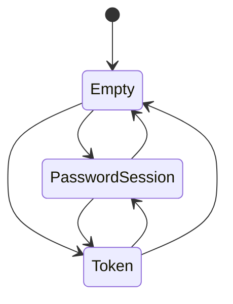

## Approval Record

- approver: user
- approval_date: 2026-08-20
- user_statement: 自动完成003任务吧


# credential_store 子模块设计（本地凭据与配置）

## Responsibility

- 独占本地凭据/配置文件：路径解析、加载/保存（原子写）、最小权限、多服务器凭据、token > session 复用优先级、login 覆盖与 logout 清除。
- 不解析 CLI 参数（`--config` 最终路径由 cli 传入）；不发起 HTTP；不判断凭据是否仍有效（服务端 401 判定）。

## File Format

路径（按平台）：类 Unix `~/.config/filehub/config.toml`（权限 `0600`）；macOS `~/Library/Application Support/filehub/config.toml`；Windows `%APPDATA%\filehub\config.toml`。`--config`/`FILEHUB_CONFIG` 可覆盖。

```toml
schema_version = 1
default_server = "filehub.example.com"

[server."filehub.example.com"]
username = "alice"
session = "<登录 session JWT>"
refresh_session = "<refresh JWT>"
# token 字段存在时优先复用；login 时两套互斥写入，不并存
[server."other.example.com"]
token = "<token JWT>"
```

## Interfaces

```rust
// cli/src/credential_store/mod.rs（fh-cli-login）
pub enum Credential { PasswordSession { session: String, refresh_session: String }, Token { token: String } }
pub struct CredentialStore { path: PathBuf, default_server: Option<String>, servers: HashMap<String, ServerCredential> }
impl CredentialStore {
    pub fn open(path: &Path) -> Result<Self, CredentialStoreError>;   // 文件不存在 -> 空；目录/文件缺失创建
    pub fn resolve_server(&self, explicit: Option<&str>, env: Option<&str>) -> Result<String, CredentialStoreError>;
    pub fn current_credential(&self, server: &str) -> Option<Credential>; // token 优先
    pub fn save_session(&mut self, server: &str, user: &str, session: &str, refresh: &str) -> Result<(), CredentialStoreError>;
    pub fn save_token(&mut self, server: &str, token: &str) -> Result<(), CredentialStoreError>;
    pub fn update_session(&mut self, server: &str, session: &str, refresh: &str) -> Result<(), CredentialStoreError>;
    pub fn logout(&mut self, server: Option<&str>) -> Result<(), CredentialStoreError>;
    pub fn flush(&mut self) -> Result<(), CredentialStoreError>; // 原子写 + 权限收敛
}
```

## Behaviors and Invariants

- 优先级：`token > session`（`current_credential` 先查 token）；登录覆盖语义：`save_token` 清除该 server 的 username/session/refresh_session；`save_session` 清除 token。
- 服务器身份：所有 `SERVER` 参数/环境变量/配置值统一归一化为 `host[:port]`（去掉协议头与路径），凭据 key 使用该身份；旧配置中带 `http://`/`https://` 的 key 通过剥协议比较兼容命中，登录/续期/logout 均按身份处理。
- 未指定 server 时：显式参数 > `FILEHUB_SERVER` > `default_server`（配置文件） > 仅有一个已存 server 时使用之；都不满足返回明确错误（退出码 2 提示先 login 或显式指定）。
- 原子写：先写同目录临时文件（同样的权限收敛），`fsync` 后 `rename` 覆盖；进程中断不产生半截主配置。
- 权限：新建文件类 Unix 设为 `0600`（忽略 umask 放宽），已有文件写入后收敛权限；Windows 不依赖 POSIX 权限，凭据放在用户配置目录。
- 损坏/非法 TOML：解析失败即报错要求重新 login 或手动移除后重试，不自动覆盖、不删除、不备份凭据明文；日志只含路径与错误类别。
- flush 失败：命令失败并返回本地文件系统退出码 8；内存模型不回滚（下次命令重新加载盘上状态）。

## State and Ownership

- Owner: `credential_store`（唯一）；`apiclient::AuthClient` 通过共享引用调用 `update_session`（401 续期落盘），`cli` handler 调用 login/logout 写入。



状态含义与 transitions 同 design.md（login 覆盖互斥、logout 清除；续期不改变凭据类型）。

## Design Notes

- `schema_version` 字段保留前向宽容：未知字段忽略、未知 server key 保留不动，避免覆盖未来版本配置。
- 环境变量通道不写入配置文件，避免凭据从环境回落到持久文件。
- token 与 session 互斥写入可让“旧凭据残留”类问题在格式层不可达。
