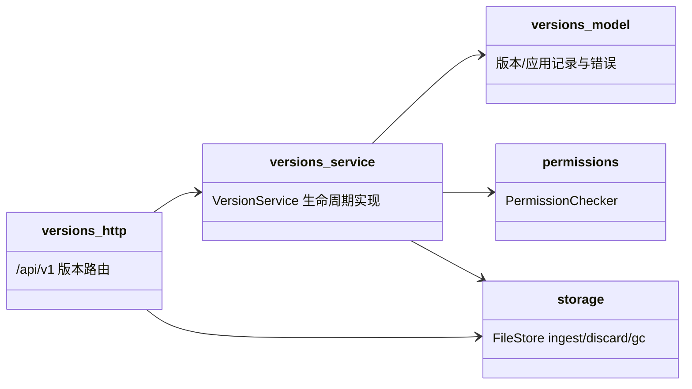
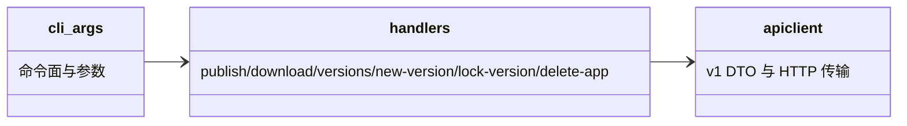
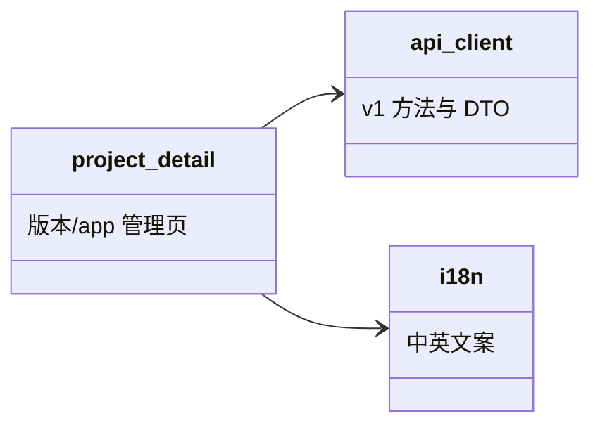
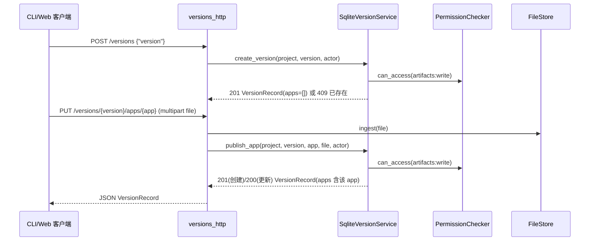
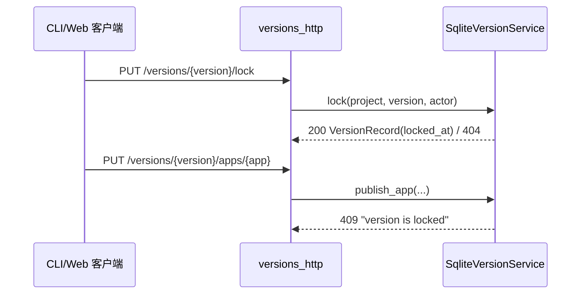
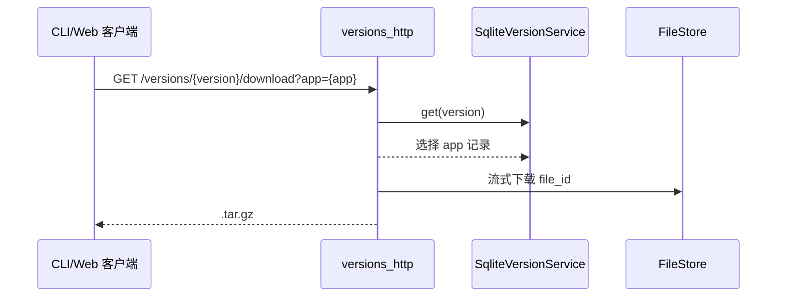
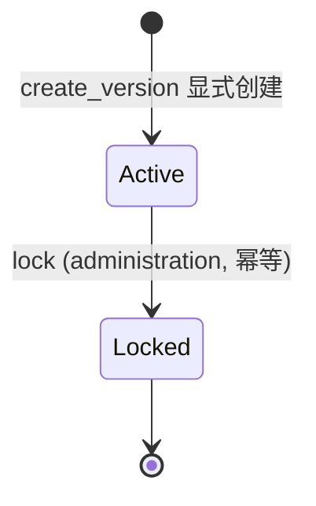

## Approval Record

- approver: user
- approval_date: 2026-08-21
- user_statement: 确认，自动完成


# filehub 版本多应用（versions multi-app）设计

Risk profile: ./risk-profile.yaml

## Design Scope

- 归属交付面：`filehub-server`（`versions` 子模块 + `/api/v1` HTTP 契约）、`filehub-cli`（命令面）、`filehub-web`（`admin-web` 版本详情页）。
- 覆盖：版本显式创建、`locked_at` 不可逆锁定、版本内具名 app 的发布/更新/删除、按 app 查询与下载、三交付面同步破缺 v1 契约。
- 不覆盖：`files` 物理存储与下载流转发机制、Project 粒度授权模型以外的权限扩展、存量数据兼容迁移（用户已明确不做）。

## Useful Context

- 仓库当前无正式发布（git 无 commit、全量文件未跟踪），v1 契约、CLI 与 admin-web 均消费“版本=单文件”模型：`versions` 在首次上传时隐式创建，`version_files.version_id` 为主键、`file_id` UNIQUE。
- `data/filehub.db` 实测仅 1 个 project、0 条版本数据；`sfo-http` 0.7 已支持 PUT/DELETE（协作者端点先例），multipart 解析工具按字段名收集、可直接扩展 `app`。
- 用户六轮澄清确定的需求边界见 proposal：版本显式创建（重复 409）、具名 app 可发布/更新/删除、单版本查询返回全部 app、版本不可逆锁定、按 app 单独下载、不做存量数据兼容。

## Overall Approach

版本从“首次上传隐式创建的单文件实体”改为“显式创建的元数据实体 + 1:N 具名 app 子实体”：

1. schema：`versions` 增加 `locked_at`；`version_files` 替换为 `version_apps(version_id, app, file_id, sha256, size, created_at, updated_at)`，`UNIQUE(version_id, app)`、`file_id` 唯一。
2. 服务层：`VersionService` 拆出 `create_version`（重复 409）、`publish_app`（UPSERT，版本不存在 404、锁定 409）、`delete_app`（锁定 409）、`lock`（不可逆、幂等、需 `administration`）；读取统一返回 `apps[]`。
3. HTTP：`POST /versions` 专职创建版本；`PUT /versions/{version}/apps/{app}` 发布/更新；`DELETE .../apps/{app}` 删除；`PUT .../lock` 锁定；下载带 `?app=`，缺省时单 app 兼容、多 app 422。
4. CLI/Web：命令面与页面流程同步改为“先建版本 → 对 app 发布/更新/删除 → 锁定”，锁定后写操作在界面/CLI 明确失败。
5. 消费面一次破缺并同批迁移：仓库无正式发布版本（无 git commit），v1 契约不保留旧形状兼容字段。

## Module Relationship UML

### filehub-server（受影响部分）



### filehub-cli



### filehub-web（admin-web）



## Layered Design Document Index

| level | parent_document | unit | design_document | responsibility |
|-------|-----------------|------|-----------------|----------------|
| root | `design.md` | filehub 三交付面 | `design.md` | 总体方案、跨面分解、契约破缺、实现顺序 |
| submodule | `design.md` | filehub-server versions | `design/versions.md` | schema、VersionService 生命周期、事务与孤儿回收语义 |
| submodule | `design.md` | v1 HTTP 契约 | `design/api.md` | 端点表、DTO 形状、错误 404/409/422 语义、multipart `app` 字段 |
| submodule | `design.md` | filehub-cli 命令面 | `design/cli.md` | 新增/修改命令、apiclient 方法、输出与退出码 |
| submodule | `design.md` | filehub-web 页面 | `design/web.md` | admin-web DTO/方法、版本详情交互、i18n、409/422 展示 |

## Key Flows

### app 发布/更新（POST 建版本 → PUT app）



### 锁定与锁定后写拒绝



### 按 app 下载



## State and Ownership

- Owner: `versions` 子模块独占 `versions` 与 `version_apps` 两表（含 `locked_at` 状态）。

### 版本状态（不可逆锁定）



- `Active`：允许 `publish_app`（创建/更新）与 `delete_app`。
- `Locked`：终态；`publish_app`/`delete_app` 返回 409；读取与下载不受影响。

### 数据归属

- `versions`（含 `locked_at`）与 `version_apps` 由 `versions` 子模块独占。
- `files` 仍拥有物理字节；`version_apps.file_id` 引用集是 `referenced_file_ids()` 与 `gc_orphans(keep)` 的唯一来源。
- 权限仍以 Project 粒度判定：`artifacts:write` 覆盖建版本/app 发布/更新/删除，`administration` 覆盖锁定。

## File-Level Interfaces

关键接口以源语言冻结在子文档（design/versions.md、design/api.md、design/cli.md、design/web.md）；顶层摘要如下：

- Consumer: filehub-server versions/http.rs、filehub-cli、admin-web ProjectDetailPage
- Compatibility: breaking

```rust
// filehub-server versions/mod.rs
pub trait VersionService {
    async fn create_version(&self, project: &ProjectId, version: &str, actor: &Principal) -> VersionResult<VersionRecord>;
    async fn publish_app(&self, project: &ProjectId, version: &str, app: &str, file: FileRecord, actor: &Principal) -> VersionResult<VersionRecord>;
    async fn delete_app(&self, project: &ProjectId, version: &str, app: &str, actor: &Principal) -> VersionResult<()>;
    async fn lock(&self, project: &ProjectId, version: &str, actor: &Principal) -> VersionResult<VersionRecord>;
    // list/get/referenced_file_ids 保留（形状变为 apps[] 聚合）
}
```

```ts
// admin-web api/contract.ts 与 client.ts
interface VersionRecord { project_id: number; version: string; published_at: string; locked_at: string | null; apps: AppRecord[] }
interface AppRecord { app: string; file_id: string; sha256: string; size: number; updated_at: string }
```

## Directly Mapped Change Items

| change_id | target_module | proposal_id | design_coverage | scope_paths |
|-----------|---------------|-------------|-----------------|-------------|
| fh-versions-multi-app-model | filehub | P-001 | design/versions.md（schema/服务生命周期/事务/GC） | `server/src/versions/`、`server/src/model/record.rs`、`server/migrations/`、`server/tests/unit/versions.rs` |
| fh-versions-multi-app-api | filehub | P-002 | design/api.md（端点/DTO/错误/multipart/下载选择） | `server/src/versions/http.rs`、`server/tests/`、`docs/api/v1-contract.md`、`docs/modules/filehub.md` |
| fh-cli-multi-app | filehub | P-003 | design/cli.md（命令面/参数/输出/退出码） | `cli/src/`、`cli/tests/` |
| fh-web-multi-app | filehub | P-004 | design/web.md（DTO/方法/页面交互/i18n） | `admin-web/src/`、`admin-web/tests/` |

## Implementation Order

| phase | goal | depends_on | output |
|-------|------|------------|--------|
| schema/服务 | 新 schema 与 VersionService 生命周期可编译 | 已批准 design | `server/migrations/0006_versions.sql`、`server/src/versions/`、`server/src/model/record.rs` |
| HTTP/契约 | 新端点与文档同步 | schema/服务 | `server/src/versions/http.rs`、`docs/api/v1-contract.md`、`docs/modules/filehub.md` |
| CLI | 命令面与新方法可用 | HTTP/契约 | `cli/src/` |
| Web | 页面交互与 i18n 可用 | HTTP/契约 | `admin-web/src/` |

## API and Build Surface Impact

- Public API impact: breaking
  - 说明：v1 `/api/v1/projects/{id}/versions` 语义破缺（发布 multipart → 创建 JSON），新增 `PUT .../apps/{app}`、`DELETE .../apps/{app}`、`PUT .../lock`；`VersionRecord` 形状由单文件改为 `apps[]`；`download` 增加 `?app=`。
- Crate-root export change: yes
  - 说明：`filehub-server` 的 `VersionService` trait 方法集变更（`publish` 移除，新增 `create_version`/`publish_app`/`delete_app`/`lock`），crate 根 `pub mod versions` 仍在；`filehub-cli` 新增三个公开子命令。
- Build-surface change: no
  - 说明：无新增依赖；Cargo workspace 与 admin-web npm 构建面不变；新增 CLI 子命令与 web 表单交互属于既有构建入口内变化。
- Documentation examples affected: yes
  - 说明：`docs/api/v1-contract.md`（端点表/数据形状/错误）、`docs/modules/filehub.md`（versions 子模块职责行）、cli/web 既有任务包内文档中的发布示例语义。

## Consumer Migration Closure

| old_symbol | new_path | change_id | consumer_path | consumer_kind | migration_status |
|------------|----------|-----------|---------------|---------------|-----------------|
| `VersionService::publish`（server/src/versions/mod.rs 旧 trait 方法） | `create_version` + `publish_app`（server/src/versions/service.rs） | fh-versions-multi-app-model | `server/src/versions/http.rs` | production | migrated |
| `versions.publish(`（旧服务调用形态） | `versions.create_version` + `publish_app` | fh-versions-multi-app-model | `server/tests/unit/versions.rs` | test | migrated |
| v1 `POST /versions` multipart 发布（docs/api/v1-contract.md） | `POST /versions` 创建 JSON + `PUT /versions/{version}/apps/{app}` multipart | fh-versions-multi-app-api | `cli/src/apiclient/mod.rs` | production | migrated |
| `client.publish(`（旧 apiclient 发布调用） | `create_version` + `publish_app(+app)` | fh-cli-multi-app | `cli/src/cli/publish_handler.rs` | production | migrated |
| `FilehubClient::download(bearer,project_id,version,tmp)`（cli/src/apiclient/mod.rs） | `download(+app)` | fh-cli-multi-app | `cli/src/cli/download_handler.rs` | production | migrated |
| `cli VersionDto{file_id,sha256,size}` 文本输出（cli/src/apiclient/contract.rs） | `VersionDto{apps[],locked_at}` 与按 app 展示 | fh-cli-multi-app | `cli/src/cli/versions_handler.rs` | production | migrated |
| `ApiClient.download(bearer,projectId,version)`（admin-web/src/api/client.ts） | `download(+app?)` | fh-web-multi-app | `admin-web/src/pages/ProjectDetailPage.tsx` | production | migrated |

## File-Level Implementation Sequence

| sequence | file_level_module | action | depends_on | change_id | scope_path | implementation_task |
|----------|-------------------|--------|------------|-----------|------------|--------------------|
| 1 | server/migrations/0006_versions.sql | 替换为 version_apps + locked_at 新 schema | - | fh-versions-multi-app-model | server/migrations/ | migrations-schema |
| 2 | server/src/model/record.rs | AppRecord/VersionRecord 新形状 | 1 | fh-versions-multi-app-model | server/src/model/record.rs | model-record |
| 3 | server/src/versions/mod.rs | VersionService trait 方法集与初始化 | 2 | fh-versions-multi-app-model | server/src/versions/ | trait-service |
| 4 | server/src/versions/service.rs | create/publish/delete/lock/list/get/referenced | 3 | fh-versions-multi-app-model | server/src/versions/ | sqlite-service |
| 5 | server/src/versions/http.rs | 新端点、app 字段、?app= 下载选择 | 4 | fh-versions-multi-app-api | server/src/versions/http.rs | http-routes |
| 6 | docs/api/v1-contract.md、docs/modules/filehub.md | 契约与边界同步 | 5 | fh-versions-multi-app-api | docs/api/、docs/modules/ | contract-docs |
| 7 | cli/src/apiclient/contract.rs | VersionDto/AppDto 新形状 | 5 | fh-cli-multi-app | cli/src/apiclient/ | cli-contract |
| 8 | cli/src/apiclient/mod.rs | create_version/publish_app/delete_app/lock_version/download(+app) | 7 | fh-cli-multi-app | cli/src/apiclient/ | cli-apiclient |
| 9 | cli/src/cli/args.rs、cli/src/cli/mod.rs | 新命令与分发 | 8 | fh-cli-multi-app | cli/src/cli/ | cli-args |
| 10 | cli/src/cli/*handler.rs | publish/download/versions 改造与新增 handler | 9 | fh-cli-multi-app | cli/src/cli/ | cli-handlers |
| 11 | admin-web/src/api/contract.ts、client.ts | DTO 与上传/锁定/删除/下载方法 | 5 | fh-web-multi-app | admin-web/src/api/ | web-client |
| 12 | admin-web/src/pages/ProjectDetailPage.tsx、i18n | 交互与文案 | 11 | fh-web-multi-app | admin-web/src/ | web-page |

## Design Notes

- `sfo-http` 0.7 已支持 PUT/DELETE（协作者端点先例），新端点沿用既有 `server.serve` 注册模式；`POST` 仅用于版本创建与保留既有 POST PATCH 语义惯例。
- 锁定不可逆（用户确认 Q6）：`locked_at` 写入后无解锁端点；重复锁定幂等返回 200。
- 不做存量兼容（用户确认 Q7）：`version_files` 表直接被 `version_apps` 取代，不提供回填/迁移；旧库由部署侧重建。
- `app` 名称校验：非空且只含 `[A-Za-z0-9._-]`（路径段安全），缺省 `default`；版本创建 body 的 `version` 沿用非空校验。
- app 更新采用 `INSERT ... ON CONFLICT(version_id, app) DO UPDATE`：更新失败不解除旧文件引用（先落库后依赖 `referenced_file_ids` 差异回收旧文件）。
- `latest` 语义保持版本级（`published_at` 倒序），返回的 `apps` 按实际内容；空版本（已创建无 app 或最后一个 app 已删）可查询、无 app 可下载。

## Risks and Rollback

- 契约破缺为一次性交付：三面同批迁移并锁定版本；如发现问题以修正符合同批修复，不回退旧契约。
- 锁定终态风险：`lock` 前无确认校验钩子以外的保护，UI/CLI 均提供确认提示；取消锁定需要手工改库（设计上不可逆）。
- 更新/删除后旧文件回收依赖 `files.gc_orphans`：服务层保证先落库新引用、再允许孤儿清理；进程中断由启动回收兜底，不回滚版本记录。
- 迁移回滚：新 schema 无存量转换需求；若整体回退到旧版本服务，需要重建库（符合“不做存量兼容”决策）。
