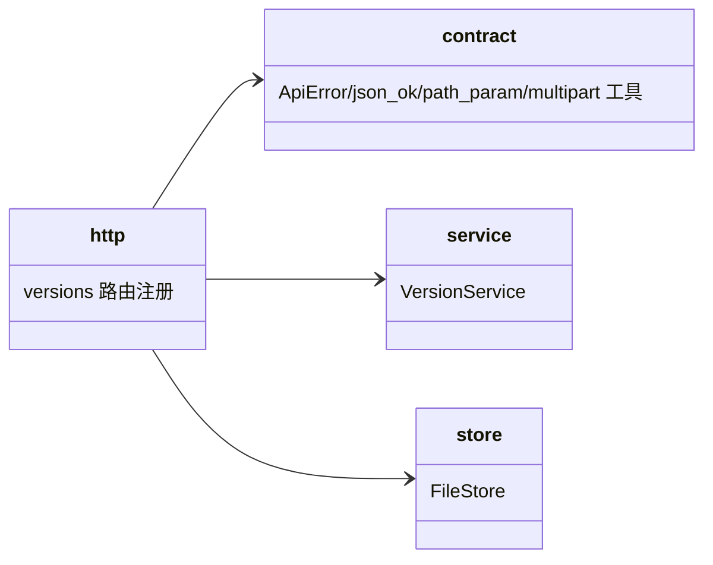
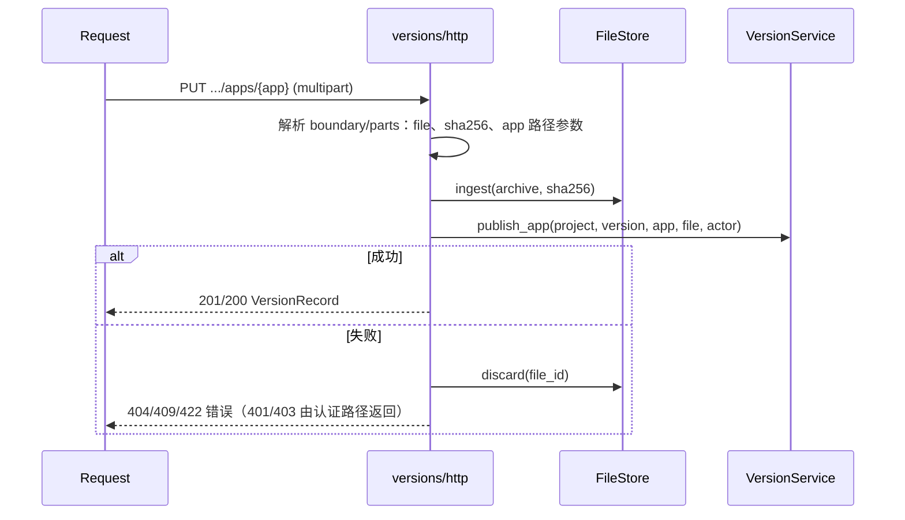

# v1 HTTP 契约：版本创建/锁定与 app 生命周期设计

Risk profile: ./risk-profile.yaml

## Design Scope

- 归属：`server/src/versions/http.rs` 路由与 `docs/api/v1-contract.md`（实现阶段同步更新）。
- 覆盖：端点表、请求/响应 DTO 形状、错误映射（404/409/422）、multipart `app` 字段解析、`?app=` 下载选择。
- 不覆盖：认证中间件（沿用 `AuthProvider::current_principal_req` 与 Bearer 头）、物理下载流（`storage::http::download_response`）、服务层生命周期（`design/versions.md`）。

## Module Relationship UML



## Endpoint Surface

| method | path | 认证/权限 | 请求 | 成功响应 | 失败语义 |
|--------|------|-----------|------|----------|----------|
| POST | `/api/v1/projects/{project_id}/versions` | session/token，`artifacts:write` | JSON `{"version":"..."}` | 201 `VersionRecord`（`apps:[]`） | 409 重复创建；422 空/非法 version；403/401 |
| PUT | `/api/v1/projects/{project_id}/versions/{version}/apps/{app}` | session/token，`artifacts:write` | multipart：`file`(.tar.gz) + 可选 `sha256` | 201（app 新建）/ 200（app 更新）`VersionRecord` | 404 版本不存在；409 版本已锁定；422 缺 file/非法 app；409 app 已有文件冲突由入库唯一性兜底 |
| DELETE | `/api/v1/projects/{project_id}/versions/{version}/apps/{app}` | session/token，`artifacts:write` | - | 204 | 404 版本或 app 不存在；409 版本已锁定 |
| PUT | `/api/v1/projects/{project_id}/versions/{version}/lock` | session/token，`administration` | - | 200 `VersionRecord`（`locked_at` 非空） | 404 版本不存在；重复锁定幂等 200 |
| GET | `/api/v1/projects/{project_id}/versions` | 匿名(public)/session/token，`metadata:read` | - | 200 `VersionRecord[]` | 401/403 按权限核心 |
| GET | `/api/v1/projects/{project_id}/versions/{version}` | 同上，`metadata:read` | `{version}=latest` 取最近版本 | 200 `VersionRecord`（含全部 `apps`） | 404 版本不存在 |
| GET | `/api/v1/projects/{project_id}/versions/{version}/download` | 匿名(public)/session/token，`artifacts:read` | 可选 query `app`；`{version}=latest` | 200 `.tar.gz` 流，`Content-Disposition: attachment; filename="{project_id}-{version}-{app}.tar.gz"` | 404 版本/app 不存在；422 多 app 未指定 app；空版本 404 |

## Response DTO（JSON，与 `model::record` 一致）

```json
{
  "project_id": 1,
  "version": "1.0.0",
  "published_at": "2026-08-21T00:00:00Z",
  "locked_at": null,
  "apps": [
    {
      "app": "server",
      "file_id": "f-abc",
      "sha256": "…",
      "size": 1024,
      "updated_at": "2026-08-21T00:00:01Z"
    }
  ]
}
```

错误统一 `{"error": code, "message": text}`：`unauthorized` 401 / `forbidden` 403 / `not_found` 404 / `conflict` 409 / `invalid_input` 422，沿用 `contract::api_error_response`。

## File-Level Interfaces（versions/http.rs）

```rust
pub fn register<S, Req, Resp>(
    server: &mut S,
    versions: Arc<dyn VersionService>,
    files: Arc<dyn FileStore>,
    auth: Arc<AuthProvider>,
) where
    S: HttpServer<Req, Resp>, Req: Request + Sync, Resp: Response;

struct CreateVersionRequest { version: String }        // serde Deserialize
fn parse_app<'a>(parts: &HashMap<String, Vec<u8>>) -> Result<String, ApiError>; // 缺省 APP_DEFAULT；非法字符 422
fn pick_download_app<'a>(record: &VersionRecord, query_app: Option<&str>) -> Result<Option<&AppRecord>, ApiError>;
    // 未指定：1 个 app → 下载；0 个 → 404；多个 → 422。指定：不存在 → 404。
```

`change_id: fh-versions-multi-app-api`；兼容性：`breaking`（POST /versions 语义与 `VersionRecord` 形状、download 参数变化；见 design.md Consumer Migration Closure）。

## Key Call Flows

### PUT app 发布/更新（HTTP 装配）



## Design Notes

- multipart 复用现有 `parse_multipart`/`multipart_boundary`（按 `name` 收集字段），新增 `app` 只需从 parts 读取并用路径参数同名约束校验；`sha256` 仍可选。
- `app` 作为路径参数时 URL 已做解码；服务层字符白名单（`[A-Za-z0-9._-]`）保证路径段安全。
- 下载文件名包含 app 名，方便多 app 版本区分产物；`latest` 与 `download` 的组合沿用现有 `{version}=latest` 合并路由语义。
- 409 在契约中的双重含义（重复创建版本 / 锁定版本写操作）通过 `message` 区分，`error` 码均为 `conflict`，与现有错误文档一致。
