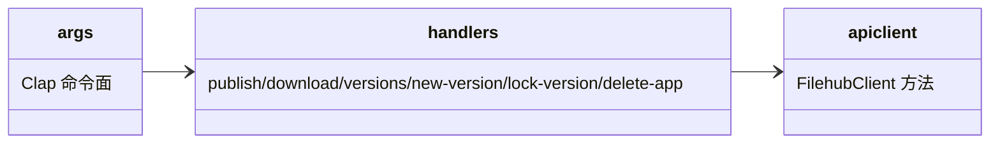

# filehub-cli：版本/app 生命周期命令面设计

Risk profile: ./risk-profile.yaml

## Design Scope

- 归属：`cli/src/`（`apiclient`、`cli/args.rs`、`cli/mod.rs` 与命令 handler）。
- 覆盖：新增 `new-version`/`lock-version`/`delete-app` 子命令，`publish`/`download` 增加 `--app`，`versions` 输出改为按版本展示 app 与锁定状态。
- 不覆盖：凭据存储、登录/登出、`.tar.gz` 打包与下载校验机制（沿用既有实现）。

## Module Relationship UML



## Command Surface

| 命令 | 参数 | 行为 | 稳定退出码 |
|------|------|------|-----------|
| `filehub new-version <project>:<version> [--server URL]` | target 两段必填 | 调 `POST /versions` 创建版本；409 重复创建退出码 4 | 0 / 4 / 2 / 3 |
| `filehub lock-version <project>:<version> [--server URL]` | target 两段必填 | 调 `PUT .../lock`；输出锁定后版本摘要 | 0 / 2 / 3 / 5(404) |
| `filehub delete-app <project>:<version> <app> [--server URL]` | app 必填 | 调 `DELETE .../apps/{app}`；成功后输出删除结果 | 0 / 2 / 3 / 4(锁定) / 5(404) |
| `filehub publish <project>:<version> <path> --app <name> [--server URL]` | `--app` 缺省 `default` | 调 `PUT .../apps/{app}`：首次创建、重复更新；发布前不隐式建版本 | 0 / 2 / 3 / 4 / 5(404 版本不存在) / 6/7/8 |
| `filehub download <project>[:<version>] -o <dir> --app <name> [--server URL]` | `--app` 缺省 `default` | 调 `GET .../download?app=`；按所选 app 的 sha256 校验落盘 | 0 / 2 / 3 / 5(404/422) / 7(完整性) |
| `filehub versions <project> [--format text|json] [-o FILE]` | 无新增 | 每版本一行，含锁定状态；json 直接输出 `VersionDto[]` | 0 / 2 / 3 / 5 |

CLI 的 404 仍归 `InvalidInput`（退出码 5）：命令输入指向的版本/app 不存在视为输入错误；锁定的 409 归 `Conflict`（退出码 4）。

## File-Level Interfaces

### cli/src/cli/args.rs

```rust
pub enum Command {
    Login(LoginArgs),
    Logout(LogoutArgs),
    Publish(PublishArgs),        // + app: Option<String>（--app，缺省 default）
    Download(DownloadArgs),      // + app: Option<String>（--app，缺省 default）
    Versions(VersionsArgs),
    NewVersion(NewVersionArgs),  // #[command(name = "new-version")]
    LockVersion(LockVersionArgs),// #[command(name = "lock-version")]
    DeleteApp(DeleteAppArgs),    // #[command(name = "delete-app")]
}

pub struct NewVersionArgs { pub target: String, pub server: Option<String> }
pub struct LockVersionArgs { pub target: String, pub server: Option<String> }
pub struct DeleteAppArgs { pub target: String, pub app: String, pub server: Option<String> }
```

`change_id: fh-cli-multi-app`；兼容性：`breaking`（新增子命令；`publish`/`download` 参数扩展为源码兼容、行为依赖新契约）。

### cli/src/apiclient/mod.rs

```rust
pub async fn create_version(&self, bearer: &str, project_id: i64, version: &str) -> Result<VersionDto, ClientError>;
pub async fn publish_app(&self, bearer: &str, project_id: i64, version: &str, app: &str, archive: &Path, sha256: &str) -> Result<VersionDto, ClientError>;
pub async fn delete_app(&self, bearer: &str, project_id: i64, version: &str, app: &str) -> Result<(), ClientError>;
pub async fn lock_version(&self, bearer: &str, project_id: i64, version: &str) -> Result<VersionDto, ClientError>;
pub async fn download(&self, bearer: &str, project_id: i64, version: Option<&str>, app: &str, tmp: &Path) -> Result<(), ClientError>;
```

`VersionDto` 形状改为：

```rust
pub struct AppDto { pub app: String, pub file_id: String, pub sha256: String, pub size: u64, pub updated_at: String }
pub struct VersionDto { pub project_id: i64, pub version: String, pub published_at: String, pub locked_at: Option<String>, pub apps: Vec<AppDto> }
```

`change_id: fh-cli-multi-app`；兼容性：`breaking`（顶层 `file_id/sha256/size` 移除，`download` 增加 `app` 参数）。

### cli/src/cli/（handler 职责）

- `new_version_handler`：解析 target → resolve_project → `create_version`；打印 `created version <project>:<version>`。
- `lock_version_handler`：target → resolve_project → `lock_version`；输出 `locked <project>:<version>`。
- `delete_app_handler`：target + app → resolve_project → `delete_app`；输出 `deleted app <app> from <project>:<version>`。
- `publish_handler`：沿用打包/清理守卫；改为 `publish_app(bearer, project_id, version, app, ...)`；输出含 app。
- `download_handler`：`get_version` 后从 `apps` 中按 `--app` 取值（不存在则 InvalidInput），用该 app 的 sha256 做完整性校验；`download(+app)`。
- `versions_handler`：text 输出列扩展为 `VERSION\tPUBLISHED_AT\tLOCKED\tAPPS`（app 列表逗号分隔，格式 `name:size`）；json 直接序列化新 DTO。

## Design Notes

- 命令名采用连字符小写风格（`new-version`/`lock-version`/`delete-app`），与既有 `after_help` 退出码文档一致。
- `--app` 在 CLI 末尾显式出现在帮助文本，缺省 `default`；多 app 版本下载若未指定存在的 app 会在 `get_version` 后立即报错，避免先下载再 422。
- 无新增依赖；所有变更在 `cli/src/` 内部完成。
