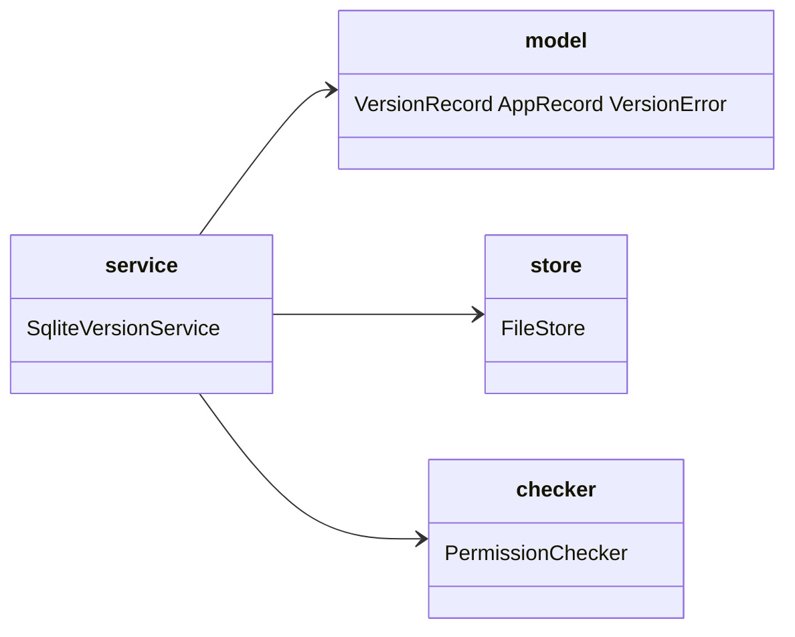
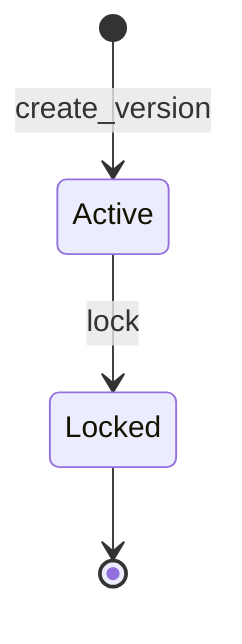
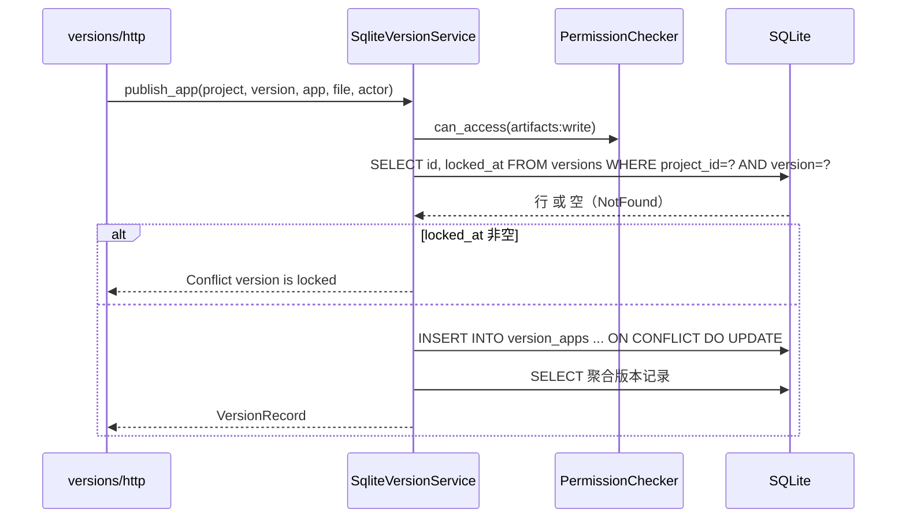

# filehub-server versions 子模块：版本与 app 生命周期设计

Risk profile: ./risk-profile.yaml

## Design Scope

- 归属：`filehub-server` crate 内 `server/src/versions/` 子 mod 与共享 `server/src/model/record.rs`。
- 覆盖：`versions`/`version_apps` schema、`VersionService` 接口与 `SqliteVersionService` 实现（显式创建、app UPSERT、删除、不可逆锁定、列表/单查/latest、引用集）、错误类别。
- 不覆盖：HTTP 端点与 multipart 解析（`design/api.md`）、物理文件存储（`storage`）、权限判定（`permissions`）。

## Module Relationship UML



## State and Ownership



- `versions` 表拥有 `project_id`/`version`/`published_at`/`locked_at`；`UNIQUE(project_id, version)`，创建时 `published_at=now`、`apps=[]`。
- `version_apps` 表拥有 `version_id`/`app`/`file_id`/`sha256`/`size`/`created_at`/`updated_at`；`UNIQUE(version_id, app)`、`file_id` 唯一（同一文件不得同时被两个 app 引用）。
- 锁定为终态转换：`locked_at` 非空后 `publish_app`/`delete_app` 一律 `Conflict("version is locked")`。
- 不做存量数据兼容：旧 `version_files` 不作为回填来源，schema 直接重建。

## Schema（0006_versions.sql 替换内容）

```sql
CREATE TABLE IF NOT EXISTS versions (
    id INTEGER PRIMARY KEY AUTOINCREMENT,
    project_id INTEGER NOT NULL,
    version TEXT NOT NULL,
    published_at TEXT NOT NULL,
    locked_at TEXT,
    UNIQUE (project_id, version)
);
CREATE TABLE IF NOT EXISTS version_apps (
    version_id INTEGER NOT NULL REFERENCES versions(id) ON DELETE CASCADE,
    app TEXT NOT NULL,
    file_id TEXT NOT NULL UNIQUE,
    sha256 TEXT NOT NULL,
    size INTEGER NOT NULL,
    created_at TEXT NOT NULL,
    updated_at TEXT NOT NULL,
    PRIMARY KEY (version_id, app)
);
CREATE INDEX IF NOT EXISTS idx_versions_project ON versions(project_id);
```

## File-Level Interfaces

### model/record.rs（filehub-server 共享模型）

```rust
pub struct AppRecord {
    pub app: String,
    pub file_id: FileId,
    pub sha256: String,
    pub size: u64,
    pub updated_at: DateTime<Utc>,
}

pub struct VersionRecord {
    pub project_id: ProjectId,
    pub version: String,
    pub published_at: DateTime<Utc>,
    pub locked_at: Option<DateTime<Utc>>,
    pub apps: Vec<AppRecord>,
}
```

`change_id: fh-versions-multi-app-model`；兼容性：`breaking`（`VersionRecord` 顶层 `file_id/sha256/size` 移除）；消费方见 design.md Consumer Migration Closure。

### versions/mod.rs（VersionService trait）

```rust
const APP_DEFAULT: &str = "default";

/// 显式创建版本；`(project, version)` 已存在返回 Conflict。
async fn create_version(&self, project: &ProjectId, version: &str, actor: &Principal) -> VersionResult<VersionRecord>;

/// 发布/更新版本内 app：版本不存在 NotFound；已锁定 Conflict；app 缺省 "default"；
/// app 不存在则创建、已存在则更新替换（刷新 sha256/size/updated_at）。
async fn publish_app(&self, project: &ProjectId, version: &str, app: &str, file: FileRecord, actor: &Principal) -> VersionResult<VersionRecord>;

/// 删除版本内 app：版本不存在 NotFound；已锁定 Conflict；app 不存在 NotFound。返回 ()。
async fn delete_app(&self, project: &ProjectId, version: &str, app: &str, actor: &Principal) -> VersionResult<()>;

/// 不可逆锁定版本：需 administration；已锁定幂等返回；版本不存在 NotFound。返回锁定后的记录。
async fn lock(&self, project: &ProjectId, version: &str, actor: &Principal) -> VersionResult<VersionRecord>;

async fn list(&self, project: &ProjectId, actor: &Principal) -> VersionResult<Vec<VersionRecord>>;
async fn get(&self, project: &ProjectId, version: Option<&str>, actor: &Principal) -> VersionResult<VersionRecord>;
async fn referenced_file_ids(&self) -> VersionResult<HashSet<FileId>>;
```

`change_id: fh-versions-multi-app-model`；兼容性：`breaking`（`publish` 签名移除，替代为三个生命周期方法 + `create_version`/`lock`）。消费方：`versions/http.rs`（production）、`server/tests/*`（test，testing 阶段迁移）。

### versions/model.rs（错误类别）

`VersionErrorKind` 保持 `NotFound/Forbidden/Conflict/InvalidInput/Db` 五类；新增语义复用现有类别：

- 重复创建版本、锁定后写操作 → `Conflict`。
- 版本不存在 / app 不存在 → `NotFound`。
- 空/非法 `version`、非法 `app` 字符 → `InvalidInput`。

### versions/service.rs（SqliteVersionService）

职责与实现约束：

- `create_version`：权限 `artifacts:write` → `INSERT INTO versions`，唯一冲突转 `Conflict`。
- `publish_app`：权限 `artifacts:write` → 先按 `(project, version)` 校验版本存在且未锁定 → `INSERT INTO version_apps ... ON CONFLICT(version_id, app) DO UPDATE SET file_id=?, sha256=?, size=?, updated_at=?`；响应记录由 `get` 聚合返回。旧文件在被替换后不再出现在 `referenced_file_ids()`，由启动回收阶段 `gc_orphans(keep)` 删除。
- `delete_app`：权限 `artifacts:write` → 校验版本存在且未锁定 → `DELETE FROM version_apps WHERE version_id=? AND app=?`；受影响 0 行 → `NotFound`。
- `lock`：权限 `administration` → `UPDATE versions SET locked_at=COALESCE(locked_at, now) WHERE id=?`；受影响 0 行 → `NotFound`；返回聚合记录。
- `list/get`：版本行倒序 + 每版本 `version_apps` 按 `app` 升序聚合；`get` 的 `None` 仍为 latest（按 `published_at` 倒序取首行）。
- `referenced_file_ids`：改从 `version_apps` 读取 `file_id`。

## Key Call Flows（服务层）

### 发布/更新



## Design Notes

- 事务边界：`publish_app` 的“校验版本/锁定 + UPSERT”放在单个事务中，防止“锁定并发通过后落库”竞态；`delete_app` 同理由单条语句保证。
- `version` 与 `app` 的空白/字符校验在服务层执行一次（HTTP 层仅解析），保证非 HTTP 调用方（测试/双客户端）行为一致。
- `published_at` 为版本创建时间；app 级变更只影响 `updated_at`，不改变 `latest` 排序。
- 不引入 app 级权限、不提供 app 重命名/版本删除接口、不提供解锁（均为 proposal 非目标）。

## Risks

- 锁定与写操作并发：以事务内读取 `locked_at` + UPSERT/DELETE 的顺序保证原子拒绝。
- 更新中断：新行落库与旧文件引用解除天然分离，中断不会丢引用；孤儿清理只处理不再被 `referenced_file_ids()` 覆盖的文件。
