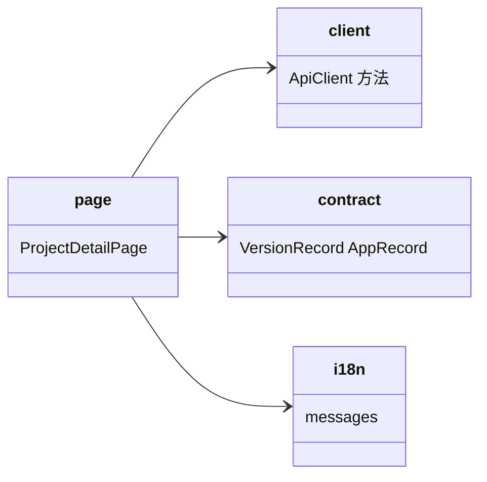

# admin-web：版本与应用管理交互设计

Risk profile: ./risk-profile.yaml

## Design Scope

- 归属：`admin-web/src/api/client.ts`、`admin-web/src/api/contract.ts`、`admin-web/src/pages/ProjectDetailPage.tsx`、`admin-web/src/i18n/messages.ts`。
- 覆盖：版本创建、按 app 上传/更新/删除、版本锁定、锁定后写操作禁用、按 app 下载、409/422 错误展示。
- 不覆盖：认证/会话、其他页面、服务端逻辑。

## Module Relationship UML



## File-Level Interfaces

### admin-web/src/api/contract.ts

```ts
export interface AppRecord {
  app: string;
  file_id: string;
  sha256: string;
  size: number;
  updated_at: string;
}

export interface VersionRecord {
  project_id: number;
  version: string;
  published_at: string;
  locked_at: string | null;
  apps: AppRecord[];
}
```

`change_id: fh-web-multi-app`；兼容性：`breaking`（顶层 `file_id/sha256/size` 移除，`locked_at/apps` 新增）。

### admin-web/src/api/client.ts

```ts
async createVersion(bearer: string, projectId: number, version: string): Promise<VersionRecord>;
async uploadApp(
  bearer: string,
  projectId: number,
  version: string,
  app: string,
  file: Blob,
  sha256?: string,
): Promise<VersionRecord>; // FormData multipart PUT
async deleteApp(bearer: string, projectId: number, version: string, app: string): Promise<void>;
async lockVersion(bearer: string, projectId: number, version: string): Promise<VersionRecord>;
async download(bearer: string | null, projectId: number, version: string, app: string): Promise<Blob>;
```

`uploadApp` 使用原生 `FormData` + `fetch`（不带 JSON Content-Type），沿用 `raw()` 的 bearer/超时/错误适配逻辑之外的独立实现；`download` 的 URL 增加 `?app=<encodeURIComponent(app)>`。

`change_id: fh-web-multi-app`；兼容性：`breaking`（`download` 增加 `app` 参数）。

## Page Interaction（ProjectDetailPage）

### 版本区

- 顶部“新建版本”行：输入框 + 创建按钮；成功调用 `listVersions()` 刷新；409 通过既有的 `statusMessage` 展示为冲突错误。
- 版本行：显示版本号、`published_at`、锁定徽标（`locked_at` 非空时红色/灰底徽标 + “已锁定”文案），以及 app 子表。
- app 子表列：`app`、`size`（`formatBytes`）、`sha256`（截断展示）、`updated_at`（`formatDate`）、操作（下载 / 删除）。
- 每版本一行“上传/更新 app”：app 名输入框 + 文件选择 + 上传按钮；对已存在 app 上传为更新，提交后刷新。
- 锁定按钮（未锁定版本行）：`Confirm` 组件二次确认，文案明确“锁定后不可逆”；成功后刷新。
- 锁定版本的 app 子表隐藏上传/删除操作，仅保留下载；后端 409（如并发锁定竞态）仍按错误展示。
- 空版本（`apps=[]`）显示 `versions.empty` 风格的“该版本暂无应用”文案。

### 下载

- 每个 app 独立下载：`saveBlob(blob, "${projectId}-${version}-${app}.tar.gz")`，与后端 `Content-Disposition` 一致。

### i18n（messages.ts）

新增中文文案键（连带英文）：`versions.create`（创建版本）、`versions.createEmpty`、`versions.lock`（锁定）、`versions.locked`（已锁定）、`versions.lockConfirm`（不可逆确认）、`versions.app`（应用）、`versions.appName`、`versions.uploadApp`（上传/更新应用）、`versions.deleteAppConfirm`、`versions.noApps`、`versions.updatedAt`。移除不再使用的单文件发布相关键（若测试断言引用则同步调整）。

## Design Notes

- 页面上“已锁定”状态以服务端 `locked_at` 为唯一事实来源；本地禁用只是体验优化，不替代后端 409。
- 上传采用 FormData 而非 JSON，与既有 CLI multipart 语义一致；不新增依赖。
- 删除与锁定均使用现成 `Confirm` 组件，避免破坏性操作无确认。
