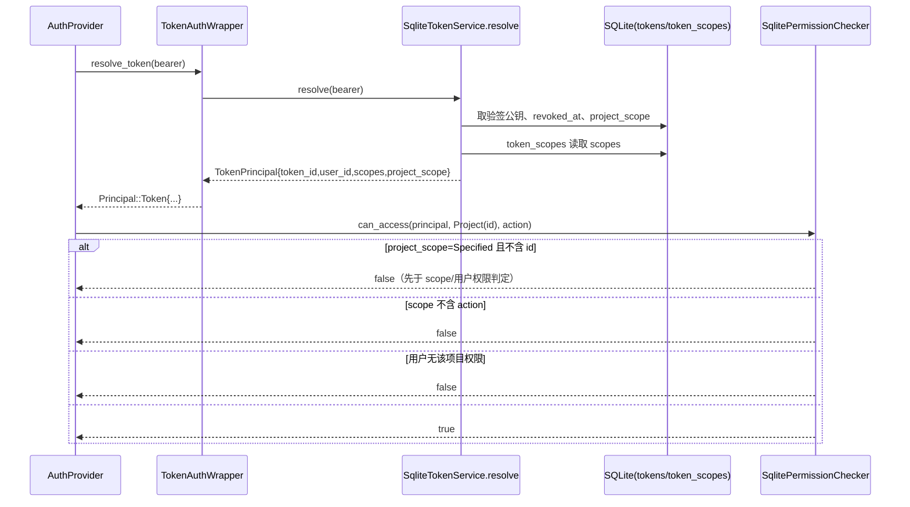

## Approval Record

- approver: user
- approval_date: 2026-08-23
- user_statement: 用户 2026-08-23 回复「确认，自动完成」，在提案确认中一并
  确认按 high-risk 全流程自动执行，设计阶段遵循已确认提案（权限不进 JWT、
  数据库权威、不考虑兼容）。

# filehub-server token 权限服务端化设计

Risk profile: ./risk-profile.yaml

## Design Scope

### Goals

- 修复 token `project_scope` 完全不生效的授权绕过：把 token 权限属性
  （`scopes` 与 `project_scope`）从 JWT claims 中移出，全部以数据库为权威，
  沿 `resolve -> TokenPrincipal -> Principal::Token -> checker` 在服务端
  链路携带并判定。
- 保持既有外部行为稳定：token 管理 HTTP 请求/响应 JSON、项目/版本/下载
  服务、密钥轮换与重签语义均不变。

### Non-goals

- 不改数据库 schema、不新增迁移（`tokens.project_scope` 列与
  `token_scopes` 表已存在）。
- 不改登录 session（`Principal::User`）判定、不改 `Resource::Feature`
  （projects:create/delete）判定语义。
- 不做旧 JWT 兼容层（按用户明确要求「不要考虑兼容问题」）。
- 不改管理端/CLI、不新增 UI 行为。

## Useful Context

- 现状断点（已核对到行）：
  - `server/src/tokens/model.rs:33` `TokenPayload` 携带 `scopes`，且无
    `project_scope`；JWT 是权限双源之一；
  - `server/src/tokens/service.rs:158/243/288` create/update/rotate 计算了
    `project_scope` 但未放入载荷，create 的 `scopes` 写入 JWT 与
    `token_scopes` 两处；
  - `server/src/tokens/service.rs:323` resolve 只回读
    `owner_id/public_key_pem/revoked_at`，scopes 直接信任
    `claims.data.scopes`，`project_scope` 完全未读；
  - `server/src/http/auth.rs:34` 构造 `Principal::Token` 未携带
    project_scope；`server/src/permissions/checker.rs:133`
    `Resource::Project` 分支未做 project_scope 校验。
- 用户本轮明确决策（提案确认前修订）：权限不需要放进 JWT，在服务器上判断
  就好；`scopes` 也一并去掉，不考虑兼容问题。
- 约束：`resolve` 每次请求都会查库（验签公钥 + 撤销状态），顺带读权限列
  不增加额外往返；`Resource::Project` 是项目访问（列表/元数据/产物/管理）
  的唯一判定入口，checker 层修复即可覆盖全部消费方。

## Overall Approach

最小但完整的服务端授权闭环：

1. `TokenPayload` 只保留 `token_id/user_id`，create/update/rotate 三个签发
   路径不再把权限写入 JWT；JWT 继续承担验签、`sub/jti/iat/exp` 与
   `token_id/user_id` 一致性校验。
2. `TokenService::resolve` 验签并校验 claims 后，从 `token_scopes` 表读取
   scopes、从 `tokens.project_scope` 读取项目范围，构造携带两者（加上
   token_id/user_id）的 `TokenPrincipal`。
3. `http/auth.rs` 把 `TokenPrincipal` 映射为带 `project_scope` 的
   `Principal::Token`。
4. `SqlitePermissionChecker` 对 `Resource::Project` 的 Token 分支先做
   `project_scope` 包含性校验（`Specified` 不含目标项目即拒绝），再做既有
   scope 二次限制与用户项目权限判定，保持 fail-closed 顺序。

## Layered Design Document Index

| level | parent_document | unit | design_document | responsibility |
|-------|-----------------|------|-----------------|----------------|
| root | `design.md` | filehub-server token 授权链路 | `design.md` | 权限服务端化整体形状、依赖方向、判定顺序与实现顺序 |
| submodule | `design.md` | model（共享模型） | `design/model.md` | `Principal::Token` 变体形状与权限字段归属 |
| submodule | `design.md` | tokens | `design/tokens.md` | JWT 载荷收窄、resolve 查库、TokenPrincipal |
| submodule | `design.md` | permissions | `design/permissions.md` | checker 项目范围校验入口 |
| submodule | `design.md` | http | `design/http.md` | 认证桥透传与装配 |

## Module Relationship UML

```mermaid
classDiagram
  direction LR
  class model {
    Principal::Token
    TokenPayload
    TokenPrincipal
  }
  class tokens {
    TokenService
    resolve()
  }
  class http {
    TokenAuthWrapper
  }
  class permissions {
    PermissionChecker
  }
  tokens --> model : 构造/返回权限承载结构
  http --> tokens : resolve_token
  http --> model : Principal::Token
  permissions --> model : 消费 Principal::Token
```

依赖方向约束：`http` 依赖 `tokens` 与共享 `model`；`permissions` 只依赖共享
`model`；`tokens` 不依赖 `permissions`/`http`。无环。

## File-Level Interfaces

```rust
// server/src/tokens/model.rs —— JWT 载荷与解析结果
pub struct TokenPayload {
    pub token_id: TokenId,
    pub user_id: UserId,
    // scopes 字段移除；不新增 project_scope：JWT 不再携带权限属性
}

pub struct TokenPrincipal {
    pub token_id: TokenId,
    pub user_id: UserId,
    pub scopes: ScopeSet,        // 来自 token_scopes 表
    pub project_scope: ProjectScope, // 来自 tokens.project_scope 列
}

// server/src/model/principal.rs —— 认证中间件产物
pub enum Principal {
    Anonymous,
    User { user_id: UserId, account_role: AccountRole },
    Token { token_id: TokenId, scopes: ScopeSet, user_id: UserId,
            project_scope: ProjectScope },
}

// server/src/tokens/mod.rs —— 解析入口（trait 签名不变）
pub trait TokenService {
    async fn resolve(&self, bearer: &str) -> TokenResult<TokenPrincipal>;
}

// server/src/permissions/mod.rs —— 统一放行判定（trait 签名不变）
pub trait PermissionChecker {
    async fn can_access(&self, principal: &Principal, resource: &Resource,
                        action: &str) -> PermissionResult<bool>;
}
```

- Consumer: 上表映射 `fh-token-permissions-server-side`（model/tokens/http
  链路）、`fh-token-project-scope-enforce`（permissions checker）；
  测试消费方见 Consumer Migration Closure。
- Compatibility: breaking
- Compatibility note: `TokenPayload` 移除 `scopes`、`TokenPrincipal` 与
  `Principal::Token` 变体新增 `project_scope`，均为仓库内服务端 crate 类型，
  无外部 crate 消费者；按用户要求不做兼容层，仓库内消费者同步迁移。
- Migration path when required: 本仓库内消费方在实现阶段同步更新；无外部
  `filehub-server` 依赖方（已核对 workspace 仅 `cli`/`server` 两成员，
  `cli` 不依赖 `filehub-server`）。

## API and Build Surface Impact

- Public API impact: none
- Public API note: v1 HTTP JSON 契约与 token 管理请求/响应不变；JWT claims
  收窄是本服务自产自销的内部凭据格式，按用户明确要求执行，不构成对外公开
  API。
- Crate-root export change: no
- Build-surface change: no
- Documentation examples affected: no
- Surface note: 不增删导出的公开根符号；不修改依赖/构建产物/文档示例。

## Consumer Migration Closure

| Old Symbol | New Path | change_id | Consumer Path | Consumer Kind | Migration Status |
|------------|----------|-----------|---------------|---------------|------------------|
| `TokenPayload { scopes }` | `server/src/tokens/model.rs`（字段移除，仅保留 token_id/user_id） | fh-token-permissions-server-side | `server/src/tokens/service.rs` | production | migrated |
| `TokenPrincipal`（无 project_scope） | `server/src/tokens/model.rs`（新增 project_scope 字段） | fh-token-permissions-server-side | `server/src/http/auth.rs` | production | migrated |
| `Principal::Token { token_id, scopes, user_id }` | `server/src/model/principal.rs`（新增 project_scope 字段） | fh-token-permissions-server-side | `server/tests/unit/permissions.rs` | test | migrated |
| `Principal::Token { token_id, scopes, user_id }` | `server/src/model/principal.rs`（新增 project_scope 字段） | fh-token-permissions-server-side | `server/tests/unit/versions.rs` | test | migrated |

## Key Flows



失败/异常语义保持现状：resolve 任何一步失败（无 token、已撤销、验签失败、
claims 不一致、DB 读取失败）都返回错误 -> 认证失败，不产生放行 principal；
checker 采用拒绝优先，不改变 `PermissionError` 传播方式。

## State and Ownership

- Owner: `tokens` 子模块独占 `tokens`（含 `project_scope` 列）与
  `token_scopes` 两表；签发与解析（create/update/rotate/resolve）均在该
  模块内完成。
- 其他模块访问方式：`permissions` 与 `http` 只消费 `resolve` 返回的
  `TokenPrincipal`/`Principal::Token`，不直接读写上述表。
- 无新增持久化状态、无事务边界变化：create/update 现有事务保持不变；
  resolve 读取为只读多查询，无状态变更。
- not-applicable: 无新增生命周期状态机。

## Directly Mapped Change Items

| change_id | target_module | proposal_id | design_coverage | scope_paths |
|-----------|---------------|-------------|-----------------|-------------|
| fh-token-permissions-server-side | filehub | P-001 | `design/tokens.md`（TokenPayload/TokenPrincipal/resolve）、`design/model.md`（Principal::Token）、`design/http.md`（认证桥透传） | server/src/tokens/, server/src/model/principal.rs, server/src/http/auth.rs |
| fh-token-project-scope-enforce | filehub | P-002 | `design/permissions.md`（checker 项目范围 fail-closed 校验） | server/src/permissions/checker.rs |
| fh-token-project-scope-tests | filehub | P-003 | 测试阶段文档（testing.md/testplan.yaml）与 `server/tests/unit/`、`docs/api/v1-contract.md` | server/tests/unit/, docs/api/v1-contract.md |

## Implementation Order

| phase | goal | depends_on | output |
|-------|------|------------|--------|
| 模型与载荷 | `TokenPayload` 去 scopes；`TokenPrincipal`/`Principal::Token` 加 project_scope | 提案 P-001/P-002 已批准 | model.rs、principal.rs 类型变化 |
| resolve 服务端读取 | resolve 从 token_scopes/tokens 读权限并构造 TokenPrincipal | 模型与载荷 | service.rs 变更 |
| 认证桥透传 | auth.rs 把 project_scope 映射进 Principal::Token | resolve 服务端读取 | http/auth.rs 变更 |
| checker 判定 | can_access 增加 project_scope fail-closed 校验 | 认证桥透传 | checker.rs 变更 |
| 测试与契约文档 | 更新既有测试、新增回归断言、同步 API 契约说明 | 上述生产变更 | server/tests、docs/api/v1-contract.md |

## File-Level Implementation Sequence

| sequence | file_level_module | action | depends_on | change_id | scope_path | implementation_task |
|----------|-------------------|--------|------------|-----------|------------|--------------------|
| 1 | server/src/tokens/model.rs | modify | - | fh-token-permissions-server-side | server/src/tokens/model.rs | 025-I-001 |
| 2 | server/src/model/principal.rs | modify | 1 | fh-token-permissions-server-side | server/src/model/principal.rs | 025-I-002 |
| 3 | server/src/tokens/service.rs | modify | 1 | fh-token-permissions-server-side | server/src/tokens/service.rs | 025-I-003 |
| 4 | server/src/http/auth.rs | modify | 3 | fh-token-permissions-server-side | server/src/http/auth.rs | 025-I-004 |
| 5 | server/src/permissions/checker.rs | modify | 4 | fh-token-project-scope-enforce | server/src/permissions/checker.rs | 025-I-005 |
| 6 | server/tests/unit/tokens.rs | modify | 3 | fh-token-project-scope-tests | server/tests/unit/tokens.rs | 025-I-006 |
| 7 | server/tests/unit/permissions.rs | modify | 5 | fh-token-project-scope-tests | server/tests/unit/permissions.rs | 025-I-007 |
| 8 | server/tests/unit/versions.rs | modify | 5 | fh-token-project-scope-tests | server/tests/unit/versions.rs | 025-I-008 |
| 9 | docs/api/v1-contract.md | modify | 8 | fh-token-project-scope-tests | docs/api/v1-contract.md | 025-I-009 |

## Design Notes

- 数据库是唯一权限权威：resolve 验签后从 `tokens`/`token_scopes` 读取，
  与 claims 的一致性只校验 `token_id/user_id/jti`，权限不再从 claims 读。
- 旧 JWT 中残留的 `scopes`/`project_scope` 字段在新 `TokenPayload`
  deserialize 时被 serde 作为未知字段忽略，属于自然行为，不是兼容层。
- `project_scope -> scope -> 用户项目权限` 三层判定顺序固定为拒绝优先：
  先做零成本的集合包含判断，再做 scope 交集，最后查用户项目权限，避免
  DB 查询放大与可能的信息泄漏。
- `resolve` 复用既有 `load_scopes(token_id)` 辅助方法，不新增表访问接口；
  `load_token_row` 已回读 `project_scope`，create/update/rotate 只需把该值
  纳入传入结构，不改表结构。
- 语义不变项：scope/project_scope 变更仍触发重签并更换验签公钥，旧 JWT
  立即失效；仅 name 变更不重签。

## Risks and Rollback

- 授权回归风险：若 resolve 或 checker 漏读/漏判 project_scope，绕过漏洞
  复现。缓解：三处签发路径 + resolve + checker 都有回归断言；checker
  固定 fail-closed 顺序；测试阶段与验收阶段分别做反例搜索。
- 类型形状变更风险：`Principal::Token`/`TokenPrincipal`/`TokenPayload` 为
  仓库内类型，消费方（http/auth.rs 与三个测试文件）在实现阶段同步迁移；
  workspace 无其他 `filehub-server` 依赖者（已用 `Cargo.toml` 核对）。
- 回滚：本任务不包含数据迁移/产物/外部契约变化，回滚即 revert 源码与测试
  提交并重启；无回滚数据迁移负担。若发布时存在已在途 token，其权限一律
  以数据库为准，行为一致。
