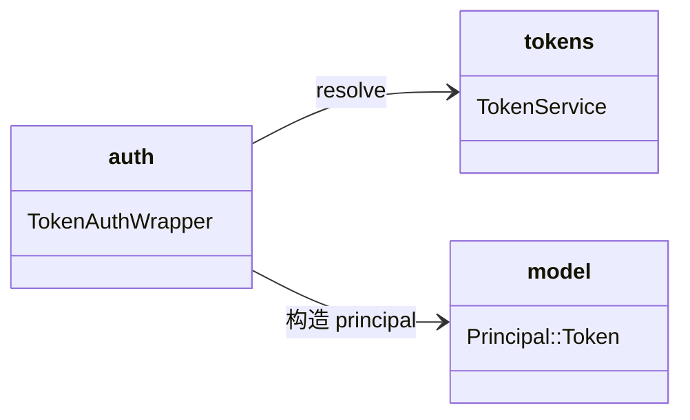

# http 子模块设计（认证桥透传 project_scope）

## Design Scope

- 归属：`filehub-server` crate 内 `server/src/http/` 子 mod。
- 覆盖：`TokenAuthWrapper::resolve_token` 把 `TokenPrincipal` 的
  `project_scope` 映射进 `Principal::Token`。
- 不覆盖：sfo-http 路由、handler、session 认证路径。

## Module Relationship UML



## File-Level Interfaces

```rust
// server/src/http/auth.rs
impl TokenAuth for TokenAuthWrapper {
    async fn resolve_token(&self, bearer: &str) -> Option<Principal> {
        self.tokens.resolve(bearer).await.ok().map(|tp| Principal::Token {
            token_id: tp.token_id,
            scopes: tp.scopes,
            user_id: tp.user_id,
            project_scope: tp.project_scope,
        })
    }
}
```

- Consumer: `server/src/http/mod.rs`（AuthProvider 装配）；change_id
  `fh-token-permissions-server-side`
- Compatibility: backward-compatible（认证桥内部实现，路由与 `TokenAuth`
  trait 签名不变）
- Migration path when required: 不适用

## State and Ownership

- 无持久化状态；仅做结构体字段映射。
- not-applicable: 无生命周期状态机。

## Design Notes

- `Option` 语义不变：resolve 失败仍返回 `None`，由 AuthProvider 统一
  401；project_scope 无默认值，避免隐式 `All`。
