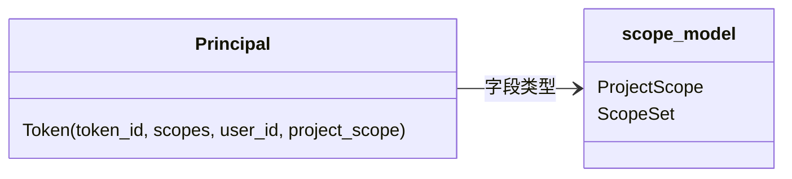

# model 子模块设计（Principal::Token 变体）

## Design Scope

- 归属：`filehub-server` crate 共享 `model` 子模块。
- 覆盖：`Principal::Token` 变体新增 `project_scope` 字段，使权限承载结构
  同时携带 scopes 与项目范围；`Principal::user_id/display_kind` 辅助逻辑
  不变。
- 不覆盖：account/permissions/tokens/http 子模块行为。

## Module Relationship UML



## File-Level Interfaces

```rust
// server/src/model/principal.rs
pub enum Principal {
    Anonymous,
    User { user_id: UserId, account_role: AccountRole },
    Token { token_id: TokenId, scopes: ScopeSet, user_id: UserId,
            project_scope: ProjectScope },
}
```

- Consumer: `server/src/http/auth.rs`（构造）、`server/src/permissions/checker.rs`
  （消费并判定）、`server/tests/unit/permissions.rs`、
  `server/tests/unit/versions.rs`（构造点）。change_id
  `fh-token-permissions-server-side`
- Compatibility: breaking（变体新增必填字段，仓库内消费方同步迁移；无外部
  消费者）
- Migration path when required: 本任务实现/测试阶段同步更新全部构造点。

## State and Ownership

- `Principal` 为进程内请求级值类型，无持久化状态。字段类型的权限数据
  （ScopeSet/ProjectScope）由 tokens 模块持久化，checker 只读消费。
- not-applicable: 无生命周期状态机。

## Design Notes

- 保持变体字段命名与现有 `scopes` 一致；`project_scope` 无默认值，避免
  隐式放行为 `All`。
