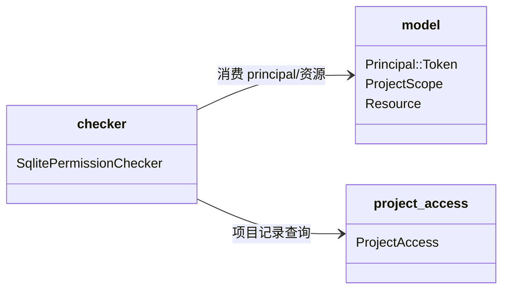

# permissions 子模块设计（checker 项目范围校验）

## Design Scope

- 归属：`filehub-server` crate 内 `server/src/permissions/` 子 mod。
- 覆盖：`SqlitePermissionChecker::can_access` 的 `Resource::Project` +
  `Principal::Token` 分支在 scope 与用户项目权限之前新增 project_scope
  包含性校验。
- 不覆盖：Feature 级别动作（projects:create/delete）、用户 session 判定、
  token 签发/解析。

## Module Relationship UML



## File-Level Interfaces

```rust
// server/src/permissions/checker.rs
async fn can_access(&self, principal: &Principal, resource: &Resource,
                    action: &str) -> PermissionResult<bool>;

// 新增私有判定（纯内存，无 IO）：
fn token_in_project_scope(project_scope: &ProjectScope, project_id: &ProjectId) -> bool;
```

- Consumer: `server/src/projects/service.rs`、`server/src/versions/service.rs`
  等全部项目资源服务经 `can_access` 调用；change_id
  `fh-token-project-scope-enforce`
- Compatibility: backward-compatible（trait 与公开函数签名不变，仅分支行为
  收紧）
- Migration path when required: 不适用

## State and Ownership

- 本模块不新增持久化状态；`ProjectScope` 数据 owner 为 tokens/tokens 表，
  `Principal::Token` 传入后只读。
- not-applicable: 无生命周期状态机。

## Design Notes

- 判定顺序固定为 `project_scope -> token scope -> 用户项目权限`，拒绝优先，
  任何一层不通过即返回 `false`，不继续执行后续查询。
- `Specified` 为空集合按现有存储约束不可能出现（FromStr 拒绝空串），
  实现仍按其语义（拒绝全部指定外项目）处理。
