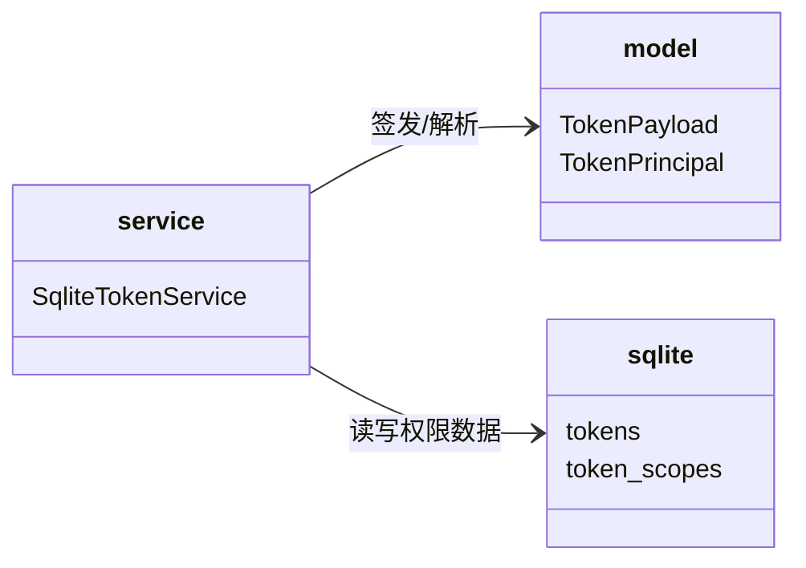

# tokens 子模块设计（JWT 去权限 + resolve 服务端读取）

## Design Scope

- 归属：`filehub-server` crate 内 `server/src/tokens/` 子 mod。
- 覆盖：`TokenPayload` 移除 `scopes`、`TokenPrincipal` 新增
  `project_scope`；create/update/rotate 签发载荷收窄；resolve 从数据库读取
  scopes 与 project_scope。
- 不覆盖：业务放行判定（permissions）、认证桥装配（http）、共享模型
  （model）。

## Module Relationship UML



## File-Level Interfaces

```rust
// server/src/tokens/model.rs
pub struct TokenPayload { pub token_id: TokenId, pub user_id: UserId }
// scopes 移除、不新增 project_scope：JWT 载荷不含权限属性

pub struct TokenPrincipal {
    pub token_id: TokenId,
    pub user_id: UserId,
    pub scopes: ScopeSet,
    pub project_scope: ProjectScope,
}

// server/src/tokens/mod.rs
pub trait TokenService {
    async fn resolve(&self, bearer: &str) -> TokenResult<TokenPrincipal>;
}
```

- Consumer: `server/src/http/auth.rs`（resolve_token）、
  `server/src/tokens/service.rs`（实现）、`server/tests/unit/tokens.rs`。
  change_id `fh-token-permissions-server-side`
- Compatibility: breaking（TokenPayload 移除字段；TokenPrincipal 新增字段；
  仓库内同步迁移，无外部消费者）
- Migration path when required: 本任务内同步更新 service/auth/tests。

## State and Ownership

- Owner: `tokens` 与 `token_scopes` SQLite 表归 tokens 子模块；`project_scope`
  列是本次授权的数据库权威值。
- resolve 顺序：验签 -> jti/token_id/user_id 一致性 -> 已撤销检查 ->
  `load_scopes` + `project_scope` 读取 -> 构造 `TokenPrincipal`。
- not-applicable: 无新增生命周期状态机；create/update 事务边界不变。

## Design Notes

- 旧 JWT 中残留权限字段由 serde 忽略未知字段自然兼容，不写任何兼容代码。
- `project_scope` 解析沿用 `ProjectScope::from_str`；入库格式仍是
  `all` / 逗号分隔 ids，无迁移。
