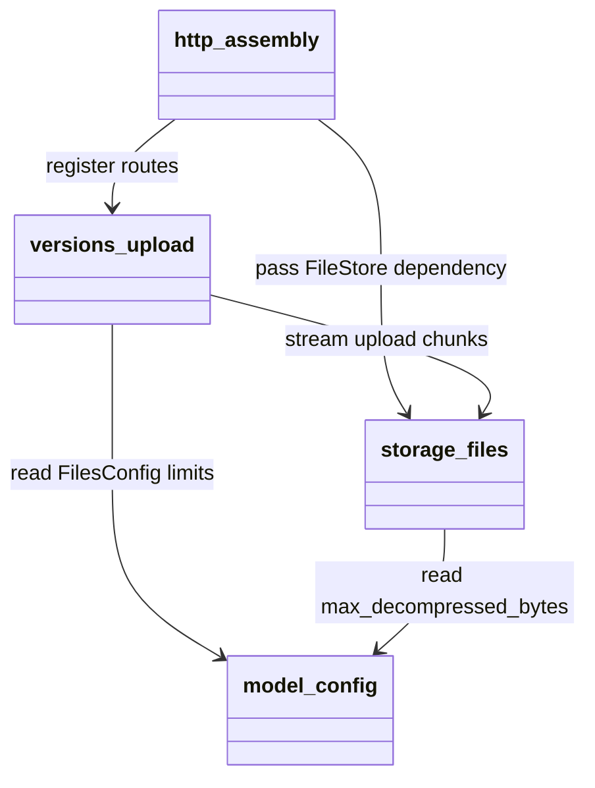
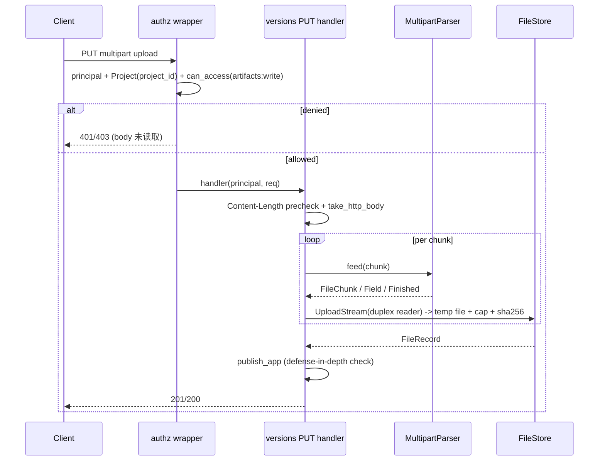
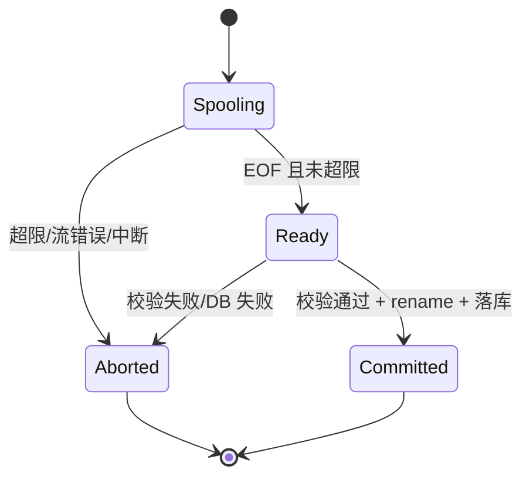

Risk profile: ./risk-profile.yaml

## Approval Record

- approver: 用户
- approval_date: 2026-08-24
- user_statement: 用户确认 high-risk 提案并要求自动完成；设计文档按已批准提案生成，作为实现基线。

## Design Scope

- 上传链路修复：PUT `/api/v1/projects/{project_id}/versions/{version}/apps/{app}`
  在读取请求体之前完成 `artifacts:write` 判定，并改为恒定内存的流式上传。
- 涉及子模块：http（authz 包装器与装配）、versions（上传编排与增量 multipart
  解析）、storage（流式入库与有界解压）、model（配置字段）。
- 不做：其它写路由迁移、hyper/tide 后端启用、DB schema/API JSON/422 语义变更。

## Useful Context

- 现状链路（评审第 2 项）：`versions/http.rs` 先 `req.body_bytes()` 整包读入，
  再解析 multipart、`ingest()` 解压写盘，`publish_app()`（`service.rs:211`）
  才校验 `artifacts:write`；sfo-http 0.7 `body_bytes()` 无上限（
  actix_server/endpoint.rs:228）；`store.rs:48` 的超限检查发生在整包入内存
  之后；`integrity.rs:19` 把解压内容累积进无限 `Vec`。
- 已确认能力：sfo-http 0.8.0（2026-08-24）为 `Request` 新增
  `take_http_body()`，返回标准 `http_body::Body`（`UnsyncBoxBody<Bytes,
  HttpError>`），三个后端一致；`Response::set_body_read`/`serve`/
  `HttpServerConfig` 等既有 API 保留，仓库未用 OpenAPI（0.8 已移除）。
- 设计依据：`001-filehub-core-platform` risk-profile 冻结“权限校验 -> 文件入库
  -> 版本落库”；本任务 `risk-profile.yaml` 的 security/runtime/build/
  contract/data 判定均已 applies。

## Overall Approach

1. http 模块提供 `authz_project_action` 包装器：解析 `Principal`、从路径参数
   取 `ProjectId`，在 handler 执行前调用 `checker.can_access(Project,
   action)`；匿名 401、已认证越权 403。versions PUT 路由成为首个使用者，
   `publish_app` 内的校验保留为纵深防御。
2. 依赖升级 `sfo-http = "0.8"`，新增 `http-body-util`/`bytes` 直接依赖；
   上传 handler 用 `take_http_body()` 读取 chunk，交给仓库内增量
   `MultipartParser`（`server/src/versions/upload.rs`）：boundary 可跨 chunk，
   `file` part 边解析边经 `tokio::io::DuplexStream` 喂给 `FileStore::ingest`
   （storage 拥有临时文件生命周期），`sha256` 等小字段有小缓冲上限。
3. `UploadStream` 由 `Vec<u8>` 改为异步流式包装；`ingest` 流式写临时文件，
   写入期实时计数 `max_archive_bytes`，超限即清理拒绝；落位前用限量
   `validate_targz`（解压累计超 `max_decompressed_bytes` 失败）并核对 sha256。
4. `FilesConfig` 新增可选 `max_decompressed_bytes`（装配时缺省为
   `max_archive_bytes × 20`），超限/非 gzip/非 tar 统一 422；`Content-Length`
   预检在读取前拒绝明显超限请求。
5. 同步更新 `001` 的 design/files.md、design/http.md 与 `docs/api/v1-contract.md`，
   使顺序与上限约束与实际实现一致（本任务包 testing.md 另行给出测试设计）。

## Layered Design Document Index

| level | parent_document | unit | design_document | responsibility |
|-------|-----------------|------|----------------|----------------|
| level-1 | design.md | http（authz 包装器与装配） | design/http.md | 上传鉴权前置与依赖兼容面 |
| level-1 | design.md | versions（上传编排与 multipart 解析） | design/versions.md | 流式请求体消费与上传编排 |
| level-1 | design.md | storage（文件入库与完整性） | design/storage.md | 流式 ingest、实时限长、有界解压 |
| level-1 | design.md | model（配置） | design/model.md | FilesConfig 可选解压上限字段 |

## Module Relationship UML



## File-Level Interfaces

```rust
// server/src/storage/mod.rs
pub struct UploadStream {
    reader: Box<dyn tokio::io::AsyncRead + Send + Unpin>,
}
impl UploadStream {
    pub fn from_reader<R: tokio::io::AsyncRead + Send + Unpin + 'static>(r: R) -> Self;
    pub fn from_bytes(bytes: Vec<u8>) -> Self;
    pub fn into_reader(self) -> Box<dyn tokio::io::AsyncRead + Send + Unpin>;
}

pub trait FileStore: 'static + Send + Sync {
    async fn ingest(&self, source: UploadStream, expected_sha256: Option<&str>)
        -> FileStoreResult<FileRecord>;
    // open_read/discard/gc_orphans 签名不变
}

// server/src/versions/upload.rs
pub struct UploadLimits {
    pub max_archive_bytes: u64,
    pub max_field_bytes: usize,
    pub max_header_bytes: usize,
    pub max_total_bytes: u64,
}
pub enum MultipartEvent<'a> {
    FileChunk(&'a [u8]),
    Field { name: String, value: String },
    Finished,
}
pub struct MultipartParser { /* boundary 状态机 + 跨 chunk 缓冲 + 计数 */ }
impl MultipartParser {
    pub fn new(boundary: &str, limits: UploadLimits) -> Self;
    pub fn feed(&mut self, chunk: &[u8]) -> Result<Option<MultipartEvent>, String>;
    pub fn finish(self) -> Result<(), String>;
}

// server/src/http/authz.rs
pub(crate) fn authz_project_action<Req, Resp, F, Fut>(
    auth: Arc<AuthProvider>,
    checker: Arc<dyn PermissionChecker>,
    action: &'static str,
    handler: F,
) -> impl Fn(Req) -> Fut
where
    Req: Request,
    F: Fn(Principal, Req) -> Fut + Clone + Send + Sync + 'static,
    Fut: Future<Output = HttpResult<Resp>> + Send + 'static;

// server/src/model/config.rs
pub struct FilesConfig {
    pub data_dir: PathBuf,
    pub max_archive_bytes: u64,
    #[serde(default)]
    pub max_decompressed_bytes: Option<u64>,
}
```

- Consumer: versions PUT 路由（fh-http-body-limit、fh-upload-authz-gate）、
  storage 单元/DV 测试与 common 夹具（fh-upload-size-and-decompression-bounds）。
- Compatibility: migration-required

兼容性说明：`UploadStream` 既有调用方需迁移（见 Consumer Migration Closure）；
sfo-http 0.8 为构建依赖升级，API 面保持兼容。

## API and Build Surface Impact

- Public API impact: migration-required
- Crate-root export change: no
- Build-surface change: yes

构建面说明：server/Cargo.toml 升级 sfo-http 0.8，新增 http-body-util/bytes，
Cargo.lock 刷新；详见 Design Notes 与 Consumer Migration Closure。
- Documentation examples affected: yes

文档示例说明：design/files.md、design/http.md 与 docs/api/v1-contract.md 的
上传上限与顺序描述随实现更新。

## Consumer Migration Closure

| old_symbol | new_path | change_id | consumer_kind | migration_status | consumer_path |
|------------|----------|-----------|---------------|------------------|---------------|
| `FileStore::ingest(Vec<u8>)` | `server/src/storage/mod.rs`（`UploadStream` 流式） | fh-upload-size-and-decompression-bounds | unit-test | migrated | server/tests/unit/storage.rs |
| `FileStore::ingest(Vec<u8>)` | `server/src/storage/mod.rs`（`UploadStream` 流式） | fh-upload-size-and-decompression-bounds | unit-test | migrated | server/tests/unit/versions.rs |
| `FileStore::ingest(Vec<u8>)` | `server/src/storage/mod.rs`（`UploadStream` 流式） | fh-upload-size-and-decompression-bounds | dv-test | migrated | server/tests/dv_tests.rs |
| `FileStore::ingest(Vec<u8>)` | `server/src/storage/mod.rs`（`UploadStream` 流式） | fh-upload-size-and-decompression-bounds | handler | migrated | server/src/versions/http.rs |
| `sfo-http 0.7` | `server/Cargo.toml`（`sfo-http = "0.8"`） | fh-http-body-limit | build-dependency | migrated | server/Cargo.toml |

## Key Flows



## State and Ownership

- Owner: storage（临时文件、正式文件字节、sha256 与 size 记录的唯一属主）
- Owner: versions（multipart 解析与上传编排状态，进程内非持久化）
- Owner: model（`FilesConfig.max_decompressed_bytes` 配置字段）

上传临时文件生命周期（storage 内部）：



## Directly Mapped Change Items

| change_id | target_module | proposal_id | design_coverage | scope_paths |
|-----------|---------------|-------------|-----------------|-------------|
| fh-upload-authz-gate | filehub | P-01 | design/http.md、design/versions.md | server/src/versions/http.rs, server/src/http/authz.rs, server/src/http/router.rs |
| fh-http-body-limit | filehub | P-02 | design/versions.md、design/http.md | server/Cargo.toml, Cargo.lock, server/src/versions/http.rs, server/src/versions/upload.rs |
| fh-upload-size-and-decompression-bounds | filehub | P-03 | design/storage.md、design/model.md | server/src/storage/mod.rs, server/src/storage/store.rs, server/src/storage/integrity.rs, server/src/model/config.rs, server/config.example.json |
| fh-upload-security-tests | filehub | P-04 | design.md、design/versions.md、design/storage.md | server/tests/unit/, server/tests/api_integration.rs, docs/versions/v0.1/modules/filehub/001-filehub-core-platform/design/files.md, docs/versions/v0.1/modules/filehub/001-filehub-core-platform/design/http.md, docs/api/v1-contract.md |

## Implementation Order

| phase | goal | depends_on | output |
|-------|------|-----------|--------|
| 基线依赖升级 | sfo-http 0.8 + http-body-util/bytes，Cargo.lock 刷新 | 无 | workspace 可编译 |
| 存储流式化 | UploadStream/流式 ingest/限量解压 | 基线依赖升级 | 存储层编译通过 |
| 配置字段 | FilesConfig.max_decompressed_bytes 可选默认 | 基线依赖升级 | 配置解析 + 默认值 |
| 授权前置 | authz_project_action 包装器接线 | 基线依赖升级 | 上传鉴权先于 body 读取 |
| 解析与编排 | MultipartParser + versions PUT 流式编排 | 存储流式化、授权前置 | PUT 流式上传可用 |
| 文档同步 | 001 design files/http 与契约文档更新 | 解析与编排 | 文档与实现一致 |

## File-Level Implementation Sequence

| sequence | file_level_module | action | depends_on | change_id | scope_path | implementation_task |
|----------|-------------------|--------|-----------|-----------|------------|--------------------|
| 1 | server/Cargo.toml | 修改依赖 | 无 | fh-http-body-limit | server/Cargo.toml | 026-impl-1 |
| 2 | server/src/storage/mod.rs | 修改 UploadStream 类型 | 1 | fh-upload-size-and-decompression-bounds | server/src/storage/mod.rs | 026-impl-2 |
| 3 | server/src/storage/integrity.rs | 修改限量流式校验 | 2 | fh-upload-size-and-decompression-bounds | server/src/storage/integrity.rs | 026-impl-3 |
| 4 | server/src/storage/store.rs | 修改流式 ingest | 2,3 | fh-upload-size-and-decompression-bounds | server/src/storage/store.rs | 026-impl-4 |
| 5 | server/src/model/config.rs | 修改 FilesConfig | 1 | fh-upload-size-and-decompression-bounds | server/src/model/config.rs | 026-impl-5 |
| 6 | server/config.example.json | 修改配置示例 | 5 | fh-upload-size-and-decompression-bounds | server/config.example.json | 026-impl-6 |
| 7 | server/src/http/authz.rs | 新增 authz 包装器 | 1 | fh-upload-authz-gate | server/src/http/authz.rs | 026-impl-7 |
| 8 | server/src/versions/upload.rs | 新增 MultipartParser | 1 | fh-http-body-limit | server/src/versions/upload.rs | 026-impl-8 |
| 9 | server/src/versions/http.rs | 修改上传路由编排 | 4,7,8 | fh-upload-authz-gate | server/src/versions/http.rs | 026-impl-9 |
| 10 | server/src/http/router.rs | 修改装配接线 | 7,9 | fh-upload-authz-gate | server/src/http/router.rs | 026-impl-10 |
| 11 | 001 design/http.md、design/files.md、docs/api/v1-contract.md | 修改文档 | 9 | fh-upload-security-tests | docs/api/v1-contract.md | 026-impl-11 |
| 12 | 测试夹具（tests/common、unit、dv） | 修改调用方迁移 | 4 | fh-upload-size-and-decompression-bounds | server/tests/ | 026-impl-12 |

## Design Notes

- `UploadStream` 仅替换类型与构造方式，不新增 trait 方法；`ingest` 内部用
  duplex 通道背压，handler 解析侧与入库侧并行，任一侧失败即清理临时文件。
- `authz_project_action` 只落地上传路由，符合 design/http.md 既有的 authz
  文档契约；未来推广其它写路由属于后续任务（提案 P-01 非目标）。
- `MultipartParser` 只支持本产品客户端契约的两类字段（file + 可选 sha256）；
  不复制命名/排序/重复字段等通用 MIME 语义，避免无谓通用化。
- 有界解压与 sha256 校验都在临时文件流式读取阶段完成，不把解压结果驻留内存；
  gzip/tar 为阻塞实现，store 层经 spawn_blocking 调用避免阻塞 async 执行器。
- 磁盘占用上限 = `max_archive_bytes`（临时文件）+ 解压校验复用同一临时文件，
  不新增第二份落盘数据。

## Risks and Rollback

- 依赖升级：sfo-http 0.8 有 breaking 面（trait 新增必选方法、移除 OpenAPI），
  仓库只以泛型消费，实现阶段以 `cargo check/test -p filehub-server` 全量
  验证；回滚 = 还原 Cargo.toml 与 Cargo.lock。
- 增量解析正确性：boundary 跨 chunk、流中断、结束标记缺失等边角在实现时
  以单元级数据流覆盖；失败路径统一删除临时文件。
- 错误码优先级：授权前移后，无权用户 + 不存在项目返回 403/401 而非 404，
  属设计接受的行为变化；测试冻结该顺序。
- 解压上限误拒：`max_decompressed_bytes` 可配置，过低时拒绝高压缩比合法
  归档属预期行为，文档说明调优边界。
- 磁盘/并发：流式写盘按配置上限预约磁盘；并发上传之间无共享可变状态。
