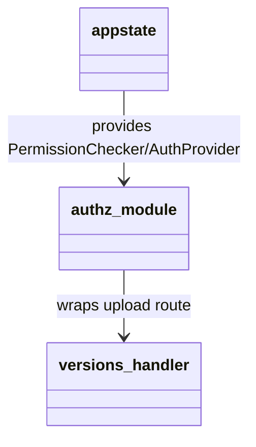

## Design Scope

- http 子模块新增 `authz_project_action`：在 handler 执行前完成 Principal 解析
  与项目资源动作判定，供 versions PUT 上传路由首个使用。
- 依赖升级兼容面（sfo-http 0.8）在本文档登记。

## Module Relationship UML



## File-Level Interfaces

```rust
// server/src/http/authz.rs（新增）
// 输入：AuthProvider（Principal 解析）、PermissionChecker（判定）、动作名、
//       inner handler（接受 Principal 与原始 Request）
// 输出：等价 Endpoint 闭包；拒绝时直接构造 401/403 JSON 响应，不触碰 body
pub(crate) fn authz_project_action<Req, Resp, F, Fut>(
    auth: Arc<AuthProvider>,
    checker: Arc<dyn PermissionChecker>,
    action: &'static str,
    handler: F,
) -> impl Fn(Req) -> Fut
where
    Req: sfo_http::http_server::Request,
    F: Fn(crate::model::Principal, Req) -> Fut + Clone + Send + Sync + 'static,
    Fut: std::future::Future<Output = sfo_http::errors::HttpResult<Resp>> + Send + 'static;
```

- Consumer: `server/src/versions/http.rs` PUT 上传路由（fh-upload-authz-gate）。
- Compatibility: new（不改变既有路由行为；仅新增包装器）。

## State and Ownership

- Owner: http（包装器闭包自身不持状态；捕获 Arc 依赖）。

## Design Notes

- 拒绝映射：匿名 401、已认证越权 403，与既有 `api_err` 语义一致；inner
  handler 只收到有权请求，避免重复判定。
- `server/src/http/router.rs` 需要把 `state.permissions` 传入
  `versions::http::register`，保持 http 为唯一装配层。
