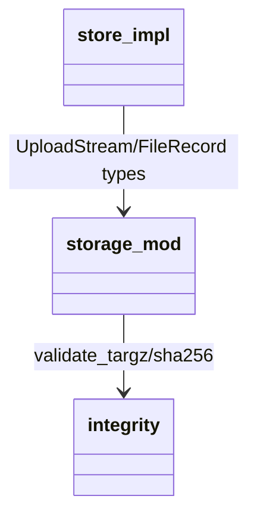

## Design Scope

- storage 子模块把上传源从整包 `Vec<u8>` 改为异步流，入库过程实时限长、
  流式计算 sha256，落位前用限量解压校验拒绝压缩炸弹。

## Module Relationship UML



## File-Level Interfaces

```rust
// server/src/storage/mod.rs
pub struct UploadStream {
    reader: Box<dyn tokio::io::AsyncRead + Send + Unpin>,
}
impl UploadStream {
    pub fn from_reader<R: tokio::io::AsyncRead + Send + Unpin + 'static>(r: R) -> Self;
    pub fn from_bytes(bytes: Vec<u8>) -> Self;
    pub fn into_reader(self) -> Box<dyn tokio::io::AsyncRead + Send + Unpin>;
}

// server/src/storage/integrity.rs（修改）
pub fn validate_targz<R: std::io::Read>(
    source: R,
    max_decompressed_bytes: u64,
) -> Result<(), String>;
pub fn sha256_hex<R: std::io::Read>(source: R) -> Result<String, std::io::Error>;
```

- Consumer: `server/src/storage/store.rs`（fh-upload-size-and-decompression-bounds）、
  versions PUT 路由与存储/单元/DV 测试。
- Compatibility: migration-required（`UploadStream` 构造与消费方式变化）。

## State and Ownership

- Owner: storage（临时文件、正式文件、sha256/size 记录；其它模块不得直接写
  data_dir）。

## Design Notes

- `ingest` 流程：创建 `.tmp-{uuid}` -> 流式复制（计数 + sha256，> 
  max_archive_bytes 即中止清理）-> 限量解压校验（spawn_blocking，计数 sink，
  > max_decompressed_bytes 失败）-> 期望 sha256 核对 -> fsync -> rename ->
  files 表插入；任何失败删除临时/正式路径。
- `validate_targz` 不再累积 `Vec`：解压总字节由 `max_decompressed_bytes`
  封顶，tar 条目仍逐个流式读出，条数由解压字节自然约束。
- 保持 Windows 语义：写入句柄同步后释放再 rename（沿袭 010 修复的经验）。
