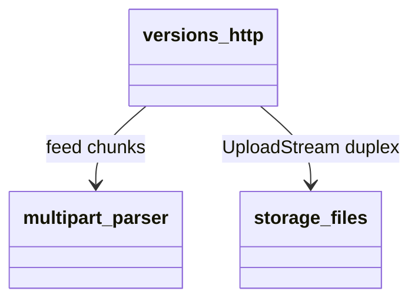

## Design Scope

- versions 子模块负责上传编排：消费 sfo-http 0.8 的 `take_http_body()`，
  用增量 multipart 解析器把 `file` part 流式送入 storage，`sha256` 字段小缓冲。

## Module Relationship UML



## File-Level Interfaces

```rust
// server/src/versions/upload.rs（新增）
pub struct UploadLimits {
    pub max_archive_bytes: u64,
    pub max_field_bytes: usize,
    pub max_header_bytes: usize,
    pub max_total_bytes: u64,
}
pub enum MultipartEvent<'a> {
    FileChunk(&'a [u8]),
    Field { name: String, value: String },
    Finished,
}
pub struct MultipartParser { /* boundary/头部/内容状态机 + 跨 chunk 余量缓冲 */ }
impl MultipartParser {
    pub fn new(boundary: &str, limits: UploadLimits) -> Self;
    pub fn feed(&mut self, chunk: &[u8]) -> Result<Option<MultipartEvent>, String>;
    pub fn finish(self) -> Result<(), String>;
}
```

- Consumer: `server/src/versions/http.rs` PUT 上传路由（fh-http-body-limit）。
- Compatibility: new（仓库内新增解析模块；外部契约仍是 multipart/form-data）。

## State and Ownership

- Owner: versions（解析器状态为 handler 栈上所有权，不跨请求共享）。

## Design Notes

- 解析器状态机：等待首边界 -> part 头部 -> content（file 直出 chunk / 小字段
  缓冲）-> 边界；剩余未匹配尾部保留到下一 chunk，避免 boundary 被切分。
- 三道实时上限：`file` part 累计不超 `max_archive_bytes`；单字段/头部不超
  小预算；总请求体不超 `max_archive_bytes + 开销预算`。超限返回 422。
- handler 用 `tokio::io::duplex` 连接解析输出与 `FileStore::ingest` 的读取侧，
  天然背压；解析失败或入库失败都会关闭对端并清理临时文件。
