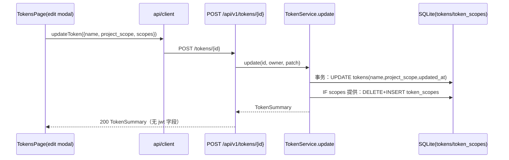
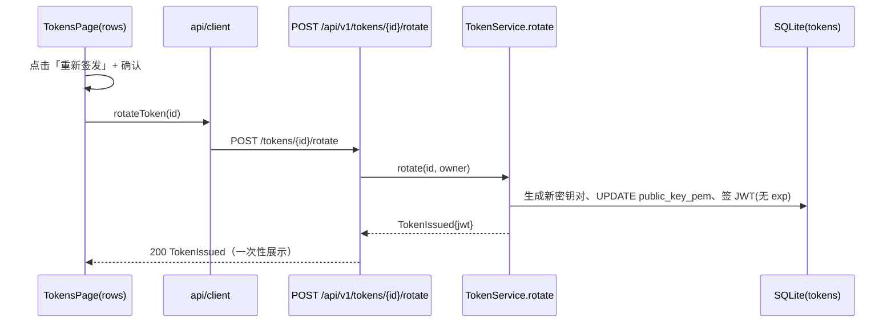

## Approval Record

- approver: user
- approval_date: 2026-08-24
- user_statement: 用户 2026-08-24 回复「确认，自动完成」，确认按 high-risk
  全流程自动执行，设计遵循已确认提案：属性修改不重签、仅显式「重新签发」
  按钮触发重签、重签沿用 rotate 默认不过期语义。

# Token 属性修改去自动重签设计

Risk profile: ./risk-profile.yaml

## Design Scope

### Goals

- `update()` 不再因 name/project_scope/scopes 修改而重签：属性修改只落库，
  不生成密钥、不签发 JWT，返回 `TokenSummary`；不再可能把有限期 Token
  意外转成不带 `exp` 的永久 JWT。
- 显式重签唯一入口化：管理端把既有 rotate 操作明确呈现为「重新签发」
  按钮，仅点击该按钮才重新签发（换验签公钥、旧 JWT 立即失效、新 JWT
  一次性展示）。
- 前后端契约、文档与测试同步收敛，确保「属性修改永不产出 JWT、永不碰
  exp」成为可验证的不变量。

### Non-goals

- 不新增 `expires_at` 数据库字段/迁移；不提供重签时选择有效期（保持 rotate
  默认不过期语义）。
- 不新增 `/resign` 端点——复用 `/api/v1/tokens/{id}/rotate`，仅前端呈现
  为「重新签发」。
- 不改 create/list/revoke/resolve、不改 CLI、不改认证/授权判定链路。
- 不引入 JWT claims 权限属性（数据库权威模型不变）。

## Useful Context

- 现状断点：
  - `server/src/tokens/model.rs:23` `TokenUpdateRequest.expires_at` 注释
    规定 `None=不修改`；
  - `server/src/tokens/service.rs:224` update 将 scopes/project_scope/
    expires_at 任一存在即视为重签条件；
  - `server/src/tokens/service.rs:237` `patch.expires_at.unwrap_or(None)`
    把缺省值转成不带 `exp` 的签发，有限期 Token 被转永久；
  - `admin-web/src/pages/TokensPage.tsx` 编辑弹窗带有效期预设与
    「修改即重签」警告，`saveToken` 期待 `TokenIssued | TokenSummary` 联合
    返回。
- 约束：JWT 只含 token_id/user_id（当前 worktree 已按 025/027 数据库权威
  模型收窄），scopes/project_scope 由 `resolve` 从数据库读取；因此属性修改
  不重签时权限变更可立即按数据库生效，无需 JWT 换发。

## Overall Approach

最小拆分方案，不引入新端点与新持久化状态：

1. `TokenUpdateRequest` 移除 `expires_at`；`TokenService::update` 签名改为
   返回 `TokenSummary`，落库 name/project_scope（归一化）/scopes（原子替换）
   后直接返回最新摘要；不调用 `generate_keypair`/`sign`。
2. rotate 保持既有语义（新密钥对 + 一次性 JWT + 旧 JWT 失效）不变，作为
   事实上的显式重签能力；前端把该行操作改名为「重新签发」并保留确认
   弹窗。
3. admin-web 编辑弹窗不再提供有效期选择与重签警告，改为提示属性修改不
   重签；`updateToken` 返回类型收敛为 `TokenSummary`，保存不再展示 JWT。
4. 契约文档与测试同步更新，新增 exp 保持/update 不签发回归断言。

## Layered Design Document Index

| level | parent_document | unit | design_document | responsibility |
|-------|-----------------|------|-----------------|----------------|
| root | `design.md` | filehub 模块 token 产品面 | `design.md` | 整体形状、依赖方向、契约边界与实现顺序 |
| submodule | `design.md` | filehub-server tokens | `design/tokens.md` | update 去重签、rotate 显式重签、DB 事务与 invariant |
| submodule | `design.md` | filehub-web tokens | `design/admin-web-tokens.md` | 编辑弹窗/重签按钮交互与 DTO 收敛 |

## Module Relationship UML

```mermaid
classDiagram
  direction LR
  class WebTokensPage {
    saveToken() : summary
    resignToken() : issued
  }
  class WebApiClient {
    updateToken() : TokenSummary
    rotateToken() : TokenIssued
  }
  class HttpRouter {
    POST /tokens/{id}
    POST /tokens/{id}/rotate
  }
  class TokenService {
    update() : TokenSummary
    rotate() : TokenIssued
  }
  class SqliteDB {
    tokens
    token_scopes
  }
  WebTokensPage --> WebApiClient : 消费 DTO
  WebApiClient --> HttpRouter : v1 JSON
  HttpRouter --> TokenService : 委托
  TokenService --> SqliteDB : 事务读写
```

依赖方向约束：web 只经 HTTP 契约消费服务端；服务端 http 装配层委托
tokens 子模块；tokens 独占 tokens/token_scopes 表。无环。

## File-Level Interfaces

```rust
// server/src/tokens/model.rs —— 属性修改请求体（不再包含 expires_at）
pub struct TokenUpdateRequest {
    pub name: Option<String>,
    pub project_scope: Option<ProjectScope>,
    pub scopes: Option<Vec<Scope>>,
}

// server/src/tokens/mod.rs —— 更新不再签发（返回最新摘要）
pub trait TokenService {
    async fn update(
        &self,
        token_id: &TokenId,
        owner: &UserId,
        patch: TokenUpdateRequest,
    ) -> TokenResult<TokenSummary>;
    // rotate 签名不变：async fn rotate(...) -> TokenResult<TokenIssued>;
}
```

```typescript
// admin-web/src/api/contract.ts
export interface TokenUpdateInput {
  name?: string;
  project_scope?: ProjectScopeDto;
  scopes?: Scope[];
  // expires_at 移除：属性修改永远不重签
}

// admin-web/src/api/client.ts —— 返回类型收敛
async updateToken(bearer: string, tokenId: number, patch: TokenUpdateInput): Promise<TokenSummary>
```

- Consumer: 服务端消费者为 `server/src/tokens/service.rs`、
  `server/src/tokens/http.rs`、`server/tests/unit/tokens.rs`；前端消费者为
  `admin-web/src/api/client.ts`、`admin-web/src/pages/TokensPage.tsx`。
  变更映射见 `## Consumer Migration Closure`；change_id
  `fh-token-update-no-resign` / `fh-token-explicit-resign-action`
- Compatibility: breaking, 仓库内服务端 trait 返回类型与 DTO 变更、HTTP
  JSON 响应形状变更（管理端同步迁移），rotate 路径不变

## API and Build Surface Impact

- Public API impact: breaking
- Public API note: `POST /api/v1/tokens/{id}` 响应从
  `TokenIssued | TokenSummary` 变为恒 `TokenSummary`；请求体移除
  `expires_at`。rotate 路径不变。
- Crate-root export change: no
- Build-surface change: no
- Documentation examples affected: yes
- Documentation examples note: `docs/api/v1-contract.md` 与
  `docs/modules/filehub.md` 的 token 语义描述需同步。

## Consumer Migration Closure

| Old Symbol | New Path | change_id | Consumer Path | Consumer Kind | Migration Status |
|------------|----------|-----------|---------------|---------------|------------------|
| `TokenService::update -> Option<TokenIssued>` | `server/src/tokens/mod.rs`（-> TokenSummary） | fh-token-update-no-resign | `server/src/tokens/http.rs` | production | migrated |
| `TokenService::update -> Option<TokenIssued>` | `server/src/tokens/mod.rs` | fh-token-update-no-resign | `server/tests/unit/tokens.rs` | test | migrated |
| `TokenUpdateRequest.expires_at` | 字段移除（`server/src/tokens/model.rs`） | fh-token-update-no-resign | `server/tests/unit/tokens.rs` | test | migrated |
| `TokenUpdateInput.expires_at`、`updateToken` 联合返回类型 | `admin-web/src/api/contract.ts`（字段移除）、`client.ts`（-> TokenSummary） | fh-token-explicit-resign-action | `admin-web/src/pages/TokensPage.tsx` | production | migrated |
| `updateToken` 联合返回类型 | `admin-web/src/api/client.ts` | fh-token-explicit-resign-action | `admin-web/tests/unit/client.test.ts` | test | migrated |
| `updateToken` 联合返回类型 | `admin-web/src/api/client.ts` | fh-token-explicit-resign-action | `admin-web/tests/integration/contract.test.ts` | test | migrated |

## Key Flows





失败语义保持现状：update 任何一步 DB 失败回滚事务并返回 TokenError；
resolve 对旧 JWT 在 rotate 换钥后验签失败 -> 认证失败。

## State and Ownership

- Owner: `tokens` 子模块独占 `tokens`（name/project_scope/public_key_pem/
  created_at/updated_at）与 `token_scopes`；update 的写入在本模块内完成，
  其他模块只消费 `resolve`/列表结果。
- 不变式 1：update 永不完全 a) 调用 `generate_keypair` 或 b) 写
  `public_key_pem` 或 c) 调用 `sign`——属性修改不会触发任何签发副作用。
- 不变式 2：属性修改的 token 行 + 权限行在同一 SQLite 事务中提交，不存在
  半改状态。
- 无新增持久化状态、无新增生命周期状态机；rotate/revoke 语义与既有实现
  一致。

## Directly Mapped Change Items

| change_id | target_module | proposal_id | design_coverage | scope_paths |
|-----------|---------------|-------------|-----------------|-------------|
| fh-token-update-no-resign | filehub | P-001 | design/tokens.md（update 去重签与事务）；design.md API/Consumer 映射 | server/src/tokens/ |
| fh-token-explicit-resign-action | filehub | P-002 | design/admin-web-tokens.md（编辑表单/重签按钮/DTO 收敛） | admin-web/src/ |
| fh-token-no-resign-regression-tests | filehub | P-003 | 测试阶段文档（testing.md/testplan.yaml）；实现于 server/tests/unit 与 admin-web/tests | server/tests/unit/、admin-web/tests/ |

## Implementation Order

| phase | goal | depends_on | output |
|-------|------|------------|--------|
| 服务端模型与接口 | TokenUpdateRequest 去 expires_at；trait 返回 TokenSummary | 提案 P-001 已批准 | model.rs/mod.rs 变更 |
| 服务端实现 | update 落库返回摘要、无签发副作用 | 模型与接口 | service.rs/http.rs 变更 |
| 前端契约与页面 | TokenUpdateInput 去 expires_at、updateToken 收敛；编辑弹窗与重签按钮 | 服务端契约定稿 | contract.ts/client.ts/TokensPage.tsx/messages.ts 变更 |
| 契约文档 | v1-contract 与 docs/modules 同步 | 上述定稿 | docs/api/v1-contract.md、docs/modules/filehub.md |
| 测试与回归 | 见 testing 阶段 | 生产变更完成 | server/tests/unit/tokens.rs、admin-web/tests |

## File-Level Implementation Sequence

| sequence | file_level_module | action | depends_on | change_id | scope_path | implementation_task |
|----------|-------------------|--------|------------|-----------|------------|--------------------|
| 1 | server/src/tokens/model.rs | modify | - | fh-token-update-no-resign | server/src/tokens/model.rs | 028-I-001 |
| 2 | server/src/tokens/mod.rs | modify | 1 | fh-token-update-no-resign | server/src/tokens/mod.rs | 028-I-002 |
| 3 | server/src/tokens/service.rs | modify | 1,2 | fh-token-update-no-resign | server/src/tokens/service.rs | 028-I-003 |
| 4 | server/src/tokens/http.rs | modify | 3 | fh-token-update-no-resign | server/src/tokens/http.rs | 028-I-004 |
| 5 | admin-web/src/api/contract.ts | modify | 4 | fh-token-explicit-resign-action | admin-web/src/api/contract.ts | 028-I-005 |
| 6 | admin-web/src/api/client.ts | modify | 5 | fh-token-explicit-resign-action | admin-web/src/api/client.ts | 028-I-006 |
| 7 | admin-web/src/pages/TokensPage.tsx | modify | 6 | fh-token-explicit-resign-action | admin-web/src/pages/TokensPage.tsx | 028-I-007 |
| 8 | admin-web/src/i18n/messages.ts | modify | 7 | fh-token-explicit-resign-action | admin-web/src/i18n/messages.ts | 028-I-008 |
| 9 | docs/api/v1-contract.md | modify | 4 | fh-token-update-no-resign | docs/api/v1-contract.md | 028-I-009 |
| 10 | docs/modules/filehub.md | modify | 9 | fh-token-update-no-resign | docs/modules/filehub.md | 028-I-010 |
| 11 | server/tests/unit/tokens.rs | modify | 3 | fh-token-no-resign-regression-tests | server/tests/unit/tokens.rs | 028-I-011 |
| 12 | admin-web/tests/unit/client.test.ts、admin-web/tests/integration/contract.test.ts | modify | 6 | fh-token-no-resign-regression-tests | admin-web/tests/ | 028-I-012 |

## Design Notes

- `rotate` 同时承担「轮换」与「重新签发」语义：两者在换钥+发新 JWT+旧 JWT
  失效上是同一操作，因此不新增端点；前端文案改为「重新签发」以消除「属性
  修改自动重签」的既有认知。
- 属性修改后 `updated_at` 刷新、名称/范围/权限任一未提供时保持原值；全部
  patch 字段为 None 时不写库、直接返回当前摘要（保持既有空操作行为）。
- 重签默认不过期是提案明示取舍：服务端未持久化旧 exp，无法推测原期限；
  显式确认弹窗会把该效果告知用户。
- 不新增副作用性抽象：仍由服务端 `resolve` 数据库权威读取权限，无 claims
  双源。

## Risks and Rollback

- 授权/吊销语义风险：权限修改不再自动使旧 JWT 副本失效。缓解：resolve
  数据库权威不变、权限变更立即生效；需要让旧副本失效时由显式重签完成；
  验收阶段对该边界做反例搜索。
- 契约漂移风险：update 返回形状变化需前后端同批收敛。缓解：Consumer
  Migration Closure 已列全部消费方，测试阶段用编译/契约测试闭合。
- 回滚：无数据迁移与外部产物变化，回滚即 revert 本任务源码与测试；
  已发布 token 的行为在回滚前后由数据库权限决定，不依赖新字段。
