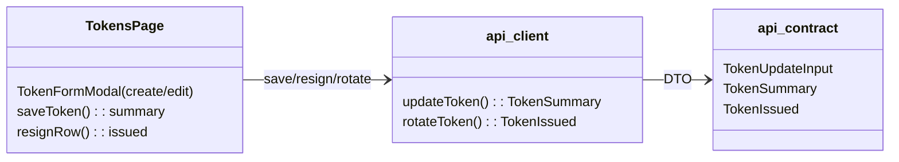
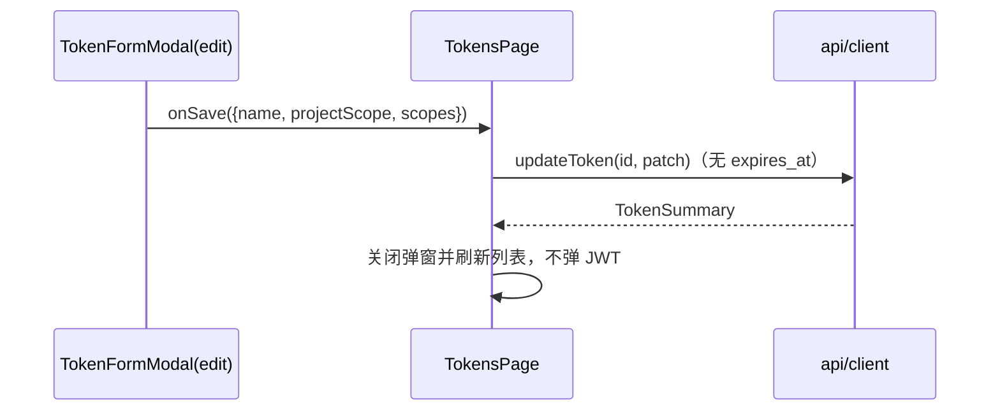
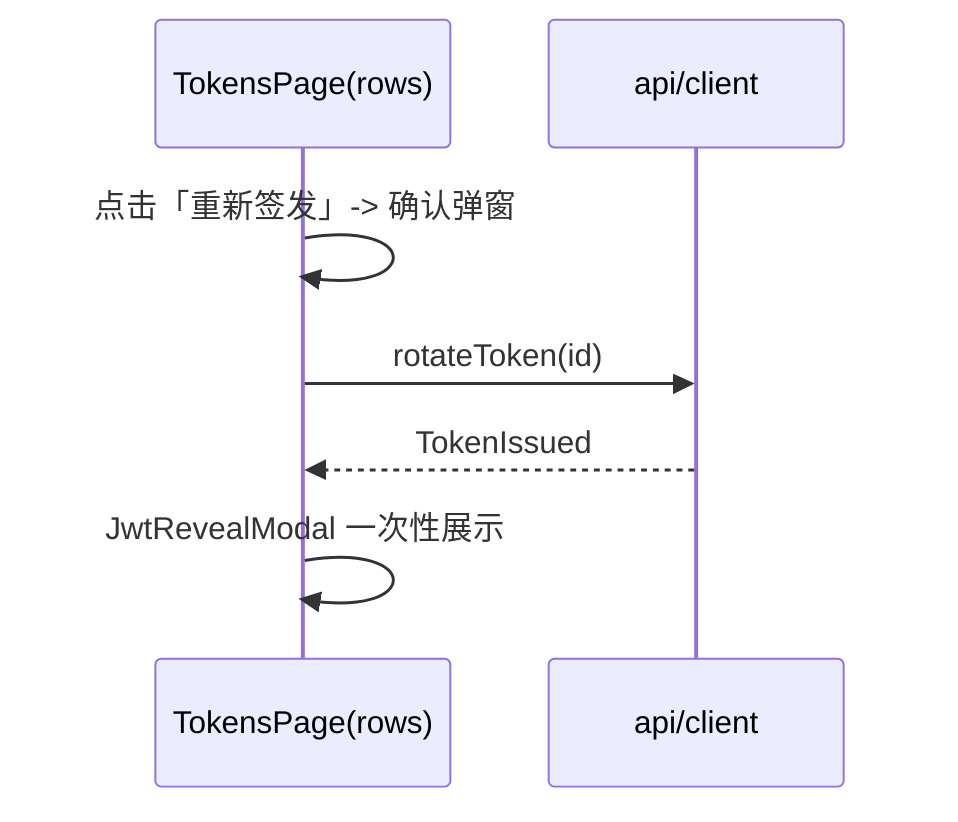

# admin-web tokens 界面设计（编辑不重签 + 显式重新签发按钮）

## Design Scope

- 归属：filehub-web 交付（`admin-web/`）tokens 子模块：`TokensPage.tsx`、
  `src/api/{contract,client}.ts`、`src/i18n/messages.ts`。
- 覆盖：编辑弹窗去掉有效期选择与重签警告；`updateToken` 返回类型收敛；
  行操作「轮换」改名「重新签发」并保留确认弹窗；创建弹窗有效期预设不变。
- 不覆盖：session/401 续期、样式系统、其他页面。

## Module Relationship UML



## File-Level Interfaces

```typescript
// admin-web/src/api/contract.ts
export interface TokenUpdateInput {
  name?: string;
  project_scope?: ProjectScopeDto;
  scopes?: Scope[];
  // expires_at 移除：属性修改不重签，请求体永远不携带过期字段
}

// admin-web/src/api/client.ts
async updateToken(
  bearer: string,
  tokenId: number,
  patch: TokenUpdateInput,
): Promise<TokenSummary>; // 旧联合类型 TokenIssued | TokenSummary 移除

async rotateToken(bearer: string, tokenId: number): Promise<TokenIssued>;
```

- Consumer: `TokensPage.tsx`（saveToken/resign 入口）、
  `admin-web/tests/unit/client.test.ts` 与
  `admin-web/tests/integration/contract.test.ts`（测试）。
  change_id `fh-token-explicit-resign-action`、`fh-token-no-resign-regression-tests`
- Compatibility: breaking（TS 类型收敛；仓库内同步迁移）

## Key Flows





## State and Ownership

- 页面状态仍是组件本地 state（tokens/projects/editTarget/rotateTarget/
  jwtReveal）；无新增持久化状态。
- 编辑弹窗状态：name/scopeType/specified/scopes；有效期状态仅创建弹窗
  使用（isEdit 时隐藏）。
- 不变式：编辑保存永不携带 expires_at 字段，也从不在成功后展示新 JWT；
  「重新签发」是唯一会在列表页产出/展示新 JWT 的行操作。

## Design Notes

- 编辑弹窗提示文案改为「属性修改仅保存、不重新签发；需要新 JWT 请使用
  列表中的『重新签发』」。
- 「重新签发」复用 rotateToken 端点与既有 Confirm/JwtReveal 组件，不
  新增抽象；按钮与文案统一走 i18n key，移除旧的「轮换/重签警告」文案。
