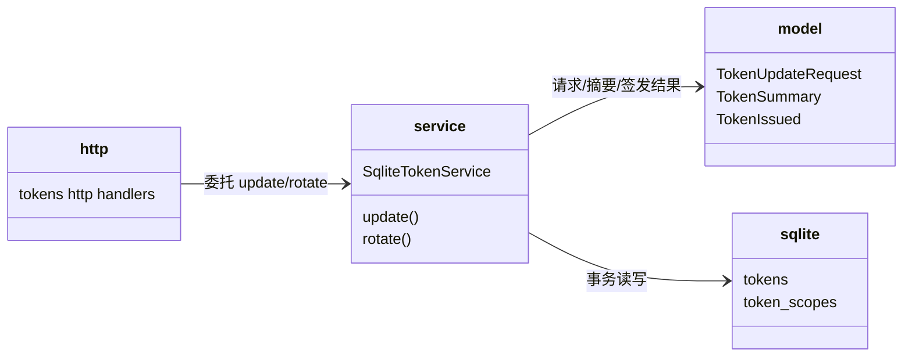
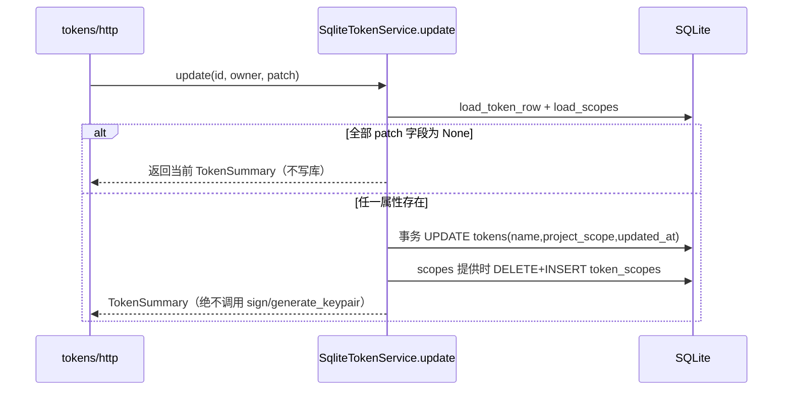

# tokens 子模块设计（update 去自动重签 + rotate 显式重签）

## Design Scope

- 归属：`filehub-server` crate 内 `server/src/tokens/` 子 mod。
- 覆盖：`TokenUpdateRequest` 移除 `expires_at`；`TokenService::update`
  返回 `TokenSummary` 且无任何签发副作用；rotate 保持既有换钥语义作为
  显式重签入口。
- 不覆盖：create/list/revoke/resolve、认证桥（http）、权限判定
  （permissions）、管理端交互（见 `design/admin-web-tokens.md`）。

## Module Relationship UML



依赖方向无环：http -> service -> model/sqlite。

## File-Level Interfaces

```rust
// server/src/tokens/model.rs
pub struct TokenUpdateRequest {
    pub name: Option<String>,
    pub project_scope: Option<ProjectScope>,
    pub scopes: Option<Vec<Scope>>,
    // expires_at 移除：属性修改从不重签，过期时间只在 create/rotate 明确设置
}

// server/src/tokens/mod.rs
pub trait TokenService {
    async fn update(
        &self,
        token_id: &TokenId,
        owner: &UserId,
        patch: TokenUpdateRequest,
    ) -> TokenResult<TokenSummary>; // 旧签名返回 Option<TokenIssued> 已移除
    async fn rotate(&self, token_id: &TokenId, owner: &UserId) -> TokenResult<TokenIssued>;
}
```

- Consumer: `server/src/tokens/service.rs`（实现）、`server/src/tokens/http.rs`
  （委托）、`server/tests/unit/tokens.rs`（测试）。
  change_id `fh-token-update-no-resign`
- Compatibility: breaking（trait 返回类型与 DTO 字段变化；仓库内同步迁移，
  无外部 crate 消费者，`cli` 不依赖 filehub-server）
- Migration path when required: 本任务内同步更新 service/http/tests。

## Key Flows



rotate 流程沿用现状：换新密钥对 -> 签无 exp JWT -> UPDATE
public_key_pem/updated_at -> 返回 `TokenIssued`；旧 JWT 因验签公钥替换立即
失效。

## State and Ownership

- Owner: tokens 子模块独占 `tokens` 与 `token_scopes` 两表；update 只改
  name/project_scope/scopes/updated_at，永不写 public_key_pem。
- 不变式：属性修改任何路径不得调用 generate_keypair 或 sign；update 的
  tokens 行与 token_scopes 修改在同一事务提交。
- not-applicable: 无新增持久化字段/迁移/生命周期状态机。

## Design Notes

- `ProjectScope::normalize()`（空集合 -> All）在 update 落库前复用，与
  create 一致。
- `updated_at` 语义：任一属性实际提供即刷新；全部为 None 时保持原始行
  时间戳（维持既有空操作行为）。
- rotate 无请求体、默认不过期是既有语义，本任务不改；「重签转永久」的
  保护来自「重签完全显式 + 确认弹窗明示」，不再来自隐式属性修改。
