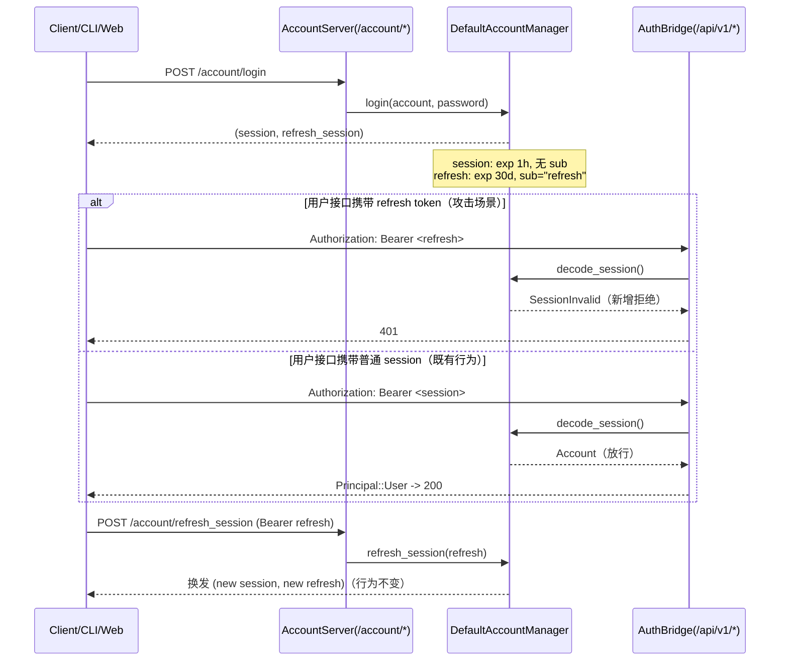
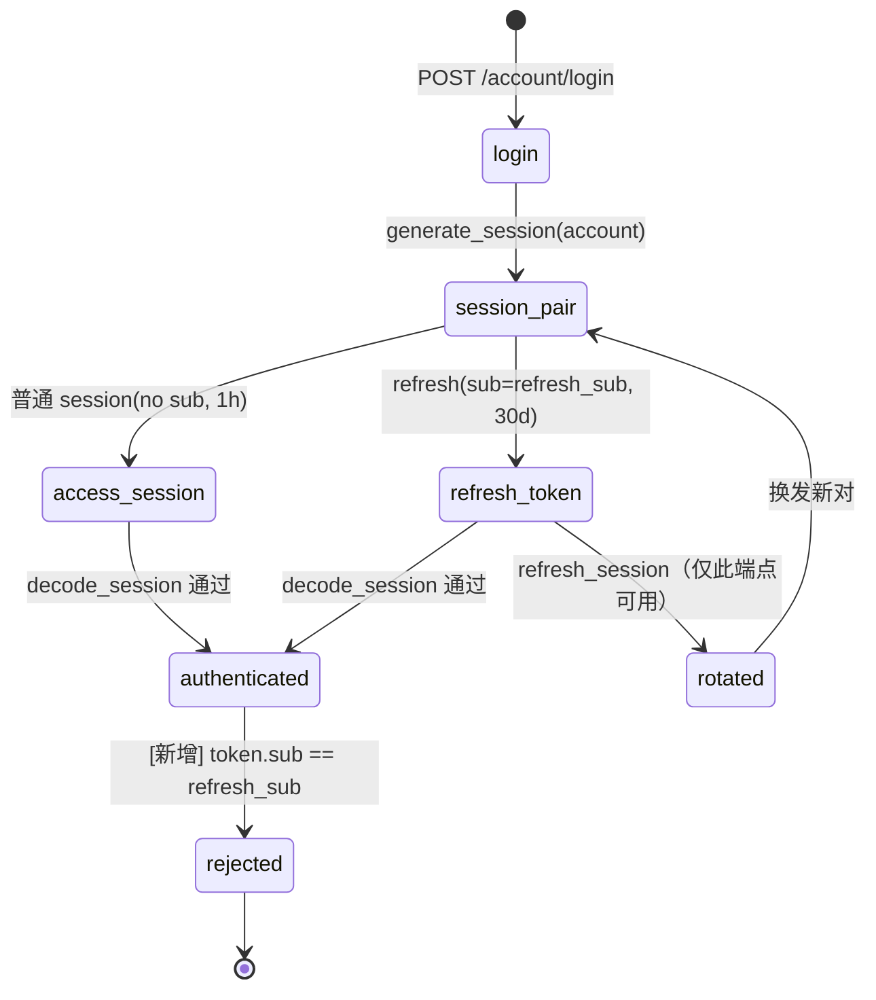

## Approval Record

- approver: user
- approval_date: 2026-08-26
- user_statement: 用户 2026-08-26 回复「修复吧」，确认采纳提案并按建议的
  high-risk 层级全流程执行；设计遵循已确认提案（decode_session 拒绝
  refresh token、refresh 只能用于续期）。

# refresh token 只能用于 refresh（账号/会话类型边界设计）

Risk profile: ./risk-profile.yaml

## Design Scope

### Goals

- 修复高危认证冒充：refresh token 与普通 session 同密钥签发、仅靠
  `sub="refresh"` 区分，但 `sfo-account::decode_session()` 只验签和查
  过期，导致 30 天有效的 refresh token 能被认证桥映射为
  `Principal::User`，访问项目/Token 管理等全部用户接口。
- 在唯一解码收口拒绝 refresh 类型，使 refresh token 只能通过
  `/account/refresh_session` 续期；普通 session 的解码、过期语义、
  refresh 轮换与换发后 session 行为保持不变。

### Non-goals

- 不修改 token 模块、不新增 JWT `typ` claim、不做 session 白名单或
  数据库会话表；`sub` 判别已能完整区分本仓库两种 session 类型。
- 不改登录/refresh HTTP 请求响应、session/refresh 有效期、CLI/admin-web
  续期调用方式与权限判定链路。
- 不处理「修复前已泄露 refresh token 仍可续期」的运维处置（部署侧提示
  轮换 `session_key`），不做存量 token 数据迁移。

## Useful Context

- `third_party/sfo-account/src/account_manager.rs:277-299`：`generate_session`
  签发普通 session（默认 `session_sub=None`，不携带 `sub`，1 小时）与
  refresh session（固定 `refresh_sub`，默认 `"refresh"`，30 天），两者
  使用同一 `SessionTokenSigner` 密钥。
- `account_manager.rs:340-356`：`decode_session` 验签 + `is_expire` 后直接
  `Ok(token.data)`，未检查 `token.sub`——本轮缺陷根因。
- `account_manager.rs:324-338`：`refresh_session` 入口已校验
  `token.sub == refresh_sub`，只保护续期端点，不保护普通用户接口。
- `account_manager.rs:75-78`：`SessionConfig::validate` 已禁止
  `session_sub == refresh_sub`，因此「拒绝 refresh_sub」不会误伤任何合法
  普通 session（默认无 sub；自定义 session_sub 也必然不同）。
- 消费方：`server/src/http/auth.rs:16-22`（SessionAuthWrapper）、
  `server/src/account/authn.rs:9`（try_user_principal）、
  `third_party/sfo-account/src/account_server.rs:122-148`
  （/account/get_account_info_of_session、/account/get_account_info），
  全部经过 `decode_session` 收口。

## Overall Approach

最小但完整的认证边界收紧：在 `DefaultAccountManager::decode_session` 的
验签与过期检查之后、返回用户之前，新增一条类型拒绝——当
`token.sub.as_deref() == Some(self.session_config.refresh_sub.as_str())`
时返回 `AccountErrorCode::SessionInvalid`。该单点改动自动覆盖全部三个
`decode_session` 消费方；`refresh_session`、签发逻辑、有效期与 refresh
轮换流程零改动。

## Layered Design Document Index

| level | parent_document | unit | design_document | responsibility |
|-------|-----------------|------|-----------------|----------------|
| root | `design.md` | 账号/会话类型边界（account 子模块 + sfo-account + 认证桥） | `design.md` | 边界形状、依赖方向、关键流、实现顺序 |
| submodule | `design.md` | account（sfo-account 解码收口 + server 消费方） | `design/account-refresh.md` | 文件级接口、改动点、兼容性与消费者 |

## Module Relationship UML

```mermaid
classDiagram
  direction LR
  class server_account {
    AccountModule::decode_session
    register_http()
  }
  class sfo_account {
    DefaultAccountManager
    SessionConfig { refresh_sub }
    decode_session()
    refresh_session()
    AccountServer
  }
  class auth_bridge {
    SessionAuthWrapper::decode_user
    try_user_principal()
  }
  class sfo_routes {
    /account/get_account_info_of_session
    /account/get_account_info
  }
  auth_bridge --> server_account : decode_session
  sfo_routes --> sfo_account : AccountServer::register_server
  server_account --> sfo_account : DefaultAccountManager::decode_session
```

依赖方向约束：`server_account`、`sfo_routes` 与 `auth_bridge` 都只依赖
`sfo_account` 的同一解码收口；`sfo_account` 不反向依赖任何 server 代码。
无环。

## File-Level Interfaces

根层只列出与变更直接相关的文件级接口；逐文件的签名与消费方见子文档
`design/account-refresh.md`。

```rust
// third_party/sfo-account/src/account_manager.rs
// trait 签名不变；decode_session 在验签 + 过期检查后新增 refresh-sub 拒绝：
pub async fn decode_session(&self, session: &str) -> AccountResult<A>;

// server/src/account/mod.rs（薄适配，不改动）
pub async fn decode_session(&self, bearer_session: &str)
    -> sfo_account::AccountResult<FilehubAccount>;

// server/src/http/auth.rs（不改动）
impl SessionAuth for SessionAuthWrapper {
    async fn decode_user(&self, bearer: &str) -> Option<UserId>;
}
```

- Consumer: `server/src/account/authn.rs`、`server/src/http/auth.rs`、
  `third_party/sfo-account/src/account_server.rs` 的账户信息路由；
  change_id `fh-refresh-decoder-reject`。
- Compatibility: backward-compatible
- Compatibility note: 无签名/契约变化；收紧的是缺陷能力，无合法消费者依赖。

## Key Flows



## State and Ownership



- Owner: `SessionConfig`（`session_sub`/`refresh_sub`，sfo-account 内部配置）
  ——唯一决定普通 session 与 refresh token 的 claims 判别；本任务不新增
  持久化状态。
- 非法迁移由新增分支拒绝：refresh token 不能进入 `authenticated` 映射用户
  身份的路径；只能走 `refreshed` 换发。

## Directly Mapped Change Items

| change_id | target_module | proposal_id | Design Coverage | Scope Paths |
|-----------|---------------|-------------|-----------------|-------------|
| fh-refresh-decoder-reject | filehub | prop-044-refresh-decode | `design/account-refresh.md` File-Level Interfaces（decode_session 新增 refresh_sub 拒绝分支） | third_party/sfo-account/src/account_manager.rs |
| fh-refresh-regression | filehub | prop-044-refresh-regression | `design/account-refresh.md` 回归面：sfo-account 测试、server 单元/API 集成 | third_party/sfo-account/src/account_manager.rs, server/tests/unit/account.rs, server/tests/api_integration.rs |

## API and Build Surface Impact

- Public API impact: none
- Public API note: v1 HTTP 路由/DTO/错误信封、登录与 refresh 响应、JWT
  格式与有效期均不变；`AccountManager::decode_session` trait 签名不变。
  「refresh token 可用作访问 session」是缺陷行为而非契约能力，收紧后
  受保护接口返回既有 401、account 信息接口返回既有错误信封（`err != 0`）。
- Crate-root export change: no
- Build-surface change: no
- Documentation examples affected: no

## Consumer Migration Closure

| Old Symbol/Behavior | New Path | change_id | Consumer Path | Consumer Kind | Migration Status |
|---------------------|----------|-----------|---------------|---------------|------------------|
| `decode_session` 接受 refresh token（缺陷行为） | `third_party/sfo-account/src/account_manager.rs`（同签名，行为收紧） | fh-refresh-decoder-reject | `server/src/http/auth.rs`、`server/src/account/authn.rs`、`third_party/sfo-account/src/account_server.rs` | production | verified-none（无合法消费者依赖 refresh 当访问凭据；契约与签名不变） |

## Invariants to Preserve

- 普通 session（无 `sub` 或自定义 `session_sub`）解码成功率与过期语义不变；
- `refresh_session` 只接受 `sub == refresh_sub` 的 token，且换发后新
  session 可访问用户接口；
- token 凭据路径（`tokens::resolve` 独立验签公钥）不受影响；
- 登录/refresh HTTP 请求响应结构与错误类别不变（拒绝走既有
  `SessionInvalid` -> 401/错误信封路径）。

## File-Level Implementation Sequence

| sequence | file_level_module | action | depends_on | change_id | scope_path | implementation_task |
|----------|-------------------|--------|------------|-----------|-----------|--------------------|
| 1 | `third_party/sfo-account/src/account_manager.rs` | 修改：`decode_session` 验签+过期后新增 `token.sub == refresh_sub` 拒绝分支 | none | fh-refresh-decoder-reject | third_party/sfo-account/src/account_manager.rs | 044-implementation（本任务内实现） |
| 2 | `docs/modules/filehub.md` | 修改：account 行补「refresh token 仅可用于 refresh」边界说明（长生命周期边界同步） | 1（待生产修改稳定） | fh-refresh-decoder-reject | docs/modules/filehub.md | 044-implementation（本任务内实现） |

说明：测试文件（sfo-account 测试、`server/tests/unit/account.rs`、
`server/tests/api_integration.rs`）由测试阶段按 `fh-refresh-regression`
实现，不在实现序列中预写。

## Implementation Order

| phase | goal | depends_on | output |
|-------|------|------------|--------|
| decode-reject | 在解码收口拒绝 refresh 类型 | none（唯一生产改动点） | 修改后的 `third_party/sfo-account/src/account_manager.rs` |
| boundary-sync | 同步模块边界说明 | decode-reject（内容稳定后再记录） | `docs/modules/filehub.md` account 行更新 |

## Design Notes

- 方案取舍：选择在 `sfo-account` 解码收口按 `refresh_sub` 拒绝，而不是在
  server 每个路由或认证桥逐一判断——收口覆盖
  `SessionAuthWrapper::decode_user`、`try_user_principal` 与两个
  `/account/get_account_info*` 端点，避免遗漏消费方与两类接口行为分叉。
- 因为 `SessionConfig::validate` 已保证 `session_sub != refresh_sub`，
  拒绝分支对默认无 `sub` 的普通 session 与自定义 `session_sub` 都无
  误伤；这是采用 `sub` 判别而非新增 claim 的依据。
- 兼容决策：行为收紧不改变任何接口签名与公开契约；CLI/admin-web 只在
  401 后调用 `/account/refresh_session`，从不把 refresh 当访问凭据，
  因此无仓库内消费者迁移需求（见 Consumer Migration Closure）。

## Risks and Rollback

- 误伤风险：若未来 `SessionConfig` 允许 `session_sub == refresh_sub`，
  新分支会误拒普通 session；`SessionConfig::validate` 在构造入口已封死该
  组合，风险面仅限配置代码回归，由 sfo-account 既有配置校验测试兜底。
- 回归风险：`decode_session` 的消费方（认证桥、账户信息路由）若在未来
  被改成绕过该收口直接解码，可能重新暴露；本任务已把回归断言放在 API
  集成层，直接以 refresh token 访问用户接口验证 401/错误信封。
- Rollback：仅回滚 `account_manager.rs` 中新增判断即恢复旧行为；无迁移、
  无持久化状态、无部署顺序依赖。
- Rollback note：仅回滚 `account_manager.rs` 中新增判断即恢复旧行为；
  无需迁移、无持久化状态、无部署顺序依赖。
