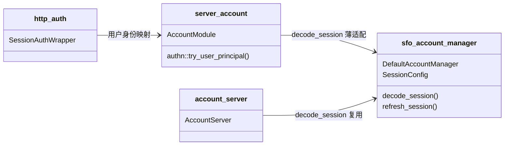

# account 子模块设计（decode_session 拒绝 refresh 类型）

## Design Scope

- 归属：`account` 子模块（`server/src/account/` 适配 + vendored
  `third_party/sfo-account` 解码收口）以及三个 `decode_session` 消费方
  （`server/src/http/auth.rs`、`server/src/account/authn.rs`、
  `sfo-account` 的 `account_server.rs` 账户信息路由）。
- 覆盖：`DefaultAccountManager::decode_session` 在验签与过期检查后拒绝
  `sub == refresh_sub` 的 token；文档同步 module 边界说明。
- 不覆盖：签发、续期端点、权限/token 模块、HTTP 契约形状。

## Module Relationship UML



## File-Level Interfaces

```rust
// third_party/sfo-account/src/account_manager.rs
// trait 签名不变（行为收紧）：
pub async fn decode_session(&self, session: &str) -> AccountResult<A> {
    // 1) JsonWebToken::decode_payload 验签（既有）
    // 2) if token.is_expire() -> SessionExpired（既有）
    // 3) 新增：if token.sub.as_deref() == Some(refresh_sub) -> SessionInvalid
    //    错误信息说明 refresh session 不能作为访问 session 使用
    // 4) Ok(token.data)（仅普通 session 可达）
}

// server/src/account/mod.rs（薄适配，不改动）
pub async fn decode_session(&self, bearer_session: &str)
    -> sfo_account::AccountResult<FilehubAccount>;

// server/src/http/auth.rs（不改动）
impl SessionAuth for SessionAuthWrapper {
    async fn decode_user(&self, bearer: &str) -> Option<UserId>;
}

// third_party/sfo-account/src/account_server.rs（不改动）
// /account/get_account_info_of_session、/account/get_account_info
// 继续复用 decode_session，新拒绝自动生效。
```

- Consumer: `server/src/account/mod.rs:58-63`、`server/src/account/authn.rs`
  与 `server/src/http/auth.rs`、`third_party/sfo-account/src/account_server.rs`
  的账户信息路由；change_id `fh-refresh-decoder-reject`。
- Compatibility: backward-compatible
- Compatibility note: trait 与 HTTP 契约不变；收紧的是缺陷能力，无合法消费者依赖。
- Note: `SessionConfig::validate` 已保证 `session_sub != refresh_sub`，因此
  新分支只命中 refresh token，不命中普通 session。

## State and Ownership

- Owner: `SessionConfig`（`session_sub`/`refresh_sub`）归
  `sfo-account::DefaultAccountManager`，是本任务唯一的 claims 判别状态；
  无持久化状态与新增生命周期。
- 判定顺序固定为：验签 -> 过期 -> refresh-sub 拒绝 -> 返回用户；拒绝优先，
  fail closed。

## Design Notes

- `refresh_session` 的既有 `sub` 校验保持不变，保证续期端点只接受 refresh
  token；本次新增的是反向边界（decode 不再接受 refresh token）。
- 不引入新错误码：复用 `AccountErrorCode::SessionInvalid`，HTTP 映射沿用
  既有失败信封/401 语义。
