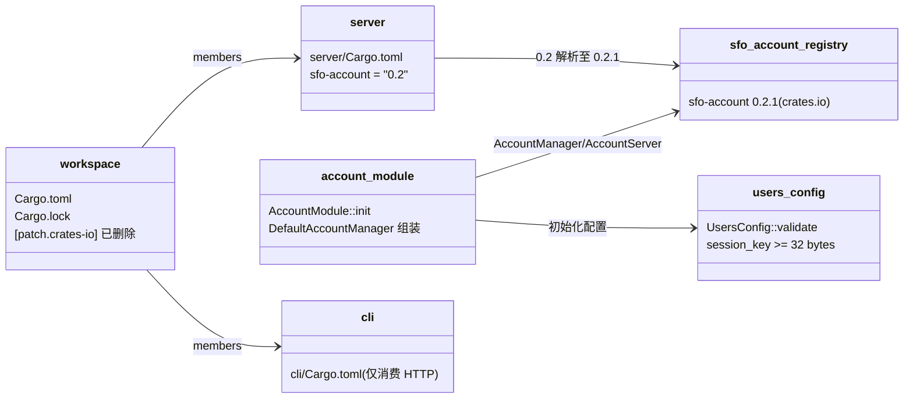
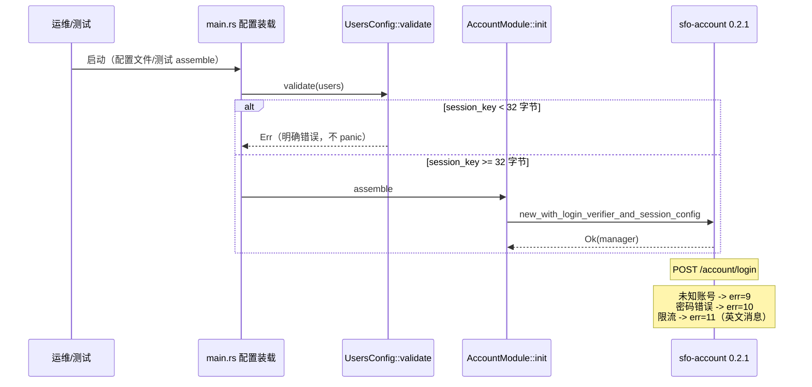

## Approval Record

- approver: user
- approval_date: 2026-08-27
- user_statement: 用户 2026-08-27 回复「按2方案实现，不管verify_dummy的问题」，
  设计按已确认提案执行：切到 crates.io sfo-account 0.2.1，接受其登录失败语义
  并适配。

# sfo-account 依赖来源切换与 0.2.1 语义适配设计

Risk profile: ./risk-profile.yaml

## Design Scope

### Goals

- 删除根 Cargo.toml 的 `[patch.crates-io] sfo-account` 与
  `third_party/sfo-account/`，让 workspace 的 `sfo-account = "0.2"` 直接解析
  crates.io `0.2.1`（已支持 `sfo-http 0.8` 并携带 038/044/045/046/047 大部分
  改动）。
- 接受并固化 0.2.1 登录失败语义：未知账号 `InvalidAccount`（err=9）、密码错误
  `InvalidPassword`（err=10）、限流 `TooManyRequests`（err=11），消息为英文，
  不做等成本伪校验（用户已确认）。
- 吸收 0.2.1 新增的 HMAC session key 最短 32 字节约束：启动期给出明确错误而非
  panic，并修正测试 fixture 密钥。

### Non-goals

- 不在本仓库补回 `verify_dummy` 等成本伪校验，不改上游 crate/发布流程；
- 不轮换既有 session_key 与已签发 session，不做存量数据迁移；
- 不触碰 vpn-server 等其它 `sfo-account` 嵌入方；
- 不追溯改写 026/038/044/045/046/047 等历史文档与验收记录。

## Useful Context

- 根 `Cargo.toml`：`[patch.crates-io] sfo-account = { path =
  "third_party/sfo-account" }`，注释要求上游支持 0.8 后移除 patch；
- `third_party/sfo-account/` 为 untracked 本地 shim（7 个文件），其账号登录
  失败语义（046）与 0.2.1 不一致；
- crates.io 索引确认 0.2.1 于 2026-08-27 发布，依赖 `sfo-http 0.8`、
  `http-body-util`、`serde_json`；GitHub HEAD 与 0.2.1 同码；
- `server/Cargo.toml` 声明 `sfo-account = "0.2"`，移除 patch 后按 semver 解析
  到 0.2.1；
- 0.2.1 `DefaultAccountManager::new_with_login_verifier` 对短于 32 字节的
  HMAC key 直接 `panic`；`new_with_login_verifier_and_session_config` 返回
  `AccountResult` 可用于非 panic 失败路径；
- 配置装载路径：`server/src/main.rs:21-24` 读取并 `serde_json` 解析
  `ServerConfig`，随后 `AppState::assemble`；测试直接构造 `ServerConfig`
  （`server/tests/common/mod.rs:60` 的 `session_key` 仅 30 字节，
  `cli/tests/e2e_cli_server.rs:82` 同值 30 字节）。

## Overall Approach

1. 移除 path patch 与 shim，用 `cargo update -p sfo-account` 把锁文件收敛到
   registry 0.2.1；
2. `UsersConfig` 增加最短 32 字节启动校验，`main.rs` 在解析后立即调用，避免
   短 key 走到 panic 构造器；
3. `AccountModule::init` 改用返回 `AccountResult` 的
   `new_with_login_verifier_and_session_config`，把失败映射为启动错误字符串
   （防御直接走 `AppState::assemble` 的路径）；
4. 测试 fixture 密钥统一加长到 32+ 字节；
5. 测试断言与 `docs/api/v1-contract.md`、模块文档按 0.2.1 语义收敛；
6. 保持 64 KiB 请求体上限、refresh-only 解码、限流窗口与 200 信封等既有
   机制不变。

## Layered Design Document Index

| level | parent_document | unit | design_document | responsibility |
|-------|-----------------|------|-----------------|----------------|
| root | `design.md` | workspace 构建面 + filehub 模块边界 | `design.md` | 依赖来源、公开契约、顺序与变更映射 |
| submodule | `design.md` | account（`server/src/account/` + `server/src/model/config.rs`） | `design/account-dependency.md` | 文件级接口、启动流、兼容性与消费者 |

## Module Relationship UML



依赖约束：`account_module` 只装配 registry 版 `sfo_account`，不再反向依赖
本仓库内第三方源码；`users_config` 是纯配置 DTO，不依赖业务模块。无环。

## File-Level Interfaces

（摘要；完整文件级接口见 `design/account-dependency.md`。）

详见 `design/account-dependency.md`；根层只给出改动边界：

```rust
// server/src/model/config.rs（新增）
impl UsersConfig {
    pub fn validate(&self) -> Result<(), String>;
}

// server/src/main.rs（调用新增）
let config: ServerConfig = serde_json::from_str(&raw)?;
config.users.validate()?;

// server/src/account/mod.rs（构造器替换）
let manager = DefaultAccountManager::new_with_login_verifier_and_session_config(
    store.clone(),
    config.session_key.as_bytes().to_vec(),
    Arc::new(FilehubPasswordVerifier::default()),
    SessionConfig::default(),
).map_err(|e| format!("init sfo-account manager failed: {e}"))?;
```

- Consumer: `server/src/main.rs`、`server/src/account/mod.rs`；change_id
  `fh-sfo-account-conformance`。
- Compatibility: migration-required

说明：登录失败契约与启动 key 校验变化，消费者迁移见下文
`Consumer Migration Closure`。

## Key Flows



## State and Ownership

```mermaid
stateDiagram-v2
  [*] --> config_parsed: serde_json 解析
  config_parsed --> validated: UsersConfig::validate
  validated --> manager_ok: session_key >= 32B
  validated --> startup_error: session_key < 32B
  startup_error --> [*]
  manager_ok --> login_failed_unknown: 未知账号
  manager_ok --> login_failed_password: 密码错误
  manager_ok --> session_pair: 登录成功
  login_failed_unknown --> [*] : err=9
  login_failed_password --> [*] : err=10
```

- Owner: `UsersConfig::session_key`（配置）与 `SessionConfig`（sfo-account 内部
  JWT claims）；本任务不新增持久化状态，不改变既有 session/refresh 生命周期。
- 非法迁移：短 key 配置在启动即被拒绝（fail closed）；refresh token 仍不可
  映射为访问身份（0.2.1 更严格的 sub 白名单语义）。

## Directly Mapped Change Items

| change_id | target_module | proposal_id | Design Coverage | Scope Paths |
|-----------|---------------|-------------|-----------------|-------------|
| fh-sfo-account-published-source | filehub | P-001 | 根 `Cargo.toml` patch 移除 + `third_party/sfo-account/` 删除 + `Cargo.lock` registry 0.2.1（模块文档记录来源切换） | Cargo.toml, Cargo.lock, docs/modules/filehub.md |
| fh-sfo-account-conformance | filehub | P-002 | `design/account-dependency.md`：config 校验、非 panic 组装、测试密钥/断言、v1-contract 与模块文档收敛 | server/tests/api_integration.rs, server/tests/unit/account.rs, server/tests/common/mod.rs, server/src/model/config.rs, server/src/account/mod.rs, docs/api/v1-contract.md, docs/modules/filehub.md, README.md |
| fh-sfo-account-regression | filehub | P-003 | 登录失败/限流/refresh 边界与 workspace 编译闭环验证（testing 阶段落地） | server/tests/api_integration.rs, server/tests/unit/account.rs |

## API and Build Surface Impact

- Public API impact: migration-required
- Public API note: `/account/login` 失败错误语义迁移（未知账号 err=9、
  密码错误 err=10、消息英文；限流消息英文）。已知消费方（admin-web、CLI）
  只按 err!=0/透传消息处理，免代码迁移，测试与契约文档随任务适配
- Crate-root export change: no
- Crate-root note: filehub 与 cli crate 根导出不变；`sfo-account` crate
  自身的导出属于上游，不由本仓库发布
- Build-surface change: yes
- Build-surface note: workspace 依赖来源由 path patch 改为 crates.io
  registry，锁文件来源/校验和变化
- Documentation examples affected: no
- Documentation note: `docs/api/v1-contract.md` 与 `docs/modules/filehub.md`
  均为散文文档，无 Rust 编译示例；README 仅新增密钥长度文字说明

## Consumer Migration Closure

| Old Symbol | New Path | change_id | Consumer Path | Consumer Kind | Migration Status |
|---------------------|----------|-----------|---------------|---------------|------------------|
| `用户名或密码错误` | registry 0.2.1：`Invalid username or password` | fh-sfo-account-conformance | `server/tests/unit/account.rs` | test | migrated |
| `用户名或密码错误` | registry 0.2.1：err=9/10 与英文消息 | fh-sfo-account-conformance | `server/tests/api_integration.rs` | test | migrated |
| `登录尝试过于频繁，请稍后再试` | registry 0.2.1：`Too many login attempts; please try again later` | fh-sfo-account-conformance | `server/tests/api_integration.rs` | test | migrated |
| `[patch.crates-io] sfo-account` | crates.io registry 0.2.1 | fh-sfo-account-published-source | `Cargo.toml` | production | migrated |
| `test-session-key-please-change` | 32 字节以上 fixture 密钥 | fh-sfo-account-conformance | `server/tests/common/mod.rs` | test | migrated |
| `test-session-key-please-change` | 32 字节以上 fixture 密钥 | fh-sfo-account-conformance | `cli/tests/e2e_cli_server.rs` | test | migrated |

## Invariants to Preserve

- `/account/*` 与 `/api/v1/*` 的 HTTP 200 错误信封和成功响应结构；
- 64 KiB 有界请求体、登录限流窗口与来源 key 归一化；
- refresh token 只能走 `/account/refresh_session`，不能映射为用户身份；
- token 模块验签、项目/版本/存储等权限判定链路不受影响；
- 配置装载顺序：解析 -> 校验 -> 启动，校验失败不进入 DB 初始化。

## Implementation Order

| phase | goal | depends_on | output | 文件级模块 | change_id |
|-------|------|------------|--------|-----------|-----------|
| 1 依赖来源 | 移除 path patch，锁文件指向 registry 0.2.1 | 无 | 可解析的 Cargo.lock | `Cargo.toml`、`Cargo.lock` | fh-sfo-account-published-source |
| 2 启动校验 | 短 key 明确失败 | 步骤 1（0.2.1 API 已知） | `UsersConfig::validate` + main 调用 | `server/src/model/config.rs`、`server/src/main.rs` | fh-sfo-account-conformance |
| 3 装配 | 非 panic 构造器 | 步骤 2 | `AccountModule::init` 错误传播 | `server/src/account/mod.rs` | fh-sfo-account-conformance |
| 4 fixture | 测试密钥 >= 32 字节 | 步骤 3 | 可启动的测试/e2e 配置 | `server/tests/common/mod.rs`、`cli/tests/e2e_cli_server.rs` | fh-sfo-account-conformance |
| 5 行为收敛 | 断言 0.2.1 失败语义 | 步骤 1-4 | 更新的账号测试 | `server/tests/api_integration.rs`、`server/tests/unit/account.rs` | fh-sfo-account-conformance / fh-sfo-account-regression |
| 6 文档 | 契约/模块说明一致 | 步骤 1-5 | 可发布的契约文档 | `docs/api/v1-contract.md`、`docs/modules/filehub.md`、`README.md` | fh-sfo-account-conformance |

## File-Level Implementation Sequence

| sequence | file_level_module | action | scope_path | implementation_task | depends_on | change_id |
|----------|------------------|--------|-----------|--------------------|------------|-----------|
| 1 | `Cargo.toml`、`Cargo.lock` | 移除 patch、cargo update 到 registry 0.2.1 | Cargo.toml, Cargo.lock, third_party/sfo-account | fh-sfo-account-published-source | none | fh-sfo-account-published-source |
| 2 | `server/src/model/config.rs`、`server/src/main.rs` | 新增并调用 validate | server/src/model/config.rs, server/src/account/mod.rs | fh-sfo-account-conformance | 1 | fh-sfo-account-conformance |
| 3 | `server/src/account/mod.rs` | 替换非 panic 构造器 | server/src/account/mod.rs | fh-sfo-account-conformance | 1-2 | fh-sfo-account-conformance |
| 4 | `server/tests/common/mod.rs`、`cli/tests/e2e_cli_server.rs` | 测试密钥加长 | server/tests/common/mod.rs | fh-sfo-account-conformance | 3 | fh-sfo-account-conformance |
| 5 | `server/tests/api_integration.rs`、`server/tests/unit/account.rs` | 新错误语义断言 | server/tests/api_integration.rs, server/tests/unit/account.rs | fh-sfo-account-conformance / fh-sfo-account-regression | 1-4 | fh-sfo-account-conformance / fh-sfo-account-regression |
| 6 | `docs/api/v1-contract.md`、`docs/modules/filehub.md`、`README.md` | 文档同步 | docs/api/v1-contract.md, docs/modules/filehub.md | fh-sfo-account-conformance | 1-5 | fh-sfo-account-conformance |

## Risks and Rollback

- 风险：登录失败语义变化（账号枚举信息面，用户已确认接受）、0.2.1 新增短
  key panic（已转为启动校验+Result 错误）、registry 来源可信度（校验和由
  Cargo.lock 固定）。
- 回滚：恢复根 `Cargo.toml` 的 `[patch.crates-io]` 块并把
  `third_party/sfo-account/` 从上游 046 前源码/`.harness` 基线副本重建；
  同时撤销配置校验、测试断言与 v1-contract 的 0.2.1 语义变更。删除前
  本 shim 未被 git 跟踪，回滚不依赖 `git checkout`，需显式恢复上述内容。

## Design Notes

- 不在本仓库补 verify_dummy：用户明确「不管verify_dummy的问题」；其 trait
  与 `FilehubPasswordVerifier::verify_dummy` 实现保留（上游 trait 要求），
  但不再作为登录失败路径行为。
- 短 key 校验同时放 `UsersConfig::validate` 与返回结果构造器：前者覆盖
  生产启动，后者覆盖所有直接走 `AppState::assemble` 的测试/复用路径，
  避免 0.2.1 panic 语义进入本仓库。
- 回滚路径：恢复根 `Cargo.toml` patch 并把 shim 从上游
  `github.com/wugren/sfo-account` 的 046 前版本/本仓库 `.harness` 基线副本
  重建（`third_party/sfo-account` 为 untracked，删除后无 git 历史）；
  登录契约与配置校验回退需一并撤销。
