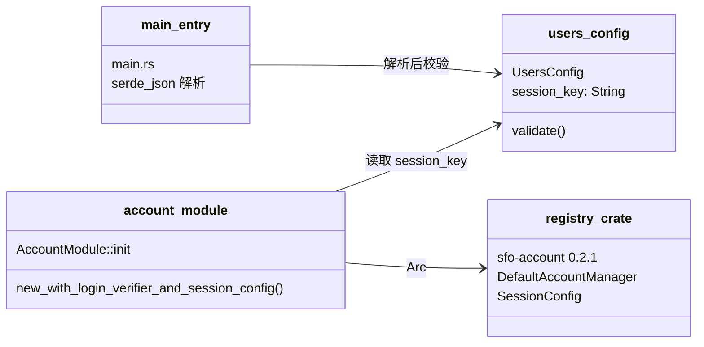
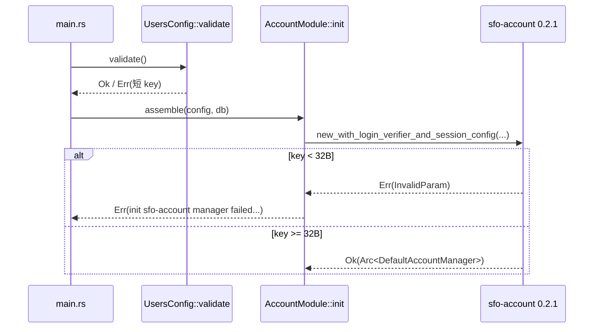

# account 子模块设计（sfo-account 0.2.1 依赖适配）

## Design Scope

- 归属：`server/src/account/` 装配层 + `server/src/model/config.rs` 配置 DTO
  + `server/src/main.rs` 启动入口。
- 覆盖：registry 版 sfo-account 的非 panic 组装、`session_key` 最短 32 字节
  校验、测试 fixture 密钥与登录失败/限流断言收敛。
- 不覆盖：上游 crate 源码、HTTP 路由/DTO 结构、refresh/token 行为。

## Module Relationship UML



## File-Level Interfaces

```rust
// server/src/model/config.rs
impl UsersConfig {
    /// session_key 必须 >= 32 字节（sfo-account 0.2.1 HMAC 下限）。
    pub fn validate(&self) -> Result<(), String> {
        if self.session_key.len() < 32 {
            Err(format!(
                "users.session_key must be at least 32 bytes (current {})",
                self.session_key.len()
            ))
        } else {
            Ok(())
        }
    }
}

// server/src/main.rs（在 serde_json 解析之后、DB 初始化之前）
config.users.validate().map_err(|e| format!("invalid config: {e}"))?;

// server/src/account/mod.rs（替换 panic 型构造器）
use sfo_account::{AccountManager, AccountStore, DefaultAccountManager,
    LoginRateLimiter, SessionConfig};

let manager = DefaultAccountManager::new_with_login_verifier_and_session_config(
    store.clone(),
    config.session_key.as_bytes().to_vec(),
    Arc::new(FilehubPasswordVerifier::default()),
    SessionConfig::default(),
)
.map_err(|e| format!("init sfo-account manager failed: {}", e.msg()))?;
```

- Consumer: `server/src/main.rs`（validate）、`server/src/account/mod.rs`
  （组装）；change_id `fh-sfo-account-conformance`。
- Compatibility: migration-required（行为契约变化 + 新增启动校验；调用方
  通过既有 `init -> Result` 传播错误，无 panic 路径）。

## Key Flows



失败路径均走 `Result<_, String>` 传播，不触发 0.2.1 的 `.expect` panic。

## State and Ownership

- `session_key` 属 `UsersConfig` 配置 DTO，唯一所有者；启动校验在
  `main.rs` 与 `AccountModule::init` 双保险，无持久化状态。
- 登录失败状态迁移由 crate 内部 `AccountErrorCode` 决定（9/10/11），本仓库
  只按新值断言与文档化。

## Directly Mapped Change Items

| change_id | target_module | proposal_id | Design Coverage | Scope Paths |
|-----------|---------------|-------------|-----------------|-------------|
| fh-sfo-account-conformance | filehub | P-002 | 本文件 File-Level Interfaces（validate + 非 panic 组装 + fixture/断言收敛） | server/tests/api_integration.rs, server/tests/unit/account.rs, server/tests/common/mod.rs, server/src/model/config.rs, server/src/account/mod.rs, docs/api/v1-contract.md, docs/modules/filehub.md, README.md |
| fh-sfo-account-regression | filehub | P-003 | 登录失败区分、限流 err=11、refresh-only 与编译闭环 | server/tests/api_integration.rs, server/tests/unit/account.rs |

## API and Build Surface Impact

- Public API impact: breaking（`/account/login` 错误体语义、启动配置新增
  32 字节下限）
- Crate-root export change: no
- Build-surface change: no（本子模块范围内无 Cargo 图变化；根层负责 registry
  切换）
- Documentation examples affected: no（子模块内无文档示例）

## Consumer Migration Closure

| Old Symbol/Behavior | New Path | change_id | Consumer Path | Consumer Kind | Migration Status |
|---------------------|----------|-----------|---------------|---------------|------------------|
| `AccountModule::init` 内部 `new_with_login_verifier`（短 key panic） | `new_with_login_verifier_and_session_config` + `UsersConfig::validate`（Result 错误） | fh-sfo-account-conformance | `server/src/main.rs`、`server/tests/common/mod.rs`、`cli/tests/e2e_cli_server.rs` | production + test fixtures | migrated |
| 登录失败 uniform err=10（046） | registry 0.2.1 区分 err=9/10 | fh-sfo-account-conformance | `server/tests/api_integration.rs`、`server/tests/unit/account.rs` | test | migrated（断言随新语义更新） |

## Design Notes

- `FilehubPasswordVerifier::verify_dummy` 与 `LOGIN_DUMMY_BCRYPT_HASH` 保留：
  上游 trait 仍要求实现；按用户决定不再通过登录路径调用。
- 不改 `server/src/account/http.rs`/`authn.rs` 的装配：错误码由
  `sfo-account` 信封原样透传，既有 `register_server` 路由不变。
