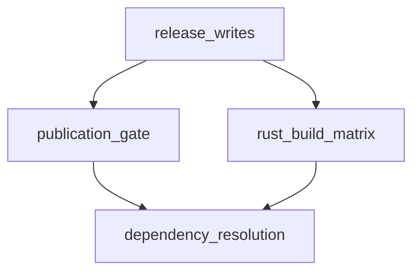

# Pipeline Plan

Workflow tier: high-risk

Risk profile: ./risk-profile.yaml

## Trigger
- Proposal: docs/versions/v0.1/modules/filehub/057-manual-build-publish/proposal.md
- User launch confirmed: yes
- User launch statement: “确认，自动完成”
- Launch stage: proposal
- First auto stage: design
- Design source: pipeline/plan.md
- Per-stage user confirmation: skipped by explicit user auto-pipeline authorization
- Auto-confirm completed document stages: no design/testing Markdown documents generated; repository-local document extensions only
- Auto-pipeline document policy: stage-selective; no design/testing Markdown docs; testplan.yaml required for automatic testing
- Version: v0.1
- Packet module: filehub
- Task name: 057-manual-build-publish
- Target module(s): filehub
- change_id values: fh-manual-build-publish, fh-ci-cargo-update

## Acceptance Baseline
- Final acceptance is judged against:
  - `proposal.md`

## Stage Graph
| Task ID | Stage | Execution Mode | Responsibility | Scope | Parent Task | Depends On | Output | Done Condition |
|---------|-------|----------------|----------------|-------|-------------|------------|--------|----------------|
| D-1 | design | auto-pipeline | 把确认后的发布与依赖更新要求转换为可执行的工作流设计 | 057 任务包设计映射 | root | none | pipeline plan 设计映射、风险检查与范围绑定 | 设计结构和 pipeline-plan 检查通过且不生成 design.md |
| I-ROOT | implementation | auto-pipeline | 集成同一 build.yml 内的依赖解析与人工发布改动 | `.github/workflows/build.yml` | root | I-2 | 完整工作流实现 | 两个 change_id 均在工作流中实现且实现范围检查通过 |
| T-1 | testing | auto-pipeline | 从提案、设计和实现派生工作流契约测试并生成 testplan | 057 任务测试与运行证据 | root | I-ROOT | testplan.yaml 与可运行的契约验证 | 任务级统一测试入口产生成功证据并覆盖两个 change_id |
| A-1 | acceptance | auto-pipeline | 独立反证审查需求、设计、实现、测试和发布失败边界 | 057 完整交付 | root | T-1 | acceptance-report.md | 无阻塞缺陷且报告结论 accepted |

## Submodule Tasks
| Task ID | Stage | Execution Mode | Responsibility | Submodule | Parent Task | Depends On | Output | Done Condition |
|---------|-------|----------------|----------------|-----------|-------------|------------|--------|----------------|
| I-1 | implementation | auto-pipeline | 实现共享 cargo update lockfile 的解析与三平台消费 | ci-dependency-resolution | I-ROOT | D-1 | build.yml 依赖解析链 | cargo update 严格先于全部 Rust 测试/编译且单次运行共享 lockfile |
| I-2 | implementation | auto-pipeline | 实现受控 workflow_dispatch 发布、tag/SHA 授权与发布并发隔离 | ci-manual-publication | I-ROOT | I-1 | build.yml 手工发布链 | 默认只构建，显式有效输入才允许写入；同 tag 发布串行且不能被新 run 取消 |

## Parallel Scheduling
- Strategy: dependency-ready-set
- Concurrency: use all runtime-available child-agent slots
- Shared artifact owner: parent-orchestrator
- Lock directory: `.harness/locks/`
- Dispatch rule: launch dependency-ready work with practical edit coordination and available capacity
- Serialization reasons: explicit dependency, edit coordination, or exhausted concurrency capacity
- Evidence: record launched task ids and serialization reasons in `.harness/pipelines/v0.1/filehub/057-manual-build-publish/state.json` scheduler waves

## Dependency Graphs

| Level | Parent | Node | Depends On |
|-------|--------|------|------------|
| submodule | filehub-ci-workflow | dependency_resolution | none |
| submodule | filehub-ci-workflow | publication_gate | dependency_resolution |
| submodule | filehub-ci-workflow | rust_build_matrix | dependency_resolution |
| submodule | filehub-ci-workflow | release_writes | publication_gate, rust_build_matrix |

## Exported Interfaces
| Interface | Owner | Consumer | Compatibility | Affected Callers | Migration Path |
|-----------|-------|----------|---------------|------------------|----------------|
| `workflow_dispatch.inputs.publish/release_tag` | publication_gate | GitHub Actions 操作者与 fh-manual-build-publish | backward-compatible | 现有无参数人工运行 | 省略或保持 publish=false 即维持只构建行为 |
| 单次运行 `cargo-lock` artifact | dependency_resolution | rust_build_matrix 与 fh-ci-cargo-update | new | 本工作流 Rust build job | 所有 Rust job 在 cargo 命令前下载到仓库根 Cargo.lock |
| 校验后的 `publish/release_tag/source_sha` job outputs | publication_gate | release_writes | new | build-image 与 release job | 写入 job 只消费授权输出，不直接信任原始 inputs |

## API and Build Surface Impact
- Public API impact: none
- Crate-root export change: no
- Build-surface change: yes
- Documentation examples affected: no

## Consumer Migration Closure
| Old Symbol | New Path | change_id | Consumer Path | Consumer Kind | Migration Status |
|------------|----------|-----------|---------------|---------------|------------------|
| 无参数 workflow_dispatch 只构建 | 带默认关闭 publish 与可选 release_tag 的 workflow_dispatch | fh-manual-build-publish | .github/workflows/build.yml | GitHub Actions workflow | migrated |
| 各 job 使用提交内 Cargo.lock | 前置 cargo update 后共享单次运行 Cargo.lock | fh-ci-cargo-update | .github/workflows/build.yml | GitHub Actions workflow | migrated |

## State Ownership
| State | Owner | Access Interface | Lifecycle | Failure Transitions |
|-------|-------|------------------|-----------|---------------------|
| 本次运行的更新后 Cargo.lock | dependency_resolution | 名为 cargo-lock 的 Actions artifact | checkout 后生成，Rust build 前下载，run 结束后按 retention 回收 | update/upload/download/校验任一失败则依赖 job 失败，后续构建和发布不运行 |
| 发布授权元组 publish/release_tag/source_sha | publication_gate | 校验后的 job outputs | 从事件和 inputs 解析，经版本、仓库、tag commit 校验后冻结供写入 job 使用 | 任一校验失败输出不可发布状态并使显式发布请求失败关闭 |
| 同一 ref/tag 的 workflow run 排队状态 | GitHub Actions concurrency | `group: release-${{ inputs.release_tag \|\| github.ref_name }}` | 同 tag 手工/自动发布与同分支构建串行排队，任何新 run 都不取消进行中的 run | 后续 run 等待前一 run 完成，避免在 GHCR 与 Release 两次写入之间取消造成部分发布 |
| GHCR 镜像与 GitHub Release | release_writes | docker push 与 gh release create/upload | 仅授权成功且构建/测试/打包通过后创建或更新 | 写入失败使 workflow 失败；既有 tag 和已完成资产不自动删除或移动 |

## Failure Flows
| Flow | Boundary | Failure | Handling |
|------|----------|---------|----------|
| 依赖更新到三平台编译 | dependency_resolution 到 rust_build_matrix | cargo update 失败、lock artifact 缺失或内容为空 | job 非零退出，依赖链阻断全部 Rust 编译和发布 |
| 人工输入到发布授权 | workflow_dispatch 到 publication_gate | publish=true 但 tag 为空、格式/版本错误或非 canonical 仓库 | 明确错误并非零退出，不执行 GHCR/Release 写入 |
| tag 到构建源码绑定 | publication_gate 到 git ref | lightweight/annotated tag 不存在或最终 commit 不等于 source_sha | 授权失败并停止发布，禁止用错误源码覆盖 Release |
| 重复运行到外部发布 | GitHub Actions concurrency 到 release_writes | 同 tag 的第二个自动/手工 run 在第一个 run 写入期间启动 | concurrency group 按 release_tag/ref_name 统一，cancel-in-progress=false，第二个 run 排队而不取消第一个 |
| 构建产物到发布写入 | rust_build_matrix 到 release_writes | 归档缺失、数量错误、镜像冒烟失败或写 API 失败 | 现有校验保持失败关闭，Release 不接受不完整四件资产 |

## Rejected Alternatives
| Decision Type | Selected | Rejected | Reason |
|---------------|----------|----------|--------|
| boundary | 普通人工运行默认只构建，显式 publish=true 才发布；同 tag/ref run 串行且不可取消 | 所有 workflow_dispatch 都自动发布，或允许新 run 取消进行中的发布 | 避免误点外部写入及 GHCR/Release 之间被取消造成部分发布 |
| technical | 前置 job 执行一次 cargo update 并分发同一 lockfile | 三个平台分别执行 cargo update | 分别解析可能在同一次运行中产生跨平台依赖漂移 |
| collaboration | 发布 job 只消费经过版本、仓库、tag/SHA 校验的输出 | build-image/release 各自直接读取原始 inputs | 集中所有权减少门控分叉和校验不一致 |

## Implementation Scope Bindings
| change_id | target_module | proposal_id | design_coverage | scope_paths | design_rules_applied |
|-----------|---------------|-------------|-----------------|-------------|----------------------|
| fh-manual-build-publish | filehub | P-001 | workflow_dispatch 输入、统一发布授权输出、tag/SHA 失败关闭、同 tag/ref 串行不可取消及现有 GHCR/Release 消费链 | `.github/workflows/build.yml` | 单一状态所有者、并发顺序、失败流、兼容输入、写权限边界、回滚 |
| fh-ci-cargo-update | filehub | P-002 | 前置 cargo update、单次运行 lock artifact、三平台下载后以 --locked 编译的顺序约束 | `.github/workflows/build.yml` | 无环依赖、共享构建状态所有者、失败关闭、供应链与可追溯性 |

## File-Level Implementation Sequence
| Sequence | Task ID | File-Level Module | Action | Depends On | change_id | target_module | Scope Paths | Context Sources |
|----------|---------|-------------------|--------|------------|-----------|---------------|-------------|-----------------|
| 1 | I-1 | `.github/workflows/build.yml` | modify dependency resolution and locked Rust job prerequisites | none | fh-ci-cargo-update | filehub | `.github/workflows/build.yml` | proposal P-002、risk-profile build、现有 version/build jobs |
| 2 | I-2 | `.github/workflows/build.yml` | modify dispatch inputs, publication authorization and non-cancelling concurrency | I-1 | fh-manual-build-publish | filehub | `.github/workflows/build.yml` | proposal P-001、risk-profile contract/security、现有 concurrency/image/release jobs |

## Return Rules
- If acceptance finds proposal ambiguity:
  - stop the pipeline and ask the user to decide; do not infer the requirement or create an automatic proposal return task
- If acceptance finds implementation defect:
  - return missing required behavior or defective delivered code to implementation
- If implementation conflicts with an existing design or testing document:
  - return the stale or incorrect document to its owning stage when implementation still satisfies the requirement
- If the same unresolved issue remains after more than 5 unsuccessful iterations:
  - stop and report the issue to the user
