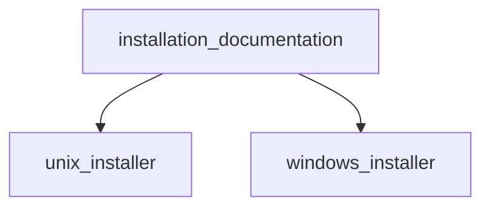

# Pipeline Plan

Workflow tier: high-risk

Risk profile: ./risk-profile.yaml

## Trigger
- Proposal: docs/versions/v0.1/modules/filehub/061-install-cli-from-github/proposal.md
- User launch confirmed: yes
- User launch statement: “确认，自动完成”
- Launch stage: proposal
- First auto stage: design
- Design source: pipeline/plan.md
- Per-stage user confirmation: skipped by explicit user auto-pipeline authorization
- Auto-confirm completed document stages: no design/testing Markdown documents generated; repository-local document extensions only
- Auto-pipeline document policy: stage-selective; no design/testing Markdown docs; testplan.yaml required for automatic testing
- Version: v0.1
- Packet module: filehub
- Task name: 061-install-cli-from-github
- Target module(s): filehub
- change_id values: fh-install-cli-from-github

## Acceptance Baseline
- Final acceptance is judged against:
  - `proposal.md`

## Stage Graph
| Task ID | Stage | Execution Mode | Responsibility | Scope | Parent Task | Depends On | Output | Done Condition |
|---------|-------|----------------|----------------|-------|-------------|------------|--------|----------------|
| D-1 | design | auto-pipeline | 把已确认的跨平台安装要求转换为安全的脚本接口、状态所有权、失败流和文件顺序 | 061 任务包设计映射 | root | none | pipeline plan 设计映射、风险检查与范围绑定 | 设计结构和 pipeline-plan 检查通过且不生成 design.md |
| I-ROOT | implementation | auto-pipeline | 集成 Unix、Windows 安装器与根 README 安装入口 | 四个批准范围中的三个交付文件 | root | I-DOC | 两个安装脚本和同步后的 README | 最新/指定版本、系统安装和文档要求全部实现且实现范围检查通过 |
| T-1 | testing | auto-pipeline | 从提案、设计和实现派生跨平台契约测试并生成 testplan | 061 任务测试与运行证据 | root | I-ROOT | tests/install_cli_scripts_contract.py、testplan.yaml 与测试状态证据 | 任务级统一测试入口产生成功证据并覆盖 change_id |
| A-1 | acceptance | auto-pipeline | 独立反证审查需求、设计、实现、测试和系统安装失败边界 | 061 完整交付 | root | T-1 | acceptance-report.md | 无阻塞缺陷且报告结论 accepted |

## Submodule Tasks
| Task ID | Stage | Execution Mode | Responsibility | Submodule | Parent Task | Depends On | Output | Done Condition |
|---------|-------|----------------|----------------|-----------|-------------|------------|--------|----------------|
| I-UNIX | implementation | auto-pipeline | 实现 Linux/macOS 的版本解析、下载、安全解包与系统安装 | unix-installer | I-ROOT | D-1 | install-cli.sh | 支持 latest/指定版本、平台矩阵、自定义目录、有限提权、原子替换和清理 |
| I-WINDOWS | implementation | auto-pipeline | 实现 Windows 的版本解析、下载、安全解包、系统安装与机器 Path 幂等更新 | windows-installer | I-ROOT | D-1 | install-cli.ps1 | 支持 latest/指定版本、自定义目录、管理员门禁、原子替换、Path 幂等和清理 |
| I-DOC | implementation | auto-pipeline | 将两个安装器的稳定接口写入根 README 并保留手工下载备用入口 | installation-documentation | I-ROOT | I-UNIX, I-WINDOWS | README.md | 最新/指定版本命令、目录、权限、架构、自定义路径和卸载说明与脚本一致 |

## Parallel Scheduling
- Strategy: dependency-ready-set
- Concurrency: use all runtime-available child-agent slots
- Shared artifact owner: parent-orchestrator
- Lock directory: `.harness/locks/`
- Dispatch rule: launch dependency-ready work with practical edit coordination and available capacity
- Serialization reasons: explicit dependency, edit coordination, or exhausted concurrency capacity
- Evidence: record launched task ids and serialization reasons in `.harness/pipelines/v0.1/filehub/061-install-cli-from-github/state.json` scheduler waves

## Dependency Graphs

| Level | Parent | Node | Depends On |
|-------|--------|------|------------|
| submodule | filehub-cli-distribution | unix_installer | none |
| submodule | filehub-cli-distribution | windows_installer | none |
| submodule | filehub-cli-distribution | installation_documentation | unix_installer, windows_installer |

## Exported Interfaces
| Interface | Owner | Consumer | Compatibility | Affected Callers | Migration Path |
|-----------|-------|----------|---------------|------------------|----------------|
| `install-cli.sh [VERSION] [--install-dir DIR]` | unix-installer | Linux/macOS 用户与 fh-install-cli-from-github | new | README CLI 安装消费者 | 无迁移要求；现有手工下载方式保留 |
| `install-cli.ps1 [-Version VERSION] [-InstallDir DIR]` | windows-installer | Windows 用户与 fh-install-cli-from-github | new | README CLI 安装消费者 | 无迁移要求；现有手工下载方式保留 |

## API and Build Surface Impact
- Public API impact: backward-compatible
- Crate-root export change: no
- Build-surface change: no
- Documentation examples affected: no

## Consumer Migration Closure
| Old Symbol | New Path | change_id | Consumer Path | Consumer Kind | Migration Status |
|------------|----------|-----------|---------------|---------------|------------------|
| README 手工解压后运行 | install-cli.sh / install-cli.ps1 首选，手工归档备用 | fh-install-cli-from-github | README.md | 用户安装文档 | migrated |

## State Ownership
| State | Owner | Access Interface | Lifecycle | Failure Transitions |
|-------|-------|------------------|-----------|---------------------|
| 解析后的 release tag 与资产 URL | 当前安装器进程 | 严格版本规范化或 GitHub releases/latest 响应 | 输入/API 响应后冻结，下载完成后随进程释放 | API/解析/白名单失败直接退出，禁止创建安装目标 |
| 随机临时下载与解包目录 | 当前安装器进程 | mktemp 或 PowerShell 临时目录 API | 进程开始后创建，成功/失败退出时删除 | 任一错误进入 cleanup/finally，删除临时目录并保留既有安装 |
| 系统目录中的 filehub 可执行文件 | 当前安装器进程与操作系统文件系统 | 同目录临时文件加原子替换 | 校验归档后写临时目标，再替换旧版本 | 写入或替换失败清理临时目标，既有二进制尽可能保持不变并返回失败 |
| Windows 机器级 Path 精确安装目录项 | windows-installer | .NET Environment Machine Path API | 仅默认系统安装成功后缺失时添加，已存在时不变 | 非管理员或更新失败返回错误；自定义目录路径绝不更新机器 Path |

## Failure Flows
| Flow | Boundary | Failure | Handling |
|------|----------|---------|----------|
| latest 解析 | GitHub REST API 到安装器 | HTTP/限流/404、JSON 无 tag 或 tag 不符合 vMAJOR.MINOR.PATCH | 非零退出并清理；不猜测版本、不创建系统目标，提示可显式指定版本重试 |
| 资产选择与下载 | 平台检测到 GitHub Release 资产 | 不支持系统/架构、资产不存在、TLS/HTTP 错误或空文件 | 失败关闭；列出支持矩阵，保持现有安装不变 |
| 归档到临时二进制 | 外部 tar.gz 到本地临时目录 | 条目不是唯一预期根级文件、路径穿越、tar 不可用或解包失败 | 不向系统目录整体解压；拒绝归档并清理临时目录 |
| 临时二进制到系统目录 | 非提权临时区到受保护目录 | sudo/管理员不可用、目录不可写或替换失败 | 仅最终写入提权，返回非零；清理同目录临时目标，避免半安装 |
| Windows 安装到命令发现 | Program Files 到机器 Path | Path 已存在、大小写/尾分隔符差异或更新失败 | 规范化后幂等判断；仅成功默认安装后添加一次，更新失败明确报错 |

## Rejected Alternatives
| Decision Type | Selected | Rejected | Reason |
|---------------|----------|----------|--------|
| boundary | POSIX Shell 与 PowerShell 两个原生安装入口 | 一个跨平台脚本或直接写 Windows System32 | 降低运行时依赖，遵循各平台权限与系统目录惯例，避免污染 OS 核心目录 |
| technical | 省略版本时查询 GitHub releases/latest 并严格校验 tag；指定版本直接规范化 | 猜测最新版本、抓取 HTML 或默认安装 prerelease | 官方 API 语义明确且失败可检测，严格 tag 防止 URL 注入和错误资产选择 |
| collaboration | 安装器接口稳定后同步 README，测试在实现后统一派生 | 先写文档猜测参数或在实现阶段夹带测试 | 保证用户命令与实际脚本一致，并保持实现/测试阶段责任清晰 |

## Implementation Scope Bindings
| change_id | target_module | proposal_id | design_coverage | scope_paths | design_rules_applied |
|-----------|---------------|-------------|-----------------|-------------|----------------------|
| fh-install-cli-from-github | filehub | P-001 | 两个原生安装器分别拥有版本解析、平台映射、临时资源、系统写入和失败关闭；README 只消费稳定入口；测试文件在 post-implementation testing 阶段实现 | `install-cli.sh`, `install-cli.ps1`, `README.md`, `tests/install_cli_scripts_contract.py` | 无环分解、单一状态所有者、公开接口消费者、失败流、安全边界、兼容新增、文件级顺序 |

## File-Level Implementation Sequence
| Sequence | Task ID | File-Level Module | Action | Depends On | change_id | target_module | Scope Paths | Context Sources |
|----------|---------|-------------------|--------|------------|-----------|---------------|-------------|-----------------|
| 1 | I-UNIX | `install-cli.sh` | create Unix installer | none | fh-install-cli-from-github | filehub | `install-cli.sh` | proposal P-001、risk-profile contract/security/runtime/build、当前 Release 资产名 |
| 2 | I-WINDOWS | `install-cli.ps1` | create Windows installer | none | fh-install-cli-from-github | filehub | `install-cli.ps1` | proposal P-001、risk-profile contract/security/runtime/build、当前 Release 资产名 |
| 3 | I-DOC | `README.md` | modify CLI installation documentation | I-UNIX, I-WINDOWS | fh-install-cli-from-github | filehub | `README.md` | proposal P-001、两个安装器的最终参数与默认行为、现有 Release 文档 |

## Return Rules
- If acceptance finds proposal ambiguity:
  - stop the pipeline and ask the user to decide; do not infer the requirement or create an automatic proposal return task
- If acceptance finds implementation defect:
  - return missing required behavior or defective delivered code to implementation
- If implementation conflicts with an existing design or testing document:
  - return the stale or incorrect document to its owning stage when implementation still satisfies the requirement
- If the same unresolved issue remains after more than 5 unsuccessful iterations:
  - stop and report the issue to the user

Execution status, testing evidence, return records, and final acceptance are stored in `.harness/pipelines/v0.1/filehub/061-install-cli-from-github/state.json`. They are deliberately excluded from this immutable design-and-scope plan.
